```
## R version 3.3.2 (2016-10-31)
## Platform: x86_64-w64-mingw32/x64 (64-bit)
## Running under: Windows 10 x64 (build 17134)
## 
## locale:
## [1] LC_COLLATE=English_United States.1252 
## [2] LC_CTYPE=English_United States.1252   
## [3] LC_MONETARY=English_United States.1252
## [4] LC_NUMERIC=C                          
## [5] LC_TIME=English_United States.1252    
## 
## attached base packages:
## [1] grid      stats     graphics  grDevices utils     datasets  methods  
## [8] base     
## 
## other attached packages:
##  [1] rms_5.1-2          SparseM_1.77       epiDisplay_3.5.0.1
##  [4] nnet_7.3-12        foreign_0.8-67     corrplot_0.84     
##  [7] purrr_0.2.4        broom_0.4.4        pROC_1.11.0       
## [10] caret_6.0-79       lmtest_0.9-36      zoo_1.8-1         
## [13] survey_3.33-2      Matrix_1.2-7.1     pscl_1.5.2        
## [16] MASS_7.3-49        tidyr_0.8.0        Hmisc_4.1-1       
## [19] Formula_1.2-3      survival_2.42-3    lattice_0.20-34   
## [22] reshape2_1.4.3     aod_1.3            car_3.0-0         
## [25] carData_3.0-1      qwraps2_0.3.0      scales_0.5.0      
## [28] dplyr_0.7.4        dataMaid_1.1.2     ggplot2_2.2.1     
## 
## loaded via a namespace (and not attached):
##  [1] TH.data_1.0-9       colorspace_1.3-2    class_7.3-14       
##  [4] rio_0.5.10          rprojroot_1.3-2     htmlTable_1.12     
##  [7] base64enc_0.1-3     rstudioapi_0.7      DRR_0.0.3          
## [10] MatrixModels_0.4-1  prodlim_2018.04.18  mvtnorm_1.0-7      
## [13] lubridate_1.7.4     codetools_0.2-15    splines_3.3.2      
## [16] mnormt_1.5-5        robustbase_0.92-8   knitr_1.20         
## [19] RcppRoll_0.2.2      ddalpha_1.3.2       cluster_2.0.5      
## [22] kernlab_0.9-25      sfsmisc_1.1-2       backports_1.1.2    
## [25] assertthat_0.2.0    lazyeval_0.2.1      acepack_1.4.1      
## [28] htmltools_0.3.6     quantreg_5.35       tools_3.3.2        
## [31] bindrcpp_0.2.2      gtable_0.2.0        glue_1.2.0         
## [34] Rcpp_0.12.16        cellranger_1.1.0    nlme_3.1-128       
## [37] iterators_1.0.9     psych_1.8.4         timeDate_3043.102  
## [40] gower_0.1.2         stringr_1.3.1       openxlsx_4.0.17    
## [43] polspline_1.1.12    DEoptimR_1.0-8      ipred_0.9-6        
## [46] parallel_3.3.2      sandwich_2.4-0      RColorBrewer_1.1-2 
## [49] yaml_2.1.18         curl_3.2            gridExtra_2.3      
## [52] pander_0.6.1        rpart_4.1-10        latticeExtra_0.6-28
## [55] stringi_1.1.7       foreach_1.4.4       checkmate_1.8.5    
## [58] lava_1.6.1          geometry_0.3-6      rlang_0.2.0        
## [61] pkgconfig_2.0.1     evaluate_0.10.1     bindr_0.1.1        
## [64] recipes_0.1.2       htmlwidgets_1.2     CVST_0.2-2         
## [67] tidyselect_0.2.4    plyr_1.8.4          magrittr_1.5       
## [70] R6_2.2.2            multcomp_1.4-8      dimRed_0.1.0       
## [73] pillar_1.2.2        haven_1.1.1         withr_2.1.2        
## [76] abind_1.4-5         tibble_1.4.2        rmarkdown_1.9      
## [79] readxl_1.1.0        data.table_1.10.4-3 forcats_0.3.0      
## [82] ModelMetrics_1.1.0  digest_0.6.14       stats4_3.3.2       
## [85] munsell_0.4.3       magic_1.5-8
```

## Thanks to RPubs Raju Rimal for this function

```r
diagPlot<-function(model){
    p1<-ggplot(model, aes(.fitted, .resid))+geom_point()
    p1<-p1+stat_smooth(method="loess")+geom_hline(yintercept=0, col="red", linetype="dashed")
    p1<-p1+xlab("Fitted values")+ylab("Residuals")
    p1<-p1+ggtitle("Residual vs Fitted Plot")+theme_bw()
    
    p2<-ggplot(model, aes(qqnorm(.stdresid)[[1]], .stdresid))+geom_point(na.rm = TRUE)
    p2<-p2+geom_abline(aes(qqline(.stdresid)))+xlab("Theoretical Quantiles")+ylab("Standardized Residuals")
    p2<-p2+ggtitle("Normal Q-Q")+theme_bw()
    
    p3<-ggplot(model, aes(.fitted, sqrt(abs(.stdresid))))+geom_point(na.rm=TRUE)
    p3<-p3+stat_smooth(method="loess", na.rm = TRUE)+xlab("Fitted Value")
    p3<-p3+ylab(expression(sqrt("|Standardized residuals|")))
    p3<-p3+ggtitle("Scale-Location")+theme_bw()
    
    p4<-ggplot(model, aes(seq_along(.cooksd), .cooksd))+geom_bar(stat="identity", position="identity")
    p4<-p4+xlab("Obs. Number")+ylab("Cook's distance")
    p4<-p4+ggtitle("Cook's distance")+theme_bw()
    
    p5<-ggplot(model, aes(.hat, .stdresid))+geom_point(aes(size=.cooksd), na.rm=TRUE)
    p5<-p5+stat_smooth(method="loess", na.rm=TRUE)
    p5<-p5+xlab("Leverage")+ylab("Standardized Residuals")
    p5<-p5+ggtitle("Residual vs Leverage Plot")
    p5<-p5+scale_size_continuous("Cook's Distance", range=c(1,5))
    p5<-p5+theme_bw()+theme(legend.position="bottom")
    
    p6<-ggplot(model, aes(.hat, .cooksd))+geom_point(na.rm=TRUE)+stat_smooth(method="loess", na.rm=TRUE)
    p6<-p6+xlab("Leverage hii")+ylab("Cook's Distance")
    p6<-p6+ggtitle("Cook's dist vs Leverage hii/(1-hii)")
    p6<-p6+geom_abline(slope=seq(0,3,0.5), color="gray", linetype="dashed")
    p6<-p6+theme_bw()
    
    return(list(rvfPlot=p1, qqPlot=p2, sclLocPlot=p3, cdPlot=p4, rvlevPlot=p5, cvlPlot=p6))
}
```
## Introduction

Voluntary attrition occurs when an employee leaves a company of his or her own accord. This can occur when employees leave their current positions for another job, leave the workforce entirely, or retire. The reasons for leaving a company can vary from personal reasons, such as desiring career advancement or moving to a different city, to company-based reasons, such as an unwanted change in company structure or management.

A high turnover rate typically means working conditions are not optimal, pay is below market average, or staffers are not well trained. Concurrently, a low turnover rate is indicative of a work environment where staffers feel appreciated, work as a team, have room to move up the corporate ladder, and are satisfied with their jobs.

Attrition rates vary widely accross industries. The following tables show attrition rates in the United States:

<!--  -->

Employee attrition statistics have worsened in recent years, after years of recovery over the recesion of 2008:

<!--  --> 

Source: CompData's 2016 edition of their annual BenchmarkPro Survey

Companies usually would like to decrease their voluntary turnover rates due to numerous unfavorable impacts:

* Overall poor company performance

* Low employee morale

* Operating and monetary costs (severance payments, cost of re-hiring and re-training)

* Money invested in the employees that leave the company can't be recovered

* The decrease in the workforce causes remaining employees to work on the slack left behind- mostly performing the task they are not completely trained to perform or are not the best suited

* The situation may get out of control and lead to mass exit of employees, disabling the ability of the company to perform at a high level.

In order to deal with employee attrition and deal with its negative impacts, it is important to know about the most important causes of Attrition. The purpose of this analysis is to try to dilucidate what are the most important factors that contribute to attrition, amongst the many factors that affect an employee's environment and satisfaction. Once these factors are determined, a company can take actions to control them. 


### 2.	Loading and cleaning the data 

**a	Read the csv into R and take a look at the data set.  Output how many rows and columns the data.frame is.**

```r
dim(talentManage)
```

```
## [1] 1470   35
```
The `talentManage` data frame has 1470 rows and 35 columns. 

**b	The column names are either too much or not enough.  Change the column names so that they do not have spaces, underscores, slashes, and the like. All column names should be under 12 characters. Make sure you’re updating your codebook with information on the tidied data set as well.**

We use an R function to automatically abbreviate the variable names:

```r
#List column names
colnames(talentManage)
```

```
##  [1] "Age"                      "Attrition"               
##  [3] "BusinessTravel"           "DailyRate"               
##  [5] "Department"               "DistanceFromHome"        
##  [7] "Education"                "EducationField"          
##  [9] "EmployeeCount"            "EmployeeNumber"          
## [11] "EnvironmentSatisfaction"  "Gender"                  
## [13] "HourlyRate"               "JobInvolvement"          
## [15] "JobLevel"                 "JobRole"                 
## [17] "JobSatisfaction"          "MaritalStatus"           
## [19] "MonthlyIncome"            "MonthlyRate"             
## [21] "NumCompaniesWorked"       "Over18"                  
## [23] "OverTime"                 "PercentSalaryHike"       
## [25] "PerformanceRating"        "RelationshipSatisfaction"
## [27] "StandardHours"            "StockOptionLevel"        
## [29] "TotalWorkingYears"        "TrainingTimesLastYear"   
## [31] "WorkLifeBalance"          "YearsAtCompany"          
## [33] "YearsInCurrentRole"       "YearsSinceLastPromotion" 
## [35] "YearsWithCurrManager"
```

```r
#Abbreviate column names
colnames(talentManage)=abbreviate(colnames(talentManage), method=c("both.sides"),minlength = 11)
```

We will now list the column names again and count the characters to confirm confirm that none exceeds the 12-character limit

```r
columns <- colnames(talentManage)
columns
```

```
##  [1] "Age"         "Attrition"   "BusinssTrvl" "DailyRate"   "Department" 
##  [6] "DistncFrmHm" "Education"   "EducatinFld" "EmployeeCnt" "EmployeNmbr"
## [11] "EnvrnmntSts" "Gender"      "HourlyRate"  "JobInvlvmnt" "JobLevel"   
## [16] "JobRole"     "JobSatsfctn" "MaritalStts" "MonthlyIncm" "MonthlyRate"
## [21] "NmCmpnsWrkd" "Over18"      "OverTime"    "PrcntSlryHk" "PrfrmncRtng"
## [26] "RltnshpStsf" "StandardHrs" "StckOptnLvl" "TtlWrkngYrs" "TrnngTmsLsY"
## [31] "WorkLifBlnc" "YersAtCmpny" "YrsInCrrntR" "YrsSncLstPr" "YrsWthCrrMn"
```

```r
sapply(columns, nchar)
```

```
##         Age   Attrition BusinssTrvl   DailyRate  Department DistncFrmHm 
##           3           9          11           9          10          11 
##   Education EducatinFld EmployeeCnt EmployeNmbr EnvrnmntSts      Gender 
##           9          11          11          11          11           6 
##  HourlyRate JobInvlvmnt    JobLevel     JobRole JobSatsfctn MaritalStts 
##          10          11           8           7          11          11 
## MonthlyIncm MonthlyRate NmCmpnsWrkd      Over18    OverTime PrcntSlryHk 
##          11          11          11           6           8          11 
## PrfrmncRtng RltnshpStsf StandardHrs StckOptnLvl TtlWrkngYrs TrnngTmsLsY 
##          11          11          11          11          11          11 
## WorkLifBlnc YersAtCmpny YrsInCrrntR YrsSncLstPr YrsWthCrrMn 
##          11          11          11          11          11
```

**c.	Some columns are, due to Qualtrics, malfunctioning. **

**d.	Make sure your columns are the proper data types (i.e., numeric, character, etc.).  If they are incorrect, convert them.**


```r
#copy the data to a new dataset talentManage1 for analysis
talentManage1 <- talentManage

str(talentManage1)
```

```
## 'data.frame':	1470 obs. of  35 variables:
##  $ Age        : int  41 49 37 33 27 32 59 30 38 36 ...
##  $ Attrition  : Factor w/ 2 levels "No","Yes": 2 1 2 1 1 1 1 1 1 1 ...
##  $ BusinssTrvl: Factor w/ 3 levels "Non-Travel","Travel_Frequently",..: 3 2 3 2 3 2 3 3 2 3 ...
##  $ DailyRate  : int  1102 279 1373 1392 591 1005 1324 1358 216 1299 ...
##  $ Department : Factor w/ 3 levels "Human Resources",..: 3 2 2 2 2 2 2 2 2 2 ...
##  $ DistncFrmHm: int  1 8 2 3 2 2 3 24 23 27 ...
##  $ Education  : int  2 1 2 4 1 2 3 1 3 3 ...
##  $ EducatinFld: Factor w/ 6 levels "Human Resources",..: 2 2 5 2 4 2 4 2 2 4 ...
##  $ EmployeeCnt: int  1 1 1 1 1 1 1 1 1 1 ...
##  $ EmployeNmbr: int  1 2 4 5 7 8 10 11 12 13 ...
##  $ EnvrnmntSts: int  2 3 4 4 1 4 3 4 4 3 ...
##  $ Gender     : Factor w/ 2 levels "Female","Male": 1 2 2 1 2 2 1 2 2 2 ...
##  $ HourlyRate : int  94 61 92 56 40 79 81 67 44 94 ...
##  $ JobInvlvmnt: int  3 2 2 3 3 3 4 3 2 3 ...
##  $ JobLevel   : int  2 2 1 1 1 1 1 1 3 2 ...
##  $ JobRole    : Factor w/ 9 levels "Healthcare Representative",..: 8 7 3 7 3 3 3 3 5 1 ...
##  $ JobSatsfctn: int  4 2 3 3 2 4 1 3 3 3 ...
##  $ MaritalStts: Factor w/ 3 levels "Divorced","Married",..: 3 2 3 2 2 3 2 1 3 2 ...
##  $ MonthlyIncm: int  5993 5130 2090 2909 3468 3068 2670 2693 9526 5237 ...
##  $ MonthlyRate: int  19479 24907 2396 23159 16632 11864 9964 13335 8787 16577 ...
##  $ NmCmpnsWrkd: int  8 1 6 1 9 0 4 1 0 6 ...
##  $ Over18     : Factor w/ 1 level "Y": 1 1 1 1 1 1 1 1 1 1 ...
##  $ OverTime   : Factor w/ 2 levels "No","Yes": 2 1 2 2 1 1 2 1 1 1 ...
##  $ PrcntSlryHk: int  11 23 15 11 12 13 20 22 21 13 ...
##  $ PrfrmncRtng: int  3 4 3 3 3 3 4 4 4 3 ...
##  $ RltnshpStsf: int  1 4 2 3 4 3 1 2 2 2 ...
##  $ StandardHrs: int  80 80 80 80 80 80 80 80 80 80 ...
##  $ StckOptnLvl: int  0 1 0 0 1 0 3 1 0 2 ...
##  $ TtlWrkngYrs: int  8 10 7 8 6 8 12 1 10 17 ...
##  $ TrnngTmsLsY: int  0 3 3 3 3 2 3 2 2 3 ...
##  $ WorkLifBlnc: int  1 3 3 3 3 2 2 3 3 2 ...
##  $ YersAtCmpny: int  6 10 0 8 2 7 1 1 9 7 ...
##  $ YrsInCrrntR: int  4 7 0 7 2 7 0 0 7 7 ...
##  $ YrsSncLstPr: int  0 1 0 3 2 3 0 0 1 7 ...
##  $ YrsWthCrrMn: int  5 7 0 0 2 6 0 0 8 7 ...
```

```r
#Check the 'class' of each variable column
lapply(talentManage, class)
```

```
## $Age
## [1] "integer"
## 
## $Attrition
## [1] "factor"
## 
## $BusinssTrvl
## [1] "factor"
## 
## $DailyRate
## [1] "integer"
## 
## $Department
## [1] "factor"
## 
## $DistncFrmHm
## [1] "integer"
## 
## $Education
## [1] "integer"
## 
## $EducatinFld
## [1] "factor"
## 
## $EmployeeCnt
## [1] "integer"
## 
## $EmployeNmbr
## [1] "integer"
## 
## $EnvrnmntSts
## [1] "integer"
## 
## $Gender
## [1] "factor"
## 
## $HourlyRate
## [1] "integer"
## 
## $JobInvlvmnt
## [1] "integer"
## 
## $JobLevel
## [1] "integer"
## 
## $JobRole
## [1] "factor"
## 
## $JobSatsfctn
## [1] "integer"
## 
## $MaritalStts
## [1] "factor"
## 
## $MonthlyIncm
## [1] "integer"
## 
## $MonthlyRate
## [1] "integer"
## 
## $NmCmpnsWrkd
## [1] "integer"
## 
## $Over18
## [1] "factor"
## 
## $OverTime
## [1] "factor"
## 
## $PrcntSlryHk
## [1] "integer"
## 
## $PrfrmncRtng
## [1] "integer"
## 
## $RltnshpStsf
## [1] "integer"
## 
## $StandardHrs
## [1] "integer"
## 
## $StckOptnLvl
## [1] "integer"
## 
## $TtlWrkngYrs
## [1] "integer"
## 
## $TrnngTmsLsY
## [1] "integer"
## 
## $WorkLifBlnc
## [1] "integer"
## 
## $YersAtCmpny
## [1] "integer"
## 
## $YrsInCrrntR
## [1] "integer"
## 
## $YrsSncLstPr
## [1] "integer"
## 
## $YrsWthCrrMn
## [1] "integer"
```

```r
#Recode variables from 'numeric' to 'factor'
talentManage[,7] <- factor(talentManage[,7], labels = c("Below College", "College", "Bachelor", "Master", "Doctor"), ordered = TRUE)
talentManage[,11] <- factor(talentManage[,11], labels = c('Low', 'Medium', 'High', 'Very High'), ordered = TRUE)
talentManage[,14] <- factor(talentManage[,14], labels = c('Low', 'Medium', 'High', 'Very High'), ordered = TRUE)
talentManage[,17] <- factor(talentManage[,17], labels = c('Low', 'Medium', 'High', 'Very High'), ordered = TRUE)
talentManage[,25] <- factor(talentManage[,25], labels = c('Excellent', 'Outstanding'), ordered = TRUE)
talentManage[,26] <- factor(talentManage[,26], labels = c('Low', 'Medium', 'High', 'Very High'), ordered = TRUE)
talentManage[,31] <- factor(talentManage[,31], labels = c('Bad', 'Good', 'Better', 'Best'), ordered = TRUE)
talentManage[,15] <- factor(talentManage[,15], ordered = TRUE)
talentManage[,28] <- factor(talentManage[,28])

#Perform an additional recoding: divide the "Years with Current Manager" variable into three groups
talentManage[,35] <- cut(talentManage[,35], breaks = c(0,5,10,17), labels = c("0-5", "6-10", "More than 10"), right = TRUE, include.lowest = TRUE, ordered_result = TRUE)

# remove employeeCount, employeeNumber, Over18 from talentManage
talentManage[, c("Over18", "EmployeeCnt", "EmployeNmbr", "StandardHrs")] <- list(NULL)
talentManage1[, c("Over18", "EmployeeCnt", "EmployeNmbr", "StandardHrs")] <- list(NULL)

#store and remove monthly Income as we are using log Monthly Income
MonthlyIncome <- talentManage[,c("MonthlyIncm")]

# Convert Monthly income to log Monthly Income
talentManage$logMthlyInc <- log(talentManage$MonthlyIncm)
talentManage1$logMthlyInc <- log(talentManage$MonthlyIncm)

#Check that all variables have the correct 'class'
str(talentManage)
```

```
## 'data.frame':	1470 obs. of  32 variables:
##  $ Age        : int  41 49 37 33 27 32 59 30 38 36 ...
##  $ Attrition  : Factor w/ 2 levels "No","Yes": 2 1 2 1 1 1 1 1 1 1 ...
##  $ BusinssTrvl: Factor w/ 3 levels "Non-Travel","Travel_Frequently",..: 3 2 3 2 3 2 3 3 2 3 ...
##  $ DailyRate  : int  1102 279 1373 1392 591 1005 1324 1358 216 1299 ...
##  $ Department : Factor w/ 3 levels "Human Resources",..: 3 2 2 2 2 2 2 2 2 2 ...
##  $ DistncFrmHm: int  1 8 2 3 2 2 3 24 23 27 ...
##  $ Education  : Ord.factor w/ 5 levels "Below College"<..: 2 1 2 4 1 2 3 1 3 3 ...
##  $ EducatinFld: Factor w/ 6 levels "Human Resources",..: 2 2 5 2 4 2 4 2 2 4 ...
##  $ EnvrnmntSts: Ord.factor w/ 4 levels "Low"<"Medium"<..: 2 3 4 4 1 4 3 4 4 3 ...
##  $ Gender     : Factor w/ 2 levels "Female","Male": 1 2 2 1 2 2 1 2 2 2 ...
##  $ HourlyRate : int  94 61 92 56 40 79 81 67 44 94 ...
##  $ JobInvlvmnt: Ord.factor w/ 4 levels "Low"<"Medium"<..: 3 2 2 3 3 3 4 3 2 3 ...
##  $ JobLevel   : Ord.factor w/ 5 levels "1"<"2"<"3"<"4"<..: 2 2 1 1 1 1 1 1 3 2 ...
##  $ JobRole    : Factor w/ 9 levels "Healthcare Representative",..: 8 7 3 7 3 3 3 3 5 1 ...
##  $ JobSatsfctn: Ord.factor w/ 4 levels "Low"<"Medium"<..: 4 2 3 3 2 4 1 3 3 3 ...
##  $ MaritalStts: Factor w/ 3 levels "Divorced","Married",..: 3 2 3 2 2 3 2 1 3 2 ...
##  $ MonthlyIncm: int  5993 5130 2090 2909 3468 3068 2670 2693 9526 5237 ...
##  $ MonthlyRate: int  19479 24907 2396 23159 16632 11864 9964 13335 8787 16577 ...
##  $ NmCmpnsWrkd: int  8 1 6 1 9 0 4 1 0 6 ...
##  $ OverTime   : Factor w/ 2 levels "No","Yes": 2 1 2 2 1 1 2 1 1 1 ...
##  $ PrcntSlryHk: int  11 23 15 11 12 13 20 22 21 13 ...
##  $ PrfrmncRtng: Ord.factor w/ 2 levels "Excellent"<"Outstanding": 1 2 1 1 1 1 2 2 2 1 ...
##  $ RltnshpStsf: Ord.factor w/ 4 levels "Low"<"Medium"<..: 1 4 2 3 4 3 1 2 2 2 ...
##  $ StckOptnLvl: Factor w/ 4 levels "0","1","2","3": 1 2 1 1 2 1 4 2 1 3 ...
##  $ TtlWrkngYrs: int  8 10 7 8 6 8 12 1 10 17 ...
##  $ TrnngTmsLsY: int  0 3 3 3 3 2 3 2 2 3 ...
##  $ WorkLifBlnc: Ord.factor w/ 4 levels "Bad"<"Good"<"Better"<..: 1 3 3 3 3 2 2 3 3 2 ...
##  $ YersAtCmpny: int  6 10 0 8 2 7 1 1 9 7 ...
##  $ YrsInCrrntR: int  4 7 0 7 2 7 0 0 7 7 ...
##  $ YrsSncLstPr: int  0 1 0 3 2 3 0 0 1 7 ...
##  $ YrsWthCrrMn: Ord.factor w/ 3 levels "0-5"<"6-10"<"More than 10": 1 2 1 1 1 2 1 1 2 2 ...
##  $ logMthlyInc: num  8.7 8.54 7.64 7.98 8.15 ...
```

### 3.	Preliminary Analysis

**a	Remove all observations where the participant is under age 18.  No further analysis of underage individuals is permitted by your client.  Remove any other age outliers as you see fit, but be sure to tell what you’re doing and why.**

First we apply a function to check whether there are participants under age 18:

```r
#Check every value of the 'Age' variable to see whether it is smaller than 18
summary(sapply(talentManage$Age, function(x) x < 18))
```

```
##    Mode   FALSE    NA's 
## logical    1470       0
```
There are no participants under age 18.

Regarding outliers, we might want to remove participants who have passed the age of retirement (65 years old, although this has increased due to SS ammendments) and that might be having a negative impact in attrition rates, because attrition would be disproportionately high in this group. We can check this in the data

```r
#Check every value of the 'Age' variable to see whether it is smaller than 18
summary(sapply(talentManage$Age, function(x) x >= 65))
```

```
##    Mode   FALSE    NA's 
## logical    1470       0
```

```r
retirement <- subset(talentManage$Age, talentManage$Age >=60)
retirement  
```

```
## [1] 60 60 60 60 60
```
We do not have instances of people 65 years old or older, and only a handful of participants are 60 years old. We proceed without eliminating any data points. 

**b	Please provide (in table format or similar), descriptive statistics on at least 7 variables (age, Income, etc.).  Create a simple histogram for two of them.  Comment on the shape of the distribution in your markdown.**

```r
options(qwraps2_markup = "markdown")
summary_numeric <- with(talentManage,
                list("Age" = tab_summary(Age)[c(1,4,2,3)],
                     "Monthly Income" = tab_summary(MonthlyIncm)[c(1,4,2,3)],
                     "Distance From Home" = tab_summary(DistncFrmHm)[c(1,4,2,3)],
                     "Number of Companies Worked In" = tab_summary(NmCmpnsWrkd)[c(1,4,2,3)],
                     "Percent Salary Raise" = tab_summary(PrcntSlryHk)[c(1,4,2,3)],
                     "Total working Years" = tab_summary(TtlWrkngYrs)[c(1,4,2,3)],
                     "Years at Company" = tab_summary(YersAtCmpny)[c(1,4,2,3)]))
                     
table_numeric <- summary_table(talentManage, summary_numeric)
table_numeric
```


|                                  |talentManage (N = 1470)       |
|:---------------------------------|:-----------------------------|
|**Age**                           |&nbsp;&nbsp;                  |
|&nbsp;&nbsp; min                  |18                            |
|&nbsp;&nbsp; max                  |60                            |
|&nbsp;&nbsp; median (IQR)         |36.00 (30.00, 43.00)          |
|&nbsp;&nbsp; mean (sd)            |36.92 &plusmn; 9.14           |
|**Monthly Income**                |&nbsp;&nbsp;                  |
|&nbsp;&nbsp; min                  |1009                          |
|&nbsp;&nbsp; max                  |19999                         |
|&nbsp;&nbsp; median (IQR)         |4,919.00 (2,911.00, 8,379.00) |
|&nbsp;&nbsp; mean (sd)            |6,502.93 &plusmn; 4,707.96    |
|**Distance From Home**            |&nbsp;&nbsp;                  |
|&nbsp;&nbsp; min                  |1                             |
|&nbsp;&nbsp; max                  |29                            |
|&nbsp;&nbsp; median (IQR)         |7.00 (2.00, 14.00)            |
|&nbsp;&nbsp; mean (sd)            |9.19 &plusmn; 8.11            |
|**Number of Companies Worked In** |&nbsp;&nbsp;                  |
|&nbsp;&nbsp; min                  |0                             |
|&nbsp;&nbsp; max                  |9                             |
|&nbsp;&nbsp; median (IQR)         |2.00 (1.00, 4.00)             |
|&nbsp;&nbsp; mean (sd)            |2.69 &plusmn; 2.50            |
|**Percent Salary Raise**          |&nbsp;&nbsp;                  |
|&nbsp;&nbsp; min                  |11                            |
|&nbsp;&nbsp; max                  |25                            |
|&nbsp;&nbsp; median (IQR)         |14.00 (12.00, 18.00)          |
|&nbsp;&nbsp; mean (sd)            |15.21 &plusmn; 3.66           |
|**Total working Years**           |&nbsp;&nbsp;                  |
|&nbsp;&nbsp; min                  |0                             |
|&nbsp;&nbsp; max                  |40                            |
|&nbsp;&nbsp; median (IQR)         |10.00 (6.00, 15.00)           |
|&nbsp;&nbsp; mean (sd)            |11.28 &plusmn; 7.78           |
|**Years at Company**              |&nbsp;&nbsp;                  |
|&nbsp;&nbsp; min                  |0                             |
|&nbsp;&nbsp; max                  |40                            |
|&nbsp;&nbsp; median (IQR)         |5.00 (3.00, 9.00)             |
|&nbsp;&nbsp; mean (sd)            |7.01 &plusmn; 6.13            |

We want to see the histogram of the `Age` variable:

```r
#Create the required histograms
ggplot(data = talentManage, mapping = aes(Age)) +
  geom_histogram(binwidth = 5, color = "gray", fill = "royalblue1" ) +
  labs(x = "Age", y = "Frequency", title = "Histogram of Age") + 
  theme(plot.title = element_text(hjust = 0.5))
```

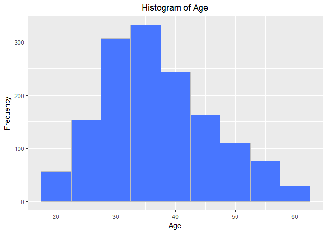<!-- -->

The shape of te histogram resembles a normal distribuiton, with a slight positive bias (mean > median)

And now the histogram of the `Income` and `log(Income)` variable:

```r
ggplot(data = talentManage, mapping = aes(MonthlyIncm)) +
  geom_histogram(binwidth = 1000, color = "gray", fill = "orchid3" ) +
  labs(x = "Montly income (in US$)", y = "Frequency", title = "Histogram of Monthly Income") + 
  scale_x_continuous(label = comma) +
  theme(plot.title = element_text(hjust = 0.5)) 
```

<!-- -->

```r
ggplot(talentManage, aes(talentManage$logMthlyInc)) + 
  geom_histogram(binwidth=0.5, color="gray", fill="orchid3") +
  labs(x = "Lof of Montly income log(US$)", y = "Frequency", title = "Histogram of Log of Monthly Income") +
  theme(plot.title = element_text(hjust = 0.5)) 
```

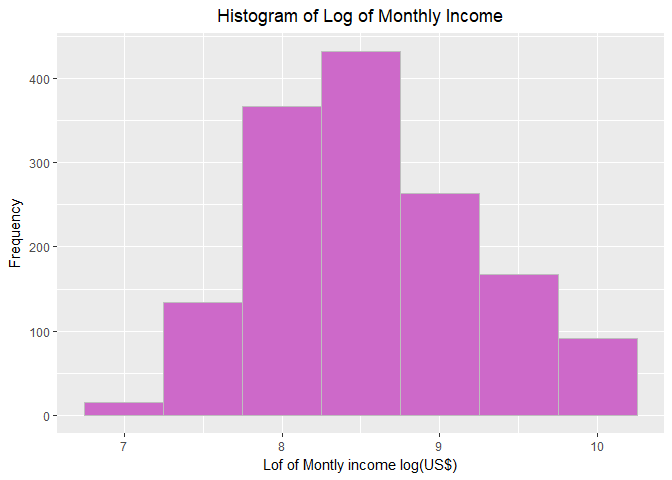<!-- -->

The histogram shows a strong positive skewness, which is typical of Income distributions: a small group of people in the organization have very high salaries. Logarithm of the income gives less skewness so we will proceed with log(MonthlyIncome) 

**c	Give the frequencies (in table format or similar) for Gender, Education, and Occupation.  They can be separate tables, if that’s your choice.**

```r
# Summarize categorical variables with counts

summary_factor <- with(talentManage,
                list("Gender" = tab_summary(factor(Gender)),
                     "Education" = tab_summary(factor(Education)),
                     "Ocupation" = tab_summary(factor(EducatinFld))))

table_factor <- summary_table(talentManage, summary_factor)
table_factor
```


|                              |talentManage (N = 1470) |
|:-----------------------------|:-----------------------|
|**Gender**                    |&nbsp;&nbsp;            |
|&nbsp;&nbsp; Female           |588 (40)                |
|&nbsp;&nbsp; Male             |882 (60)                |
|**Education**                 |&nbsp;&nbsp;            |
|&nbsp;&nbsp; Below College    |170 (12)                |
|&nbsp;&nbsp; College          |282 (19)                |
|&nbsp;&nbsp; Bachelor         |572 (39)                |
|&nbsp;&nbsp; Master           |398 (27)                |
|&nbsp;&nbsp; Doctor           |48 (3)                  |
|**Ocupation**                 |&nbsp;&nbsp;            |
|&nbsp;&nbsp; Human Resources  |27 (2)                  |
|&nbsp;&nbsp; Life Sciences    |606 (41)                |
|&nbsp;&nbsp; Marketing        |159 (11)                |
|&nbsp;&nbsp; Medical          |464 (32)                |
|&nbsp;&nbsp; Other            |82 (6)                  |
|&nbsp;&nbsp; Technical Degree |132 (9)                 |

**d	Give the counts (again, table) of management positions.**

```r
#Management positions are 3 and above:
paste(talentManage$JobRole[110:125], talentManage$JobLevel[110:125], sep = ",")
```

 [1] "Laboratory Technician,1"     "Healthcare Representative,3"
 [3] "Laboratory Technician,2"     "Manager,4"                  
 [5] "Laboratory Technician,1"     "Research Scientist,2"       
 [7] "Sales Executive,3"           "Manager,3"                  
 [9] "Sales Executive,3"           "Laboratory Technician,1"    
[11] "Manager,4"                   "Research Scientist,1"       
[13] "Sales Executive,2"           "Research Scientist,1"       
[15] "Research Director,5"         "Sales Executive,2"          

```r
summary_positions <- with(talentManage,
                     list("Management Positions" = tab_summary(factor(JobLevel[JobLevel == 3 | JobLevel ==4 | JobLevel ==5]))))

table_positions <- summary_table(talentManage, summary_positions)
table_positions
```


|                         |talentManage (N = 1470) |
|:------------------------|:-----------------------|
|**Management Positions** |&nbsp;&nbsp;            |
|&nbsp;&nbsp; 3           |218 (55)                |
|&nbsp;&nbsp; 4           |106 (27)                |
|&nbsp;&nbsp; 5           |69 (18)                 |

### Additional Analysis

Examine the proportion of attrition vs. No Attrition


```r
ggplot(data = talentManage) + 
  geom_bar(mapping = aes(x = Attrition, fill = Attrition)) +
  annotate("text", label = "Yes = 233, or 15.9%", y=350, x=2) +
  annotate("text", label = "No = 1237, or 84.1%", y=1300, x=1) +
  labs(x = "Attrition", y = "Total", title = "Summary of Attrition") +
  theme(plot.title = element_text(hjust = 0.5)) +
  guides(fill=FALSE)
```

<!-- -->

Investigate whether there are differences in attrition by continuous and categorical variables (Age and Gender, Marital Status and distance from home, Income and Job Level)

```r
#Graphing Age and Gender
ggplot((talentManage), aes(Age, as.numeric(Attrition)-1, color=Gender)) +
  stat_smooth(method="loess", formula=y~x, alpha=0.2, size=2, aes(fill=Gender)) +
  geom_point(position=position_jitter(height=0.03, width=0)) +
  labs(title = "Attrition levels by age and gender", x= "Age", y = "Proportion of Attrition")
```

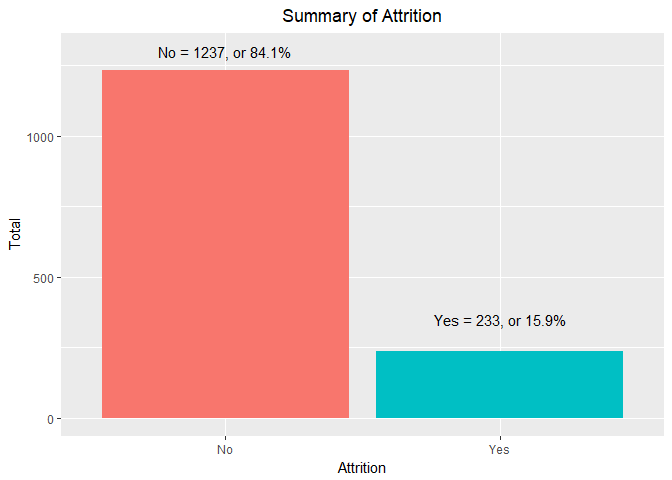<!-- -->

```r
# Using distance from home and Marital Status:
ggplot((talentManage), aes(DistncFrmHm, as.numeric(Attrition)-1, color=MaritalStts)) +
  stat_smooth(method="loess", formula=y~x,
              alpha=0.2, size=2, aes(fill=MaritalStts)) +
  geom_point(position=position_jitter(height=0.03, width=0)) +
  xlab("Distance from Home") + ylab("Attrition")
```

<!-- -->

```r
# Using Montly Income and Job Level:
ggplot((talentManage), aes(MonthlyIncm, as.numeric(Attrition)-1, color=JobLevel)) +
  stat_smooth(method="loess", formula=y~x,
              alpha=0.2, size=2, aes(fill=JobLevel)) +
  geom_point(position=position_jitter(height=0.03, width=0)) +
  xlab("Monthly Income in US$") + ylab("Attrition")
```

<!-- -->

```r
# Using Years in the Company
ggplot((talentManage), aes(YersAtCmpny, as.numeric(Attrition)-1, color=StckOptnLvl)) +
  stat_smooth(method="loess", formula=y~x,
              alpha=0.2, size=2, aes(fill=StckOptnLvl)) +
  geom_point(position=position_jitter(height=0.03, width=0)) +
  xlab("Years Worked at the Company") + ylab("Attrition")
```

<!-- -->

```r
#Using Salary Hike and Overtime
ggplot((talentManage), aes(PrcntSlryHk, as.numeric(Attrition)-1, color=OverTime)) +
  stat_smooth(method="loess", formula=y~x,
              alpha=0.2, size=2, aes(fill=OverTime)) +
  geom_point(position=position_jitter(height=0.03, width=0)) +
  xlab("Percentage Salary Hike") + ylab("Attrition")
```

<!-- -->

Analyze if the proportion of Attrition vs. No Attrition varies significantly among different categorical variables, related to Job Satisfaction and organizational factors


```r
ggplot(data = talentManage) + 
  geom_bar(mapping = aes(x = JobSatsfctn, fill = Attrition), position = "fill") +
  labs(x = "Job Satisfaction (4 is higher)", y = "Proportion", title = "Attrition by Level of Job Satisfaction")
```

<!-- -->

```r
ggplot(data = talentManage) + 
  geom_bar(mapping = aes(x = EnvrnmntSts, fill = Attrition), position = "fill") +
  labs(x = "Environment Satisfaction (4 is higher)", y = "Proportion", title = "Attrition by Level of Environment Satisfaction")
```

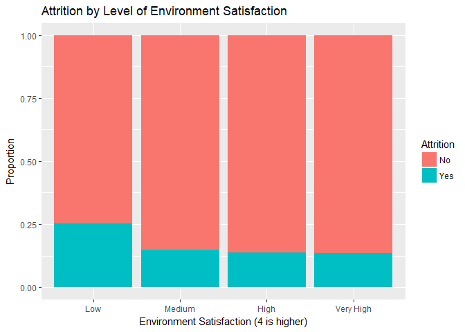<!-- -->

```r
ggplot(data = talentManage) + 
  geom_bar(mapping = aes(x = RltnshpStsf, fill = Attrition), position = "fill") +
  labs(x = "Relationship Satisfaction", y = "Proportion", title = "Attrition by Relationship Satisfaction")
```

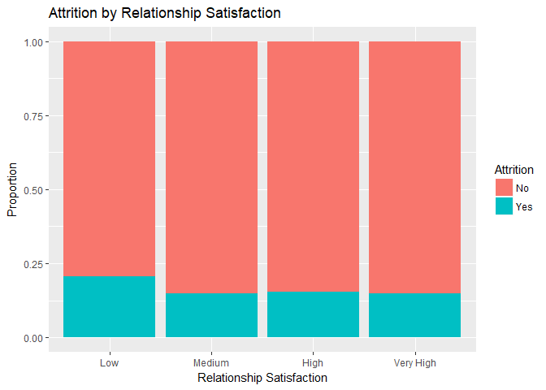<!-- -->

```r
ggplot(data = talentManage) + 
  geom_bar(mapping = aes(x = JobInvlvmnt, fill = Attrition), position = "fill") +
  labs(x = "Job Involvement (4 is higher)", y = "Proportion", title = "Attrition by Level of Job Involvement")
```

<!-- -->

```r
ggplot(data = talentManage) + 
  geom_bar(mapping = aes(x = Department, fill = Attrition), position = "fill") +
  labs(x = "Department", y = "Proportion", title = "Attrition by Department")
```

<!-- -->

```r
ggplot(data = talentManage) + 
  geom_bar(mapping = aes(x = YrsWthCrrMn, fill = Attrition), position = "fill") +
  labs(x = "Years with Current Manager", y = "Proportion", title = "Attrition levels by Years with Current Manager")
```

<!-- -->

```r
ggplot(data = talentManage) + 
  geom_bar(mapping = aes(x = BusinssTrvl, fill = Attrition), position = "fill") +
  labs(x = "Business Travel", y = "Proportion", title = "Attrition for Business Travel")
```

<!-- -->

Do people with a history of changing jobs have a larger tendency for Attrition (controlling by Environment Satisfaction)?

```r
ggplot((talentManage), aes(NmCmpnsWrkd, as.numeric(Attrition)-1, color=EnvrnmntSts)) +
  stat_smooth(method="loess", formula=y~x,
              alpha=0.2, size=2, aes(fill=EnvrnmntSts)) +
  geom_point(position=position_jitter(height=0.03, width=0)) +
  xlab("Number of previous Jobs") + ylab("Attrition")
```

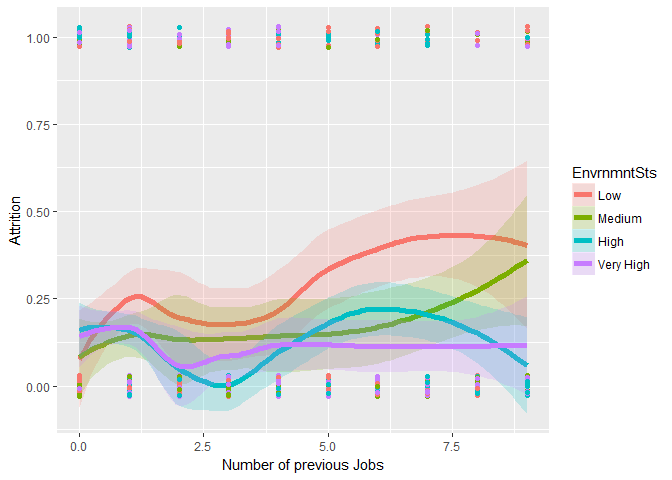<!-- -->


We see very clear differences in Attrition by Job Role:

```r
ggplot(data = talentManage) + 
  geom_bar(mapping = aes(x = JobRole, fill = Attrition), position = "fill") +
  labs(x = "Job Role", y = "Proportion", title = "Attrition by Job Roles") +
  coord_flip()
```

<!-- -->

Create the new variable `AggSatisfaction` that aggregates closely related variables: `Job Satisfaction`, `Job Involvement`, `Environment Satisfaction` and `Relationship Satisfaction`.


```r
talentManage$AggStsfctn = (as.numeric(talentManage$EnvrnmntSts) + as.numeric(talentManage$JobInvlvmnt) + as.numeric(talentManage$JobSatsfctn) + as.numeric(talentManage$RltnshpStsf)) /4
```

Explore satisfaction levels by Job Role:


```r
ggplot(data = talentManage, aes(x=JobRole, y = AggStsfctn, color=JobRole)) + 
  geom_boxplot() +
  labs(x = "Job Role", y = "Aggregate Satisfaction", title = "Aggregate Satisfaction by Job Role") +
  coord_flip() +
  guides(colour=FALSE)
```

<!-- -->

### 4.	Deeper Analysis and Visualization 

a	Note: You should make all of these appealing looking.  Remember to include things like a clean, informative title, axis labels that are in plain English, and readable axis values that do not overlap.

** Analysis of Data using backward elimination:  
**** VIF for backward elimination is within 1-2 so there is not a strong correlation between these parameters selected by the model

```r
talentManage1[, c("MonthlyIncm")] <- list(NULL)

#change variables to factors for talentManage1
talentManage1[,c("Education")] <- as.factor(talentManage1$Education)
talentManage1[,c("EnvrnmntSts")] <- as.factor(talentManage1$EnvrnmntSts)
talentManage1[,c("JobInvlvmnt")] <- as.factor(talentManage1$JobInvlvmnt)
talentManage1[,c("JobLevel")] <- as.factor(talentManage1$JobLevel)
talentManage1[,c("JobSatsfctn")] <- as.factor(talentManage1$JobSatsfctn)
talentManage1[,c("PrfrmncRtng")] <- as.factor(talentManage1$PrfrmncRtng)
talentManage1[,c("StckOptnLvl")] <- as.factor(talentManage1$StckOptnLvl)
talentManage1[,c("TrnngTmsLsY")] <- as.factor(talentManage1$TrnngTmsLsY)
talentManage1[,c("WorkLifBlnc")] <- as.factor(talentManage1$WorkLifBlnc)
talentManage1[,c("NmCmpnsWrkd")] <- as.factor(talentManage1$NmCmpnsWrkd)

str(talentManage1)
```

```
## 'data.frame':	1470 obs. of  31 variables:
##  $ Age        : int  41 49 37 33 27 32 59 30 38 36 ...
##  $ Attrition  : Factor w/ 2 levels "No","Yes": 2 1 2 1 1 1 1 1 1 1 ...
##  $ BusinssTrvl: Factor w/ 3 levels "Non-Travel","Travel_Frequently",..: 3 2 3 2 3 2 3 3 2 3 ...
##  $ DailyRate  : int  1102 279 1373 1392 591 1005 1324 1358 216 1299 ...
##  $ Department : Factor w/ 3 levels "Human Resources",..: 3 2 2 2 2 2 2 2 2 2 ...
##  $ DistncFrmHm: int  1 8 2 3 2 2 3 24 23 27 ...
##  $ Education  : Factor w/ 5 levels "1","2","3","4",..: 2 1 2 4 1 2 3 1 3 3 ...
##  $ EducatinFld: Factor w/ 6 levels "Human Resources",..: 2 2 5 2 4 2 4 2 2 4 ...
##  $ EnvrnmntSts: Factor w/ 4 levels "1","2","3","4": 2 3 4 4 1 4 3 4 4 3 ...
##  $ Gender     : Factor w/ 2 levels "Female","Male": 1 2 2 1 2 2 1 2 2 2 ...
##  $ HourlyRate : int  94 61 92 56 40 79 81 67 44 94 ...
##  $ JobInvlvmnt: Factor w/ 4 levels "1","2","3","4": 3 2 2 3 3 3 4 3 2 3 ...
##  $ JobLevel   : Factor w/ 5 levels "1","2","3","4",..: 2 2 1 1 1 1 1 1 3 2 ...
##  $ JobRole    : Factor w/ 9 levels "Healthcare Representative",..: 8 7 3 7 3 3 3 3 5 1 ...
##  $ JobSatsfctn: Factor w/ 4 levels "1","2","3","4": 4 2 3 3 2 4 1 3 3 3 ...
##  $ MaritalStts: Factor w/ 3 levels "Divorced","Married",..: 3 2 3 2 2 3 2 1 3 2 ...
##  $ MonthlyRate: int  19479 24907 2396 23159 16632 11864 9964 13335 8787 16577 ...
##  $ NmCmpnsWrkd: Factor w/ 10 levels "0","1","2","3",..: 9 2 7 2 10 1 5 2 1 7 ...
##  $ OverTime   : Factor w/ 2 levels "No","Yes": 2 1 2 2 1 1 2 1 1 1 ...
##  $ PrcntSlryHk: int  11 23 15 11 12 13 20 22 21 13 ...
##  $ PrfrmncRtng: Factor w/ 2 levels "3","4": 1 2 1 1 1 1 2 2 2 1 ...
##  $ RltnshpStsf: int  1 4 2 3 4 3 1 2 2 2 ...
##  $ StckOptnLvl: Factor w/ 4 levels "0","1","2","3": 1 2 1 1 2 1 4 2 1 3 ...
##  $ TtlWrkngYrs: int  8 10 7 8 6 8 12 1 10 17 ...
##  $ TrnngTmsLsY: Factor w/ 7 levels "0","1","2","3",..: 1 4 4 4 4 3 4 3 3 4 ...
##  $ WorkLifBlnc: Factor w/ 4 levels "1","2","3","4": 1 3 3 3 3 2 2 3 3 2 ...
##  $ YersAtCmpny: int  6 10 0 8 2 7 1 1 9 7 ...
##  $ YrsInCrrntR: int  4 7 0 7 2 7 0 0 7 7 ...
##  $ YrsSncLstPr: int  0 1 0 3 2 3 0 0 1 7 ...
##  $ YrsWthCrrMn: int  5 7 0 0 2 6 0 0 8 7 ...
##  $ logMthlyInc: num  8.7 8.54 7.64 7.98 8.15 ...
```

```r
# Regression for full Model
fullModel <- glm(Attrition ~ Age + BusinssTrvl + DailyRate + Department + DistncFrmHm + 
    Education + EducatinFld + EnvrnmntSts + Gender + HourlyRate + 
    JobInvlvmnt + JobLevel + JobRole + JobSatsfctn + MaritalStts + 
    MonthlyRate + NmCmpnsWrkd + OverTime + PrcntSlryHk + PrfrmncRtng + 
    RltnshpStsf + StckOptnLvl + TtlWrkngYrs + TrnngTmsLsY + WorkLifBlnc + 
    YersAtCmpny + YrsInCrrntR + YrsSncLstPr + YrsWthCrrMn + logMthlyInc, data=talentManage1, family=binomial(link = logit))

summary(fullModel)
```

```
## 
## Call:
## glm(formula = Attrition ~ Age + BusinssTrvl + DailyRate + Department + 
##     DistncFrmHm + Education + EducatinFld + EnvrnmntSts + Gender + 
##     HourlyRate + JobInvlvmnt + JobLevel + JobRole + JobSatsfctn + 
##     MaritalStts + MonthlyRate + NmCmpnsWrkd + OverTime + PrcntSlryHk + 
##     PrfrmncRtng + RltnshpStsf + StckOptnLvl + TtlWrkngYrs + TrnngTmsLsY + 
##     WorkLifBlnc + YersAtCmpny + YrsInCrrntR + YrsSncLstPr + YrsWthCrrMn + 
##     logMthlyInc, family = binomial(link = logit), data = talentManage1)
## 
## Deviance Residuals: 
##     Min       1Q   Median       3Q      Max  
## -1.9074  -0.4290  -0.1877  -0.0520   3.7684  
## 
## Coefficients:
##                                    Estimate Std. Error z value Pr(>|z|)
## (Intercept)                      -1.509e+00  5.898e+02  -0.003 0.997958
## Age                              -2.586e-02  1.469e-02  -1.761 0.078287
## BusinssTrvlTravel_Frequently      2.316e+00  4.615e-01   5.018 5.22e-07
## BusinssTrvlTravel_Rarely          1.258e+00  4.223e-01   2.980 0.002886
## DailyRate                        -4.261e-04  2.394e-04  -1.780 0.075144
## DepartmentResearch & Development  1.446e+01  5.898e+02   0.025 0.980443
## DepartmentSales                   1.380e+01  5.898e+02   0.023 0.981328
## DistncFrmHm                       5.797e-02  1.197e-02   4.842 1.29e-06
## Education2                        2.580e-01  3.572e-01   0.722 0.470031
## Education3                        1.873e-01  3.187e-01   0.588 0.556714
## Education4                        1.859e-01  3.466e-01   0.537 0.591604
## Education5                       -1.008e-01  6.818e-01  -0.148 0.882486
## EducatinFldLife Sciences         -1.083e+00  9.268e-01  -1.169 0.242486
## EducatinFldMarketing             -5.203e-01  9.789e-01  -0.532 0.595026
## EducatinFldMedical               -1.160e+00  9.311e-01  -1.246 0.212661
## EducatinFldOther                 -8.630e-01  9.907e-01  -0.871 0.383709
## EducatinFldTechnical Degree       2.230e-02  9.379e-01   0.024 0.981032
## EnvrnmntSts2                     -1.109e+00  2.980e-01  -3.720 0.000199
## EnvrnmntSts3                     -1.267e+00  2.756e-01  -4.596 4.31e-06
## EnvrnmntSts4                     -1.511e+00  2.819e-01  -5.362 8.21e-08
## GenderMale                        4.745e-01  2.017e-01   2.353 0.018645
## HourlyRate                        3.035e-03  4.852e-03   0.626 0.531567
## JobInvlvmnt2                     -1.371e+00  3.930e-01  -3.487 0.000488
## JobInvlvmnt3                     -1.637e+00  3.702e-01  -4.421 9.81e-06
## JobInvlvmnt4                     -2.194e+00  5.047e-01  -4.347 1.38e-05
## JobLevel2                        -1.082e+00  4.855e-01  -2.230 0.025774
## JobLevel3                         7.642e-01  6.827e-01   1.119 0.262931
## JobLevel4                        -3.741e-01  1.103e+00  -0.339 0.734457
## JobLevel5                         2.403e+00  1.409e+00   1.706 0.088033
## JobRoleHuman Resources            1.487e+01  5.898e+02   0.025 0.979887
## JobRoleLaboratory Technician      6.328e-01  6.139e-01   1.031 0.302593
## JobRoleManager                   -3.198e-01  1.069e+00  -0.299 0.764795
## JobRoleManufacturing Director     3.116e-01  5.752e-01   0.542 0.587953
## JobRoleResearch Director         -1.958e+00  1.147e+00  -1.708 0.087652
## JobRoleResearch Scientist        -5.500e-01  6.336e-01  -0.868 0.385409
## JobRoleSales Executive            1.990e+00  1.310e+00   1.518 0.128906
## JobRoleSales Representative       1.715e+00  1.384e+00   1.239 0.215445
## JobSatsfctn2                     -6.800e-01  2.958e-01  -2.299 0.021501
## JobSatsfctn3                     -6.803e-01  2.623e-01  -2.594 0.009496
## JobSatsfctn4                     -1.348e+00  2.813e-01  -4.791 1.66e-06
## MaritalSttsMarried                4.025e-01  2.946e-01   1.366 0.171923
## MaritalSttsSingle                 7.448e-01  4.243e-01   1.756 0.079171
## MonthlyRate                       1.238e-05  1.352e-05   0.916 0.359717
## NmCmpnsWrkd1                      5.997e-01  3.245e-01   1.848 0.064626
## NmCmpnsWrkd2                      7.096e-01  4.794e-01   1.480 0.138842
## NmCmpnsWrkd3                      3.315e-01  4.788e-01   0.692 0.488757
## NmCmpnsWrkd4                      8.847e-01  4.842e-01   1.827 0.067658
## NmCmpnsWrkd5                      1.646e+00  5.185e-01   3.175 0.001498
## NmCmpnsWrkd6                      1.729e+00  5.163e-01   3.348 0.000814
## NmCmpnsWrkd7                      2.068e+00  5.008e-01   4.129 3.64e-05
## NmCmpnsWrkd8                      1.270e+00  6.211e-01   2.045 0.040893
## NmCmpnsWrkd9                      2.099e+00  5.733e-01   3.662 0.000251
## OverTimeYes                       2.247e+00  2.206e-01  10.183  < 2e-16
## PrcntSlryHk                       3.123e-03  4.252e-02   0.073 0.941457
## PrfrmncRtng4                     -1.447e-01  4.389e-01  -0.330 0.741707
## RltnshpStsf                      -3.436e-01  8.971e-02  -3.830 0.000128
## StckOptnLvl1                     -1.132e+00  3.354e-01  -3.375 0.000738
## StckOptnLvl2                     -9.797e-01  4.633e-01  -2.115 0.034452
## StckOptnLvl3                     -3.327e-01  5.001e-01  -0.665 0.505886
## TtlWrkngYrs                      -5.013e-02  3.343e-02  -1.500 0.133712
## TrnngTmsLsY1                     -1.210e+00  5.879e-01  -2.059 0.039509
## TrnngTmsLsY2                     -1.504e+00  4.496e-01  -3.345 0.000822
## TrnngTmsLsY3                     -1.712e+00  4.578e-01  -3.739 0.000185
## TrnngTmsLsY4                     -1.165e+00  5.182e-01  -2.248 0.024583
## TrnngTmsLsY5                     -1.952e+00  5.646e-01  -3.458 0.000545
## TrnngTmsLsY6                     -2.078e+00  6.854e-01  -3.031 0.002434
## WorkLifBlnc2                     -1.065e+00  4.047e-01  -2.632 0.008481
## WorkLifBlnc3                     -1.547e+00  3.795e-01  -4.076 4.59e-05
## WorkLifBlnc4                     -1.081e+00  4.587e-01  -2.358 0.018397
## YersAtCmpny                       9.283e-02  4.522e-02   2.053 0.040069
## YrsInCrrntR                      -1.305e-01  5.280e-02  -2.472 0.013435
## YrsSncLstPr                       1.726e-01  4.650e-02   3.713 0.000205
## YrsWthCrrMn                      -1.485e-01  5.169e-02  -2.872 0.004077
## logMthlyInc                      -1.167e+00  4.095e-01  -2.848 0.004393
##                                     
## (Intercept)                         
## Age                              .  
## BusinssTrvlTravel_Frequently     ***
## BusinssTrvlTravel_Rarely         ** 
## DailyRate                        .  
## DepartmentResearch & Development    
## DepartmentSales                     
## DistncFrmHm                      ***
## Education2                          
## Education3                          
## Education4                          
## Education5                          
## EducatinFldLife Sciences            
## EducatinFldMarketing                
## EducatinFldMedical                  
## EducatinFldOther                    
## EducatinFldTechnical Degree         
## EnvrnmntSts2                     ***
## EnvrnmntSts3                     ***
## EnvrnmntSts4                     ***
## GenderMale                       *  
## HourlyRate                          
## JobInvlvmnt2                     ***
## JobInvlvmnt3                     ***
## JobInvlvmnt4                     ***
## JobLevel2                        *  
## JobLevel3                           
## JobLevel4                           
## JobLevel5                        .  
## JobRoleHuman Resources              
## JobRoleLaboratory Technician        
## JobRoleManager                      
## JobRoleManufacturing Director       
## JobRoleResearch Director         .  
## JobRoleResearch Scientist           
## JobRoleSales Executive              
## JobRoleSales Representative         
## JobSatsfctn2                     *  
## JobSatsfctn3                     ** 
## JobSatsfctn4                     ***
## MaritalSttsMarried                  
## MaritalSttsSingle                .  
## MonthlyRate                         
## NmCmpnsWrkd1                     .  
## NmCmpnsWrkd2                        
## NmCmpnsWrkd3                        
## NmCmpnsWrkd4                     .  
## NmCmpnsWrkd5                     ** 
## NmCmpnsWrkd6                     ***
## NmCmpnsWrkd7                     ***
## NmCmpnsWrkd8                     *  
## NmCmpnsWrkd9                     ***
## OverTimeYes                      ***
## PrcntSlryHk                         
## PrfrmncRtng4                        
## RltnshpStsf                      ***
## StckOptnLvl1                     ***
## StckOptnLvl2                     *  
## StckOptnLvl3                        
## TtlWrkngYrs                         
## TrnngTmsLsY1                     *  
## TrnngTmsLsY2                     ***
## TrnngTmsLsY3                     ***
## TrnngTmsLsY4                     *  
## TrnngTmsLsY5                     ***
## TrnngTmsLsY6                     ** 
## WorkLifBlnc2                     ** 
## WorkLifBlnc3                     ***
## WorkLifBlnc4                     *  
## YersAtCmpny                      *  
## YrsInCrrntR                      *  
## YrsSncLstPr                      ***
## YrsWthCrrMn                      ** 
## logMthlyInc                      ** 
## ---
## Signif. codes:  0 '***' 0.001 '**' 0.01 '*' 0.05 '.' 0.1 ' ' 1
## 
## (Dispersion parameter for binomial family taken to be 1)
## 
##     Null deviance: 1298.6  on 1469  degrees of freedom
## Residual deviance:  757.1  on 1396  degrees of freedom
## AIC: 905.1
## 
## Number of Fisher Scoring iterations: 15
```

```r
#anova(fullModel, test="Chisq")

#Get the confidence intervals for full Model
exp(cbind(coef(fullModel), confint(fullModel)))
```

```
## Waiting for profiling to be done...
```

```
##                                                       2.5 %        97.5 %
## (Intercept)                      2.210498e-01 1.682804e-103  3.951345e-24
## Age                              9.744691e-01  9.463226e-01  1.002518e+00
## BusinssTrvlTravel_Frequently     1.013160e+01  4.253248e+00  2.611388e+01
## BusinssTrvlTravel_Rarely         3.519285e+00  1.598071e+00  8.417404e+00
## DailyRate                        9.995740e-01  9.991023e-01  1.000042e+00
## DepartmentResearch & Development 1.899405e+06  8.587748e+86 2.256095e+111
## DepartmentSales                  9.875493e+05 4.854768e+190 2.419446e+116
## DistncFrmHm                      1.059687e+00  1.035200e+00  1.085034e+00
## Education2                       1.294383e+00  6.457451e-01  2.627579e+00
## Education3                       1.206029e+00  6.517067e-01  2.280085e+00
## Education4                       1.204354e+00  6.151438e-01  2.400759e+00
## Education5                       9.041232e-01  2.196672e-01  3.259363e+00
## EducatinFldLife Sciences         3.384993e-01  5.348235e-02  2.071111e+00
## EducatinFldMarketing             5.943239e-01  8.522819e-02  4.036390e+00
## EducatinFldMedical               3.133508e-01  4.902139e-02  1.929906e+00
## EducatinFldOther                 4.219110e-01  5.853793e-02  2.914217e+00
## EducatinFldTechnical Degree      1.022548e+00  1.608492e-01  6.493935e+00
## EnvrnmntSts2                     3.300010e-01  1.823791e-01  5.879152e-01
## EnvrnmntSts3                     2.817314e-01  1.631363e-01  4.814986e-01
## EnvrnmntSts4                     2.205867e-01  1.258993e-01  3.807682e-01
## GenderMale                       1.607208e+00  1.086537e+00  2.398291e+00
## HourlyRate                       1.003040e+00  9.935581e-01  1.012663e+00
## JobInvlvmnt2                     2.539397e-01  1.169881e-01  5.480999e-01
## JobInvlvmnt3                     1.946129e-01  9.378440e-02  4.018336e-01
## JobInvlvmnt4                     1.115240e-01  4.037572e-02  2.938978e-01
## JobLevel2                        3.387691e-01  1.251416e-01  8.477472e-01
## JobLevel3                        2.147374e+00  5.536375e-01  8.105510e+00
## JobLevel4                        6.879040e-01  7.464790e-02  5.723262e+00
## JobLevel5                        1.105714e+01  7.255083e-01  1.947605e+02
## JobRoleHuman Resources           2.865178e+06 1.436814e+175 1.070085e+116
## JobRoleLaboratory Technician     1.882934e+00  5.656579e-01  6.377425e+00
## JobRoleManager                   7.263098e-01  6.843133e-02  5.106555e+00
## JobRoleManufacturing Director    1.365668e+00  4.414590e-01  4.290694e+00
## JobRoleResearch Director         1.411194e-01  1.093513e-02  1.084921e+00
## JobRoleResearch Scientist        5.769705e-01  1.656087e-01  2.016874e+00
## JobRoleSales Executive           7.312656e+00  5.933894e-01  1.106979e+02
## JobRoleSales Representative      5.556373e+00  3.879534e-01  9.558093e+01
## JobSatsfctn2                     5.065966e-01  2.819410e-01  9.008366e-01
## JobSatsfctn3                     5.064674e-01  3.020527e-01  8.459511e-01
## JobSatsfctn4                     2.598279e-01  1.485305e-01  4.483294e-01
## MaritalSttsMarried               1.495561e+00  8.453275e-01  2.690652e+00
## MaritalSttsSingle                2.106125e+00  9.261789e-01  4.900604e+00
## MonthlyRate                      1.000012e+00  9.999859e-01  1.000039e+00
## NmCmpnsWrkd1                     1.821580e+00  9.777807e-01  3.502304e+00
## NmCmpnsWrkd2                     2.033191e+00  7.872446e-01  5.193911e+00
## NmCmpnsWrkd3                     1.393029e+00  5.395119e-01  3.547485e+00
## NmCmpnsWrkd4                     2.422274e+00  9.291820e-01  6.241573e+00
## NmCmpnsWrkd5                     5.186743e+00  1.869627e+00  1.437244e+01
## NmCmpnsWrkd6                     5.632513e+00  2.042101e+00  1.555042e+01
## NmCmpnsWrkd7                     7.906994e+00  2.967636e+00  2.125968e+01
## NmCmpnsWrkd8                     3.560797e+00  9.893996e-01  1.156574e+01
## NmCmpnsWrkd9                     8.161129e+00  2.611825e+00  2.494631e+01
## OverTimeYes                      9.455413e+00  6.192303e+00  1.472518e+01
## PrcntSlryHk                      1.003127e+00  9.223344e-01  1.089903e+00
## PrfrmncRtng4                     8.653123e-01  3.647409e-01  2.044499e+00
## RltnshpStsf                      7.092395e-01  5.938179e-01  8.445247e-01
## StckOptnLvl1                     3.224330e-01  1.669542e-01  6.235013e-01
## StckOptnLvl2                     3.754226e-01  1.476235e-01  9.151713e-01
## StckOptnLvl3                     7.169898e-01  2.645150e-01  1.889598e+00
## TtlWrkngYrs                      9.511071e-01  8.891128e-01  1.013896e+00
## TrnngTmsLsY1                     2.980843e-01  9.193958e-02  9.324840e-01
## TrnngTmsLsY2                     2.222564e-01  9.252242e-02  5.426435e-01
## TrnngTmsLsY3                     1.805214e-01  7.386956e-02  4.476256e-01
## TrnngTmsLsY4                     3.120014e-01  1.127315e-01  8.646939e-01
## TrnngTmsLsY5                     1.419680e-01  4.611888e-02  4.255061e-01
## TrnngTmsLsY6                     1.251968e-01  3.087993e-02  4.616610e-01
## WorkLifBlnc2                     3.446660e-01  1.564768e-01  7.682619e-01
## WorkLifBlnc3                     2.129562e-01  1.016492e-01  4.523939e-01
## WorkLifBlnc4                     3.391178e-01  1.375128e-01  8.346482e-01
## YersAtCmpny                      1.097274e+00  1.004586e+00  1.199924e+00
## YrsInCrrntR                      8.776303e-01  7.908893e-01  9.732020e-01
## YrsSncLstPr                      1.188441e+00  1.085902e+00  1.303428e+00
## YrsWthCrrMn                      8.620216e-01  7.787837e-01  9.541352e-01
## logMthlyInc                      3.114344e-01  1.386090e-01  6.922765e-01
```

```r
#Model with only the intercept
nothing <- glm(Attrition ~ 1, data=talentManage1, family=binomial(link=logit))

summary(nothing)
```

```
## 
## Call:
## glm(formula = Attrition ~ 1, family = binomial(link = logit), 
##     data = talentManage1)
## 
## Deviance Residuals: 
##    Min      1Q  Median      3Q     Max  
## -0.593  -0.593  -0.593  -0.593   1.910  
## 
## Coefficients:
##             Estimate Std. Error z value Pr(>|z|)    
## (Intercept) -1.64915    0.07093  -23.25   <2e-16 ***
## ---
## Signif. codes:  0 '***' 0.001 '**' 0.01 '*' 0.05 '.' 0.1 ' ' 1
## 
## (Dispersion parameter for binomial family taken to be 1)
## 
##     Null deviance: 1298.6  on 1469  degrees of freedom
## Residual deviance: 1298.6  on 1469  degrees of freedom
## AIC: 1300.6
## 
## Number of Fisher Scoring iterations: 3
```

```r
#backwards = step(fullModel)

#backwards = step(fullModel, list(lower=formula(nothing),upper=formula(fullModel)), direction="backward",trace=0)
 
#formula(backwards)

#summary(backwards)

#back2 = glm(Attrition ~ Age + BusinssTrvl + DailyRate + DistncFrmHm + EducatinFld + 
#    EnvrnmntSts + Gender + JobInvlvmnt + JobRole + 
#    JobSatsfctn + NmCmpnsWrkd + OverTime + RltnshpStsf + StckOptnLvl + 
#    TtlWrkngYrs + TrnngTmsLsY + WorkLifBlnc + YrsInCrrntR + YrsSncLstPr + 
#    YrsWthCrrMn + logMthlyInc, data=talentManage, family=binomial(link = logit))

#summary(back2)

# Check overall effect of JobRole using aod library
#wald.test(b=coef(back2), Sigma=vcov(back2), Terms=18:25)

# Check overall effect of Education Field using aod library
#wald.test(b=coef(back2), Sigma=vcov(back2), Terms=6:10)

#car::vif(back2)
```


** Visual Inspection of the model 

** Checking linear relationship between continuous predictor variables and the logit of the outcome. This can be done by visually inspecting the scatter plot between each predictor and the logit values.  

** We see all other parameters except StandardHrs are all linearly associated

```r
probabilities <- round(predict(fullModel, type = "response"), 2)

dataForAnalysis <- talentManage1 %>%
  dplyr::select_if(is.numeric) 

cor1 <- cor(data.matrix(talentManage1), method=c("kendall"))
corrplot(cor1)
```

<!-- -->

```r
#dataForAnalysis[, rm("log")]
predictors <- colnames(dataForAnalysis)

#Bind the logit and tidying the data for plot
dataForAnalysis <- dataForAnalysis %>%
  mutate(logit = log(probabilities/(1-probabilities))) %>%
  tidyr::gather(key = "predictors", value = "predictor.value", -logit)

ggplot(dataForAnalysis, aes(logit, predictor.value))+
  geom_point(size = 0.5, alpha = 0.5) +
  geom_smooth(method = "loess") + 
  theme_bw() + 
  facet_wrap(~predictors, scales = "free_y")+
  labs(title="Predicted values Vs Logit for Continuous variables", x="Logit Values", y="Predicted Values")+
  theme(plot.title = element_text(hjust = 0.5))
```

```
## Warning: Removed 3536 rows containing non-finite values (stat_smooth).
```

<!-- -->


** Analysis of Data using forward selection: 
** Model obtained using forward selection is
Attrition ~ OverTime + JobRole + StckOptnLvl + JobLevel + EnvrnmntSts +
    BusinssTrvl + JobInvlvmnt + DistncFrmHm + JobSatsfctn + NmCmpnsWrkd + 
    TtlWrkngYrs + WorkLifBlnc + RltnshpStsf + YrsSncLstPr + logMthlyInc + 
    YrsInCrrntR + EducatinFld + TrnngTmsLsY + Gender + YrsWthCrrMn + 
    DailyRate + Age


```r
## forward selection

forwards = step(nothing, scope=list(lower=formula(nothing),upper=formula(fullModel)), direction="forward", trace=0)

formula(forwards)
```

```
## Attrition ~ OverTime + JobRole + StckOptnLvl + JobLevel + EnvrnmntSts + 
##     BusinssTrvl + JobInvlvmnt + DistncFrmHm + JobSatsfctn + WorkLifBlnc + 
##     YrsWthCrrMn + YrsSncLstPr + RltnshpStsf + NmCmpnsWrkd + logMthlyInc + 
##     EducatinFld + Age + TrnngTmsLsY + YrsInCrrntR + Gender + 
##     DailyRate + YersAtCmpny + TtlWrkngYrs
```

#### Check the vif for the forwards model. We do find that JobLevel and JobRole are highly correlated so doing chi-square test of independence  
#### Chi- square test reveals that these two variables are independent   

```r
# Variance inflation factor
car::vif(forwards)
```

```
##                  GVIF Df GVIF^(1/(2*Df))
## OverTime     1.352735  1        1.163071
## JobRole     70.017313  8        1.304143
## StckOptnLvl  1.338452  3        1.049785
## JobLevel    60.374779  4        1.669579
## EnvrnmntSts  1.377332  3        1.054807
## BusinssTrvl  1.276734  2        1.062980
## JobInvlvmnt  1.305739  3        1.045465
## DistncFrmHm  1.158207  1        1.076200
## JobSatsfctn  1.241094  3        1.036655
## WorkLifBlnc  1.290141  3        1.043373
## YrsWthCrrMn  3.142206  1        1.772627
## YrsSncLstPr  2.601987  1        1.613067
## RltnshpStsf  1.135477  1        1.065588
## NmCmpnsWrkd  3.888844  9        1.078370
## logMthlyInc  7.247314  1        2.692084
## EducatinFld  3.422445  5        1.130925
## Age          2.025980  1        1.423369
## TrnngTmsLsY  1.623367  6        1.041201
## YrsInCrrntR  3.164102  1        1.778792
## Gender       1.091385  1        1.044694
## DailyRate    1.101446  1        1.049498
## YersAtCmpny  7.609121  1        2.758463
## TtlWrkngYrs  6.136076  1        2.477111
```

```r
#Check parameters selected are independent
cJob <- cbind(talentManage1$JobLevel, talentManage1$JobRole)

chisq.test(cJob)
```

```
## Warning in chisq.test(cJob): Chi-squared approximation may be incorrect
```

```
## 
## 	Pearson's Chi-squared test
## 
## data:  cJob
## X-squared = 1270.7, df = 1469, p-value = 0.9999
```

### Removing JobLevel since JobRole and JobLevel are highly correlated

```r
forward2 <- glm(Attrition ~ OverTime + JobRole + StckOptnLvl +  EnvrnmntSts +  
    BusinssTrvl + JobInvlvmnt + DistncFrmHm + JobSatsfctn + NmCmpnsWrkd + 
    TtlWrkngYrs + WorkLifBlnc + RltnshpStsf + YrsSncLstPr + logMthlyInc + 
    YrsInCrrntR + EducatinFld + TrnngTmsLsY + Gender + YrsWthCrrMn + 
    DailyRate + Age, data=talentManage1, family = binomial(link = logit))

summary(forward2)
```

```
## 
## Call:
## glm(formula = Attrition ~ OverTime + JobRole + StckOptnLvl + 
##     EnvrnmntSts + BusinssTrvl + JobInvlvmnt + DistncFrmHm + JobSatsfctn + 
##     NmCmpnsWrkd + TtlWrkngYrs + WorkLifBlnc + RltnshpStsf + YrsSncLstPr + 
##     logMthlyInc + YrsInCrrntR + EducatinFld + TrnngTmsLsY + Gender + 
##     YrsWthCrrMn + DailyRate + Age, family = binomial(link = logit), 
##     data = talentManage1)
## 
## Deviance Residuals: 
##     Min       1Q   Median       3Q      Max  
## -1.9294  -0.4447  -0.2251  -0.0767   3.8597  
## 
## Coefficients:
##                                 Estimate Std. Error z value Pr(>|z|)    
## (Intercept)                    9.0297775  3.0150958   2.995 0.002746 ** 
## OverTimeYes                    2.0943724  0.2078070  10.078  < 2e-16 ***
## JobRoleHuman Resources         1.0234999  0.7189794   1.424 0.154578    
## JobRoleLaboratory Technician   1.0854740  0.5056645   2.147 0.031823 *  
## JobRoleManager                 0.7389684  0.7140500   1.035 0.300717    
## JobRoleManufacturing Director  0.2178184  0.5552456   0.392 0.694843    
## JobRoleResearch Director      -0.9075748  0.9392519  -0.966 0.333907    
## JobRoleResearch Scientist     -0.0006601  0.5158824  -0.001 0.998979    
## JobRoleSales Executive         1.0297465  0.4697663   2.192 0.028377 *  
## JobRoleSales Representative    1.6617723  0.5874387   2.829 0.004672 ** 
## StckOptnLvl1                  -1.4261413  0.2171861  -6.566 5.15e-11 ***
## StckOptnLvl2                  -1.5574844  0.3707008  -4.201 2.65e-05 ***
## StckOptnLvl3                  -0.6959546  0.3958634  -1.758 0.078736 .  
## EnvrnmntSts2                  -1.1119965  0.2899351  -3.835 0.000125 ***
## EnvrnmntSts3                  -1.1930759  0.2652306  -4.498 6.85e-06 ***
## EnvrnmntSts4                  -1.3171465  0.2648132  -4.974 6.56e-07 ***
## BusinssTrvlTravel_Frequently   2.1060529  0.4309718   4.887 1.03e-06 ***
## BusinssTrvlTravel_Rarely       1.0900747  0.3938034   2.768 0.005639 ** 
## JobInvlvmnt2                  -1.1541228  0.3767844  -3.063 0.002191 ** 
## JobInvlvmnt3                  -1.4120345  0.3530595  -3.999 6.35e-05 ***
## JobInvlvmnt4                  -2.0233018  0.4812081  -4.205 2.62e-05 ***
## DistncFrmHm                    0.0517694  0.0113922   4.544 5.51e-06 ***
## JobSatsfctn2                  -0.6632489  0.2843524  -2.332 0.019675 *  
## JobSatsfctn3                  -0.6896637  0.2509933  -2.748 0.006001 ** 
## JobSatsfctn4                  -1.3383443  0.2695396  -4.965 6.86e-07 ***
## NmCmpnsWrkd1                   0.6777347  0.3138008   2.160 0.030791 *  
## NmCmpnsWrkd2                   0.5594458  0.4469738   1.252 0.210705    
## NmCmpnsWrkd3                   0.0283352  0.4527290   0.063 0.950095    
## NmCmpnsWrkd4                   0.6540197  0.4569810   1.431 0.152380    
## NmCmpnsWrkd5                   1.5247465  0.5006309   3.046 0.002322 ** 
## NmCmpnsWrkd6                   1.4124111  0.4825420   2.927 0.003422 ** 
## NmCmpnsWrkd7                   1.7328710  0.4800953   3.609 0.000307 ***
## NmCmpnsWrkd8                   0.8845858  0.5945448   1.488 0.136794    
## NmCmpnsWrkd9                   1.9846926  0.5315087   3.734 0.000188 ***
## TtlWrkngYrs                   -0.0156874  0.0275287  -0.570 0.568776    
## WorkLifBlnc2                  -0.9949891  0.3845956  -2.587 0.009679 ** 
## WorkLifBlnc3                  -1.4977730  0.3628732  -4.128 3.67e-05 ***
## WorkLifBlnc4                  -1.0200361  0.4405201  -2.316 0.020584 *  
## RltnshpStsf                   -0.3068334  0.0865724  -3.544 0.000394 ***
## YrsSncLstPr                    0.2028450  0.0431617   4.700 2.61e-06 ***
## logMthlyInc                   -0.7119079  0.3233183  -2.202 0.027674 *  
## YrsInCrrntR                   -0.0889978  0.0460736  -1.932 0.053404 .  
## EducatinFldLife Sciences      -0.3989724  0.8124183  -0.491 0.623361    
## EducatinFldMarketing           0.0785214  0.8661070   0.091 0.927763    
## EducatinFldMedical            -0.5566119  0.8184565  -0.680 0.496457    
## EducatinFldOther              -0.4346813  0.8838786  -0.492 0.622869    
## EducatinFldTechnical Degree    0.5626240  0.8343727   0.674 0.500116    
## TrnngTmsLsY1                  -1.1416513  0.5712318  -1.999 0.045654 *  
## TrnngTmsLsY2                  -1.3113145  0.4312981  -3.040 0.002363 ** 
## TrnngTmsLsY3                  -1.6353140  0.4380394  -3.733 0.000189 ***
## TrnngTmsLsY4                  -1.0445803  0.4992295  -2.092 0.036404 *  
## TrnngTmsLsY5                  -1.7440631  0.5445937  -3.203 0.001362 ** 
## TrnngTmsLsY6                  -2.0571665  0.6657226  -3.090 0.002001 ** 
## GenderMale                     0.4352630  0.1935986   2.248 0.024559 *  
## YrsWthCrrMn                   -0.1134144  0.0466852  -2.429 0.015126 *  
## DailyRate                     -0.0003890  0.0002310  -1.684 0.092155 .  
## Age                           -0.0265097  0.0140317  -1.889 0.058856 .  
## ---
## Signif. codes:  0 '***' 0.001 '**' 0.01 '*' 0.05 '.' 0.1 ' ' 1
## 
## (Dispersion parameter for binomial family taken to be 1)
## 
##     Null deviance: 1298.58  on 1469  degrees of freedom
## Residual deviance:  802.35  on 1413  degrees of freedom
## AIC: 916.35
## 
## Number of Fisher Scoring iterations: 7
```

```r
#Get the correlation plot of the variables selected

#Get the confidence intervals
exp(cbind(coef(forward2), confint(forward2)))
```

```
## Waiting for profiling to be done...
```

```
##                                                  2.5 %       97.5 %
## (Intercept)                   8348.0022952 23.89669777 3.300656e+06
## OverTimeYes                      8.1203432  5.44259563 1.230544e+01
## JobRoleHuman Resources           2.7829178  0.65754749 1.128002e+01
## JobRoleLaboratory Technician     2.9608431  1.13773616 8.355752e+00
## JobRoleManager                   2.0937744  0.49138328 8.355456e+00
## JobRoleManufacturing Director    1.2433612  0.41915679 3.776463e+00
## JobRoleResearch Director         0.4035016  0.04897164 2.212785e+00
## JobRoleResearch Scientist        0.9993401  0.37417622 2.862853e+00
## JobRoleSales Executive           2.8003558  1.16045189 7.422450e+00
## JobRoleSales Representative      5.2686402  1.70888510 1.726907e+01
## StckOptnLvl1                     0.2402341  0.15551433 3.648289e-01
## StckOptnLvl2                     0.2106654  0.09752394 4.207326e-01
## StckOptnLvl3                     0.4985983  0.22251416 1.056454e+00
## EnvrnmntSts2                     0.3289016  0.18469437 5.767029e-01
## EnvrnmntSts3                     0.3032870  0.17931133 5.080334e-01
## EnvrnmntSts4                     0.2678987  0.15841825 4.480655e-01
## BusinssTrvlTravel_Frequently     8.2157485  3.65348753 1.991977e+01
## BusinssTrvlTravel_Rarely         2.9744961  1.42646778 6.726260e+00
## JobInvlvmnt2                     0.3153340  0.15041669 6.609622e-01
## JobInvlvmnt3                     0.2436471  0.12197008 4.883940e-01
## JobInvlvmnt4                     0.1322182  0.05026098 3.337127e-01
## DistncFrmHm                      1.0531328  1.02992963 1.077041e+00
## JobSatsfctn2                     0.5151749  0.29325043 8.958267e-01
## JobSatsfctn3                     0.5017448  0.30593440 8.195811e-01
## JobSatsfctn4                     0.2622796  0.15352311 4.424379e-01
## NmCmpnsWrkd1                     1.9694114  1.08033503 3.709640e+00
## NmCmpnsWrkd2                     1.7497026  0.72159749 4.191416e+00
## NmCmpnsWrkd3                     1.0287405  0.41868117 2.486420e+00
## NmCmpnsWrkd4                     1.9232562  0.77705713 4.691162e+00
## NmCmpnsWrkd5                     4.5939786  1.71041555 1.225254e+01
## NmCmpnsWrkd6                     4.1058432  1.58766140 1.059104e+01
## NmCmpnsWrkd7                     5.6568713  2.20402309 1.455530e+01
## NmCmpnsWrkd8                     2.4219810  0.70720643 7.449966e+00
## NmCmpnsWrkd9                     7.2768104  2.52571178 2.047780e+01
## TtlWrkngYrs                      0.9844350  0.93185200 1.038192e+00
## WorkLifBlnc2                     0.3697275  0.17483379 7.928896e-01
## WorkLifBlnc3                     0.2236276  0.11042157 4.600224e-01
## WorkLifBlnc4                     0.3605819  0.15158574 8.562874e-01
## RltnshpStsf                      0.7357732  0.62009278 8.710532e-01
## YrsSncLstPr                      1.2248825  1.12644500 1.334602e+00
## logMthlyInc                      0.4907071  0.25917331 9.220758e-01
## YrsInCrrntR                      0.9148476  0.83510548 1.000745e+00
## EducatinFldLife Sciences         0.6710092  0.13798580 3.380860e+00
## EducatinFldMarketing             1.0816865  0.20077409 6.056167e+00
## EducatinFldMedical               0.5731477  0.11637431 2.917038e+00
## EducatinFldOther                 0.6474710  0.11387672 3.702193e+00
## EducatinFldTechnical Degree      1.7552723  0.34859224 9.314539e+00
## TrnngTmsLsY1                     0.3192913  0.10173623 9.673834e-01
## TrnngTmsLsY2                     0.2694656  0.11682168 6.377684e-01
## TrnngTmsLsY3                     0.1948912  0.08325577 4.667595e-01
## TrnngTmsLsY4                     0.3518394  0.13229041 9.426253e-01
## TrnngTmsLsY5                     0.1748087  0.05925228 5.056085e-01
## TrnngTmsLsY6                     0.1278156  0.03285810 4.550377e-01
## GenderMale                       1.5453694  1.06110031 2.268743e+00
## YrsWthCrrMn                      0.8927806  0.81403681 9.777216e-01
## DailyRate                        0.9996111  0.99915605 1.000062e+00
## Age                              0.9738386  0.94698531 1.000615e+00
```

```r
# Variance inflation factor
car::vif(forward2)
```

```
##                  GVIF Df GVIF^(1/(2*Df))
## OverTime     1.303502  1        1.141710
## JobRole     13.234279  8        1.175185
## StckOptnLvl  1.298541  3        1.044502
## EnvrnmntSts  1.328968  3        1.048542
## BusinssTrvl  1.241925  2        1.055659
## JobInvlvmnt  1.258568  3        1.039073
## DistncFrmHm  1.129602  1        1.062828
## JobSatsfctn  1.228631  3        1.034912
## NmCmpnsWrkd  3.026027  9        1.063445
## TtlWrkngYrs  4.186385  1        2.046066
## WorkLifBlnc  1.255216  3        1.038611
## RltnshpStsf  1.117264  1        1.057007
## YrsSncLstPr  2.290856  1        1.513558
## logMthlyInc  4.465514  1        2.113176
## YrsInCrrntR  2.524763  1        1.588950
## EducatinFld  3.435897  5        1.131368
## TrnngTmsLsY  1.493230  6        1.033976
## Gender       1.074783  1        1.036718
## YrsWthCrrMn  2.632441  1        1.622480
## DailyRate    1.091466  1        1.044733
## Age          1.981698  1        1.407728
```

```r
# How accurate our test is
lroc(forward2)
```

<!-- -->

```
## $model.description
## [1] "Attrition ~ OverTime + JobRole + StckOptnLvl + EnvrnmntSts + "             
## [2] "    BusinssTrvl + JobInvlvmnt + DistncFrmHm + JobSatsfctn + NmCmpnsWrkd + "
## [3] "    TtlWrkngYrs + WorkLifBlnc + RltnshpStsf + YrsSncLstPr + logMthlyInc + "
## [4] "    YrsInCrrntR + EducatinFld + TrnngTmsLsY + Gender + YrsWthCrrMn + "     
## [5] "    DailyRate + Age"                                                       
## 
## $auc
## [1] 0.8846934
## 
## $predicted.table
##  predicted.prob Non-diseased Diseased
##          7.7467            1        0
##          7.7676            1        0
##          0.0001            1        0
##          0.0001            1        0
##          0.0001            1        0
##          0.0001            1        0
##          0.0001            1        0
##          0.0001            1        0
##          0.0001            1        0
##          0.0001            1        0
##          0.0002            1        0
##          0.0002            1        0
##          0.0002            1        0
##          0.0002            1        0
##          0.0002            1        0
##          0.0002            1        0
##          0.0003            1        0
##          0.0003            1        0
##          0.0003            1        0
##          0.0003            1        0
##          0.0003            1        0
##          0.0003            1        0
##          0.0004            1        0
##          0.0004            1        0
##          0.0004            1        0
##          0.0004            1        0
##          0.0004            1        0
##          0.0004            1        0
##          0.0004            1        0
##          0.0005            1        0
##          0.0005            1        0
##          0.0005            1        0
##          0.0005            1        0
##          0.0005            0        1
##          0.0006            1        0
##          0.0006            1        0
##          0.0007            1        0
##          0.0007            1        0
##          0.0007            1        0
##          0.0007            1        0
##          0.0007            1        0
##          0.0007            1        0
##          0.0008            1        0
##          0.0008            1        0
##          0.0008            1        0
##          0.0008            1        0
##          0.0009            1        0
##          0.0009            1        0
##          0.0009            1        0
##          0.0010            1        0
##          0.0010            1        0
##          0.0010            1        0
##          0.0010            1        0
##          0.0011            1        0
##          0.0011            1        0
##          0.0011            1        0
##          0.0011            1        0
##          0.0011            1        0
##          0.0011            1        0
##          0.0011            1        0
##          0.0012            1        0
##          0.0012            1        0
##          0.0012            1        0
##          0.0013            1        0
##          0.0013            1        0
##          0.0013            1        0
##          0.0013            1        0
##          0.0013            1        0
##          0.0014            1        0
##          0.0014            1        0
##          0.0014            1        0
##          0.0014            1        0
##          0.0014            1        0
##          0.0015            1        0
##          0.0015            1        0
##          0.0015            1        0
##          0.0016            1        0
##          0.0016            1        0
##          0.0016            1        0
##          0.0016            1        0
##          0.0016            1        0
##          0.0016            1        0
##          0.0017            1        0
##          0.0017            0        1
##          0.0017            1        0
##          0.0018            1        0
##          0.0018            1        0
##          0.0018            1        0
##          0.0019            1        0
##          0.0019            1        0
##          0.0019            1        0
##          0.0019            1        0
##          0.0019            1        0
##          0.0019            1        0
##          0.0019            1        0
##          0.0019            1        0
##          0.0019            1        0
##          0.0019            1        0
##          0.0020            1        0
##          0.0021            1        0
##          0.0021            1        0
##          0.0021            1        0
##          0.0021            1        0
##          0.0022            1        0
##          0.0022            1        0
##          0.0022            1        0
##          0.0022            1        0
##          0.0022            1        0
##          0.0022            1        0
##          0.0023            1        0
##          0.0023            1        0
##          0.0023            1        0
##          0.0023            1        0
##          0.0023            1        0
##          0.0023            1        0
##          0.0024            1        0
##          0.0024            1        0
##          0.0024            1        0
##          0.0024            1        0
##          0.0024            1        0
##          0.0025            1        0
##          0.0025            1        0
##          0.0025            1        0
##          0.0026            1        0
##          0.0026            1        0
##          0.0026            1        0
##          0.0026            1        0
##          0.0026            1        0
##          0.0027            0        1
##          0.0027            1        0
##          0.0028            1        0
##          0.0029            1        0
##          0.0029            1        0
##          0.0029            1        0
##          0.0029            1        0
##          0.0029            1        0
##          0.0030            1        0
##          0.0030            1        0
##          0.0030            1        0
##          0.0030            1        0
##          0.0031            1        0
##          0.0031            1        0
##          0.0031            1        0
##          0.0032            1        0
##          0.0032            1        0
##          0.0032            1        0
##          0.0032            1        0
##          0.0032            1        0
##          0.0032            1        0
##          0.0033            1        0
##          0.0033            1        0
##          0.0033            1        0
##          0.0033            1        0
##          0.0033            1        0
##          0.0034            1        0
##          0.0034            1        0
##          0.0034            1        0
##          0.0034            1        0
##          0.0035            1        0
##          0.0035            1        0
##          0.0036            1        0
##          0.0037            1        0
##          0.0037            1        0
##          0.0037            1        0
##          0.0037            1        0
##          0.0037            1        0
##          0.0037            1        0
##          0.0037            1        0
##          0.0038            1        0
##          0.0038            1        0
##          0.0038            1        0
##          0.0039            1        0
##          0.0039            1        0
##          0.0039            1        0
##          0.0039            1        0
##          0.0040            1        0
##          0.0040            0        1
##          0.0040            1        0
##          0.0041            1        0
##          0.0042            1        0
##          0.0043            1        0
##          0.0043            1        0
##          0.0045            1        0
##          0.0046            1        0
##          0.0046            1        0
##          0.0047            1        0
##          0.0047            1        0
##          0.0048            1        0
##          0.0048            1        0
##          0.0048            1        0
##          0.0048            1        0
##          0.0049            1        0
##          0.0049            1        0
##          0.0049            1        0
##          0.0050            1        0
##          0.0050            1        0
##          0.0051            1        0
##          0.0052            0        1
##          0.0052            1        0
##          0.0052            1        0
##          0.0053            1        0
##          0.0053            1        0
##          0.0053            1        0
##          0.0053            1        0
##          0.0053            1        0
##          0.0053            1        0
##          0.0054            1        0
##          0.0055            1        0
##          0.0055            1        0
##          0.0055            1        0
##          0.0055            1        0
##          0.0056            1        0
##          0.0056            1        0
##          0.0056            1        0
##          0.0056            1        0
##          0.0056            1        0
##          0.0057            1        0
##          0.0057            1        0
##          0.0057            1        0
##          0.0057            1        0
##          0.0058            1        0
##          0.0058            1        0
##          0.0058            1        0
##          0.0058            1        0
##          0.0059            1        0
##          0.0059            1        0
##          0.0059            1        0
##          0.0060            1        0
##          0.0060            1        0
##          0.0060            1        0
##          0.0061            1        0
##          0.0061            1        0
##          0.0061            1        0
##          0.0061            1        0
##          0.0061            1        0
##          0.0062            1        0
##          0.0063            1        0
##          0.0064            1        0
##          0.0064            1        0
##          0.0064            1        0
##          0.0064            1        0
##          0.0065            1        0
##          0.0066            1        0
##          0.0066            1        0
##          0.0067            1        0
##          0.0067            1        0
##          0.0067            1        0
##          0.0067            1        0
##          0.0068            1        0
##          0.0068            1        0
##          0.0068            1        0
##          0.0069            1        0
##          0.0069            1        0
##          0.0069            1        0
##          0.0069            1        0
##          0.0070            1        0
##          0.0070            1        0
##          0.0070            1        0
##          0.0070            1        0
##          0.0070            1        0
##          0.0071            1        0
##          0.0071            1        0
##          0.0071            1        0
##          0.0071            1        0
##          0.0071            1        0
##          0.0071            1        0
##          0.0072            1        0
##          0.0072            1        0
##          0.0072            1        0
##          0.0073            0        1
##          0.0073            1        0
##          0.0074            1        0
##          0.0074            1        0
##          0.0075            1        0
##          0.0075            1        0
##          0.0076            1        0
##          0.0079            1        0
##          0.0080            1        0
##          0.0080            1        0
##          0.0080            1        0
##          0.0081            1        0
##          0.0081            1        0
##          0.0082            1        0
##          0.0082            1        0
##          0.0083            1        0
##          0.0084            1        0
##          0.0084            1        0
##          0.0084            1        0
##          0.0085            1        0
##          0.0085            1        0
##          0.0085            1        0
##          0.0086            1        0
##          0.0086            1        0
##          0.0087            1        0
##          0.0088            0        1
##          0.0088            1        0
##          0.0089            1        0
##          0.0089            1        0
##          0.0090            1        0
##          0.0091            1        0
##          0.0091            1        0
##          0.0092            1        0
##          0.0092            1        0
##          0.0093            1        0
##          0.0093            1        0
##          0.0093            1        0
##          0.0093            1        0
##          0.0094            1        0
##          0.0094            1        0
##          0.0095            1        0
##          0.0095            1        0
##          0.0096            1        0
##          0.0096            1        0
##          0.0098            1        0
##          0.0099            1        0
##          0.0101            0        1
##          0.0101            1        0
##          0.0103            1        0
##          0.0104            1        0
##          0.0105            1        0
##          0.0105            1        0
##          0.0105            1        0
##          0.0106            1        0
##          0.0106            1        0
##          0.0106            1        0
##          0.0107            1        0
##          0.0107            1        0
##          0.0108            1        0
##          0.0108            1        0
##          0.0108            1        0
##          0.0109            1        0
##          0.0110            1        0
##          0.0110            1        0
##          0.0110            1        0
##          0.0110            1        0
##          0.0111            1        0
##          0.0112            1        0
##          0.0112            1        0
##          0.0113            1        0
##          0.0116            1        0
##          0.0116            1        0
##          0.0116            1        0
##          0.0116            1        0
##          0.0116            1        0
##          0.0117            1        0
##          0.0117            1        0
##          0.0118            1        0
##          0.0120            1        0
##          0.0121            1        0
##          0.0122            1        0
##          0.0123            1        0
##          0.0123            1        0
##          0.0124            1        0
##          0.0125            1        0
##          0.0126            1        0
##          0.0127            1        0
##          0.0128            0        1
##          0.0129            1        0
##          0.0129            1        0
##          0.0129            1        0
##          0.0130            1        0
##          0.0131            1        0
##          0.0131            1        0
##          0.0134            1        0
##          0.0134            1        0
##          0.0134            1        0
##          0.0134            1        0
##          0.0135            0        1
##          0.0137            1        0
##          0.0138            1        0
##          0.0138            1        0
##          0.0140            1        0
##          0.0140            1        0
##          0.0140            1        0
##          0.0141            1        0
##          0.0141            1        0
##          0.0142            1        0
##          0.0142            1        0
##          0.0143            1        0
##          0.0143            1        0
##          0.0144            1        0
##          0.0147            1        0
##          0.0147            1        0
##          0.0148            1        0
##          0.0148            1        0
##          0.0148            1        0
##          0.0149            1        0
##          0.0149            1        0
##          0.0150            1        0
##          0.0150            1        0
##          0.0150            1        0
##          0.0151            1        0
##          0.0155            1        0
##          0.0155            1        0
##          0.0156            1        0
##          0.0156            1        0
##          0.0157            1        0
##          0.0158            1        0
##          0.0159            1        0
##          0.0159            1        0
##          0.0159            1        0
##          0.0161            1        0
##          0.0163            1        0
##          0.0163            1        0
##          0.0164            1        0
##          0.0164            1        0
##          0.0164            1        0
##          0.0164            1        0
##          0.0165            1        0
##          0.0165            1        0
##          0.0168            1        0
##          0.0169            1        0
##          0.0169            1        0
##          0.0169            1        0
##          0.0171            1        0
##          0.0171            1        0
##          0.0173            1        0
##          0.0173            1        0
##          0.0174            1        0
##          0.0174            1        0
##          0.0175            1        0
##          0.0175            1        0
##          0.0176            1        0
##          0.0176            1        0
##          0.0177            1        0
##          0.0177            1        0
##          0.0178            1        0
##          0.0178            1        0
##          0.0178            1        0
##          0.0178            1        0
##          0.0179            1        0
##          0.0180            1        0
##          0.0182            1        0
##          0.0182            1        0
##          0.0183            1        0
##          0.0184            1        0
##          0.0184            1        0
##          0.0186            1        0
##          0.0189            1        0
##          0.0189            1        0
##          0.0190            1        0
##          0.0190            1        0
##          0.0192            1        0
##          0.0192            1        0
##          0.0193            1        0
##          0.0194            1        0
##          0.0194            1        0
##          0.0199            0        1
##          0.0201            1        0
##          0.0203            1        0
##          0.0204            1        0
##          0.0205            1        0
##          0.0205            1        0
##          0.0206            1        0
##          0.0206            1        0
##          0.0206            1        0
##          0.0207            1        0
##          0.0208            1        0
##          0.0208            1        0
##          0.0210            1        0
##          0.0211            1        0
##          0.0212            1        0
##          0.0212            1        0
##          0.0214            1        0
##          0.0215            1        0
##          0.0215            1        0
##          0.0216            1        0
##          0.0217            1        0
##          0.0218            1        0
##          0.0219            1        0
##          0.0219            1        0
##          0.0220            1        0
##          0.0220            1        0
##          0.0220            1        0
##          0.0221            1        0
##          0.0223            1        0
##          0.0224            0        1
##          0.0226            1        0
##          0.0226            1        0
##          0.0226            1        0
##          0.0226            1        0
##          0.0227            1        0
##          0.0228            1        0
##          0.0228            1        0
##          0.0229            1        0
##          0.0229            1        0
##          0.0230            1        0
##          0.0230            1        0
##          0.0230            1        0
##          0.0230            0        1
##          0.0231            1        0
##          0.0231            1        0
##          0.0232            1        0
##          0.0233            1        0
##          0.0234            1        0
##          0.0235            1        0
##          0.0235            1        0
##          0.0236            1        0
##          0.0237            1        0
##          0.0238            1        0
##          0.0239            1        0
##          0.0239            1        0
##          0.0240            1        0
##          0.0242            1        0
##          0.0243            1        0
##          0.0243            1        0
##          0.0243            1        0
##          0.0243            1        0
##          0.0248            1        0
##          0.0248            1        0
##          0.0249            1        0
##          0.0250            1        0
##          0.0250            1        0
##          0.0250            1        0
##          0.0250            0        1
##          0.0251            0        1
##          0.0252            1        0
##          0.0252            1        0
##          0.0253            1        0
##          0.0253            1        0
##          0.0254            1        0
##          0.0254            1        0
##          0.0256            1        0
##          0.0257            1        0
##          0.0258            1        0
##          0.0258            1        0
##          0.0258            1        0
##          0.0259            1        0
##          0.0259            0        1
##          0.0259            1        0
##          0.0260            1        0
##          0.0260            1        0
##          0.0261            1        0
##          0.0262            1        0
##          0.0262            0        1
##          0.0264            1        0
##          0.0265            1        0
##          0.0265            1        0
##          0.0266            1        0
##          0.0268            1        0
##          0.0269            1        0
##          0.0271            1        0
##          0.0274            1        0
##          0.0278            1        0
##          0.0278            1        0
##          0.0278            1        0
##          0.0279            1        0
##          0.0280            1        0
##          0.0280            1        0
##          0.0280            0        1
##          0.0281            1        0
##          0.0282            1        0
##          0.0282            1        0
##          0.0283            1        0
##          0.0284            1        0
##          0.0284            1        0
##          0.0285            1        0
##          0.0285            1        0
##          0.0286            1        0
##          0.0289            1        0
##          0.0290            1        0
##          0.0292            1        0
##          0.0293            1        0
##          0.0294            1        0
##          0.0296            1        0
##          0.0298            1        0
##          0.0299            1        0
##          0.0300            1        0
##          0.0302            1        0
##          0.0303            1        0
##          0.0303            1        0
##          0.0308            1        0
##          0.0310            1        0
##          0.0311            1        0
##          0.0314            1        0
##          0.0316            1        0
##          0.0317            1        0
##          0.0320            1        0
##          0.0325            1        0
##          0.0326            1        0
##          0.0326            1        0
##          0.0328            1        0
##          0.0329            1        0
##          0.0329            1        0
##          0.0330            1        0
##          0.0331            1        0
##          0.0332            1        0
##          0.0334            1        0
##          0.0336            1        0
##          0.0337            1        0
##          0.0337            1        0
##          0.0338            1        0
##          0.0338            1        0
##          0.0339            1        0
##          0.0339            1        0
##          0.0340            1        0
##          0.0340            1        0
##          0.0342            1        0
##          0.0343            1        0
##          0.0344            1        0
##          0.0344            1        0
##          0.0348            0        1
##          0.0348            1        0
##          0.0348            1        0
##          0.0350            1        0
##          0.0351            1        0
##          0.0352            1        0
##          0.0353            1        0
##          0.0353            1        0
##          0.0353            1        0
##          0.0353            1        0
##          0.0354            1        0
##          0.0355            1        0
##          0.0355            1        0
##          0.0355            1        0
##          0.0355            1        0
##          0.0355            1        0
##          0.0357            1        0
##          0.0362            1        0
##          0.0362            1        0
##          0.0362            1        0
##          0.0363            1        0
##          0.0363            1        0
##          0.0364            1        0
##          0.0365            1        0
##          0.0365            1        0
##          0.0367            1        0
##          0.0369            1        0
##          0.0369            1        0
##          0.0369            1        0
##          0.0370            1        0
##          0.0371            1        0
##          0.0371            1        0
##          0.0372            1        0
##          0.0372            1        0
##          0.0374            1        0
##          0.0374            1        0
##          0.0374            1        0
##          0.0374            1        0
##          0.0375            1        0
##          0.0376            1        0
##          0.0378            1        0
##          0.0379            1        0
##          0.0383            1        0
##          0.0386            1        0
##          0.0387            1        0
##          0.0390            1        0
##          0.0391            1        0
##          0.0391            1        0
##          0.0391            1        0
##          0.0392            1        0
##          0.0393            1        0
##          0.0395            1        0
##          0.0399            1        0
##          0.0401            1        0
##          0.0402            1        0
##          0.0402            1        0
##          0.0403            1        0
##          0.0405            1        0
##          0.0406            1        0
##          0.0409            0        1
##          0.0409            0        1
##          0.0410            1        0
##          0.0410            1        0
##          0.0413            1        0
##          0.0415            1        0
##          0.0415            1        0
##          0.0416            1        0
##          0.0423            1        0
##          0.0428            1        0
##          0.0429            1        0
##          0.0429            1        0
##          0.0430            1        0
##          0.0430            1        0
##          0.0430            1        0
##          0.0431            1        0
##          0.0432            1        0
##          0.0432            1        0
##          0.0435            1        0
##          0.0436            1        0
##          0.0441            0        1
##          0.0442            1        0
##          0.0442            1        0
##          0.0446            1        0
##          0.0448            1        0
##          0.0448            1        0
##          0.0451            1        0
##          0.0451            1        0
##          0.0451            1        0
##          0.0452            1        0
##          0.0453            1        0
##          0.0455            1        0
##          0.0456            1        0
##          0.0456            1        0
##          0.0461            1        0
##          0.0462            1        0
##          0.0463            1        0
##          0.0463            1        0
##          0.0466            1        0
##          0.0466            1        0
##          0.0466            1        0
##          0.0466            1        0
##          0.0467            1        0
##          0.0467            1        0
##          0.0473            1        0
##          0.0478            1        0
##          0.0481            1        0
##          0.0487            1        0
##          0.0490            1        0
##          0.0492            1        0
##          0.0497            1        0
##          0.0497            1        0
##          0.0498            1        0
##          0.0499            1        0
##          0.0502            1        0
##          0.0504            1        0
##          0.0505            1        0
##          0.0506            1        0
##          0.0506            1        0
##          0.0507            0        1
##          0.0510            1        0
##          0.0510            1        0
##          0.0511            1        0
##          0.0514            1        0
##          0.0517            1        0
##          0.0522            1        0
##          0.0522            1        0
##          0.0524            1        0
##          0.0525            1        0
##          0.0526            1        0
##          0.0529            1        0
##          0.0532            1        0
##          0.0532            1        0
##          0.0539            1        0
##          0.0539            1        0
##          0.0541            1        0
##          0.0543            1        0
##          0.0546            1        0
##          0.0556            1        0
##          0.0566            1        0
##          0.0569            1        0
##          0.0569            1        0
##          0.0569            1        0
##          0.0575            1        0
##          0.0576            1        0
##          0.0578            1        0
##          0.0579            1        0
##          0.0580            1        0
##          0.0581            1        0
##          0.0585            1        0
##          0.0585            1        0
##          0.0586            1        0
##          0.0586            1        0
##          0.0590            1        0
##          0.0590            1        0
##          0.0591            1        0
##          0.0593            1        0
##          0.0595            1        0
##          0.0597            1        0
##          0.0597            1        0
##          0.0603            1        0
##          0.0605            1        0
##          0.0606            1        0
##          0.0606            1        0
##          0.0609            1        0
##          0.0610            1        0
##          0.0610            1        0
##          0.0611            1        0
##          0.0613            0        1
##          0.0613            1        0
##          0.0615            1        0
##          0.0616            1        0
##          0.0617            1        0
##          0.0624            1        0
##          0.0625            1        0
##          0.0626            1        0
##          0.0626            1        0
##          0.0628            1        0
##          0.0630            1        0
##          0.0631            1        0
##          0.0631            1        0
##          0.0634            1        0
##          0.0634            1        0
##          0.0635            0        1
##          0.0635            1        0
##          0.0635            1        0
##          0.0636            1        0
##          0.0639            1        0
##          0.0639            1        0
##          0.0639            1        0
##          0.0639            1        0
##          0.0640            1        0
##          0.0642            1        0
##          0.0643            1        0
##          0.0643            1        0
##          0.0644            1        0
##          0.0644            1        0
##          0.0644            1        0
##          0.0645            1        0
##          0.0647            1        0
##          0.0649            1        0
##          0.0650            1        0
##          0.0652            1        0
##          0.0652            1        0
##          0.0653            0        1
##          0.0655            1        0
##          0.0658            1        0
##          0.0666            0        1
##          0.0667            1        0
##          0.0667            1        0
##          0.0668            1        0
##          0.0676            1        0
##          0.0678            1        0
##          0.0681            1        0
##          0.0683            1        0
##          0.0684            1        0
##          0.0688            1        0
##          0.0691            1        0
##          0.0694            1        0
##          0.0699            1        0
##          0.0708            1        0
##          0.0714            1        0
##          0.0715            1        0
##          0.0721            1        0
##          0.0722            1        0
##          0.0731            1        0
##          0.0731            1        0
##          0.0732            1        0
##          0.0734            1        0
##          0.0742            1        0
##          0.0747            1        0
##          0.0751            1        0
##          0.0751            1        0
##          0.0752            1        0
##          0.0755            1        0
##          0.0759            1        0
##          0.0761            1        0
##          0.0767            0        1
##          0.0776            1        0
##          0.0784            1        0
##          0.0784            1        0
##          0.0786            0        1
##          0.0789            1        0
##          0.0790            1        0
##          0.0794            1        0
##          0.0794            1        0
##          0.0796            1        0
##          0.0807            1        0
##          0.0807            1        0
##          0.0807            1        0
##          0.0808            1        0
##          0.0809            1        0
##          0.0810            1        0
##          0.0819            0        1
##          0.0820            0        1
##          0.0822            1        0
##          0.0822            1        0
##          0.0830            1        0
##          0.0832            1        0
##          0.0832            1        0
##          0.0834            1        0
##          0.0835            1        0
##          0.0842            1        0
##          0.0845            0        1
##          0.0851            1        0
##          0.0858            1        0
##          0.0865            0        1
##          0.0870            1        0
##          0.0871            1        0
##          0.0875            1        0
##          0.0878            1        0
##          0.0883            1        0
##          0.0886            1        0
##          0.0886            1        0
##          0.0891            1        0
##          0.0892            1        0
##          0.0896            1        0
##          0.0903            1        0
##          0.0905            1        0
##          0.0906            1        0
##          0.0907            1        0
##          0.0908            1        0
##          0.0910            1        0
##          0.0911            1        0
##          0.0912            1        0
##          0.0913            1        0
##          0.0913            0        1
##          0.0920            1        0
##          0.0921            1        0
##          0.0922            1        0
##          0.0922            1        0
##          0.0925            1        0
##          0.0926            1        0
##          0.0927            1        0
##          0.0929            1        0
##          0.0933            1        0
##          0.0935            1        0
##          0.0938            1        0
##          0.0941            1        0
##          0.0941            1        0
##          0.0942            0        1
##          0.0944            1        0
##          0.0948            1        0
##          0.0954            1        0
##          0.0959            1        0
##          0.0959            1        0
##          0.0967            1        0
##          0.0967            1        0
##          0.0972            1        0
##          0.0974            1        0
##          0.0983            1        0
##          0.0983            1        0
##          0.0985            0        1
##          0.0992            0        1
##          0.0993            1        0
##          0.0995            1        0
##          0.1011            1        0
##          0.1014            1        0
##          0.1018            1        0
##          0.1019            1        0
##          0.1022            1        0
##          0.1025            1        0
##          0.1028            1        0
##          0.1029            1        0
##          0.1053            1        0
##          0.1065            1        0
##          0.1065            1        0
##          0.1071            1        0
##          0.1073            1        0
##          0.1075            1        0
##          0.1079            1        0
##          0.1094            1        0
##          0.1096            1        0
##          0.1103            1        0
##          0.1103            1        0
##          0.1112            1        0
##          0.1122            1        0
##          0.1122            1        0
##          0.1132            1        0
##          0.1137            1        0
##          0.1138            1        0
##          0.1138            1        0
##          0.1143            1        0
##          0.1144            1        0
##          0.1154            1        0
##          0.1154            1        0
##          0.1161            1        0
##          0.1169            1        0
##          0.1169            1        0
##          0.1173            1        0
##          0.1185            1        0
##          0.1190            1        0
##          0.1195            1        0
##          0.1202            1        0
##          0.1205            1        0
##          0.1208            1        0
##          0.1228            1        0
##          0.1255            1        0
##          0.1259            1        0
##          0.1260            1        0
##          0.1268            1        0
##          0.1289            1        0
##          0.1292            1        0
##          0.1304            1        0
##          0.1307            0        1
##          0.1309            1        0
##          0.1310            1        0
##          0.1314            1        0
##          0.1316            1        0
##          0.1327            1        0
##          0.1327            1        0
##          0.1329            1        0
##          0.1330            0        1
##          0.1334            1        0
##          0.1338            1        0
##          0.1343            1        0
##          0.1346            1        0
##          0.1348            1        0
##          0.1350            1        0
##          0.1386            1        0
##          0.1391            0        1
##          0.1397            1        0
##          0.1402            1        0
##          0.1408            1        0
##          0.1409            1        0
##          0.1412            1        0
##          0.1419            1        0
##          0.1422            1        0
##          0.1423            1        0
##          0.1436            1        0
##          0.1439            0        1
##          0.1443            1        0
##          0.1449            1        0
##          0.1453            1        0
##          0.1456            1        0
##          0.1460            1        0
##          0.1461            1        0
##          0.1465            1        0
##          0.1477            1        0
##          0.1477            1        0
##          0.1482            1        0
##          0.1493            1        0
##          0.1515            1        0
##          0.1522            0        1
##          0.1525            1        0
##          0.1552            1        0
##          0.1557            1        0
##          0.1565            1        0
##          0.1570            1        0
##          0.1580            1        0
##          0.1583            1        0
##          0.1586            1        0
##          0.1589            1        0
##          0.1592            1        0
##          0.1603            1        0
##          0.1605            1        0
##          0.1611            1        0
##          0.1613            1        0
##          0.1616            1        0
##          0.1626            1        0
##          0.1634            1        0
##          0.1639            1        0
##          0.1653            0        1
##          0.1660            1        0
##          0.1670            1        0
##          0.1676            0        1
##          0.1677            1        0
##          0.1694            1        0
##          0.1695            1        0
##          0.1698            1        0
##          0.1700            1        0
##          0.1704            1        0
##          0.1706            1        0
##          0.1713            0        1
##          0.1714            1        0
##          0.1719            1        0
##          0.1727            1        0
##          0.1739            1        0
##          0.1741            1        0
##          0.1742            1        0
##          0.1750            1        0
##          0.1751            1        0
##          0.1752            1        0
##          0.1754            1        0
##          0.1760            1        0
##          0.1762            1        0
##          0.1773            1        0
##          0.1774            0        1
##          0.1777            1        0
##          0.1778            1        0
##          0.1790            1        0
##          0.1792            1        0
##          0.1795            1        0
##          0.1803            1        0
##          0.1808            1        0
##          0.1813            1        0
##          0.1813            1        0
##          0.1815            1        0
##          0.1828            0        1
##          0.1835            1        0
##          0.1844            1        0
##          0.1860            0        1
##          0.1866            1        0
##          0.1866            1        0
##          0.1868            1        0
##          0.1868            1        0
##          0.1869            1        0
##          0.1873            1        0
##          0.1878            1        0
##          0.1880            1        0
##          0.1880            1        0
##          0.1883            1        0
##          0.1897            1        0
##          0.1903            1        0
##          0.1910            1        0
##          0.1917            1        0
##          0.1928            1        0
##          0.1932            1        0
##          0.1934            1        0
##          0.1946            1        0
##          0.1966            1        0
##          0.1968            1        0
##          0.1971            1        0
##          0.2001            1        0
##          0.2004            1        0
##          0.2005            0        1
##          0.2008            1        0
##          0.2009            1        0
##          0.2010            1        0
##          0.2011            1        0
##          0.2011            1        0
##          0.2013            1        0
##          0.2021            0        1
##          0.2023            1        0
##          0.2029            1        0
##          0.2044            1        0
##          0.2052            0        1
##          0.2062            0        1
##          0.2067            1        0
##          0.2077            1        0
##          0.2092            1        0
##          0.2098            1        0
##          0.2117            1        0
##          0.2119            1        0
##          0.2123            1        0
##          0.2124            1        0
##          0.2132            0        1
##          0.2147            1        0
##          0.2150            1        0
##          0.2163            1        0
##          0.2181            1        0
##          0.2185            1        0
##          0.2193            1        0
##          0.2197            0        1
##          0.2201            1        0
##          0.2212            1        0
##          0.2212            1        0
##          0.2220            1        0
##          0.2230            1        0
##          0.2241            1        0
##          0.2254            1        0
##          0.2264            0        1
##          0.2266            1        0
##          0.2267            1        0
##          0.2276            1        0
##          0.2292            1        0
##          0.2312            1        0
##          0.2328            1        0
##          0.2331            0        1
##          0.2334            1        0
##          0.2348            1        0
##          0.2359            1        0
##          0.2360            1        0
##          0.2363            1        0
##          0.2372            1        0
##          0.2375            1        0
##          0.2390            1        0
##          0.2422            1        0
##          0.2424            1        0
##          0.2425            1        0
##          0.2433            1        0
##          0.2456            1        0
##          0.2458            1        0
##          0.2469            1        0
##          0.2470            1        0
##          0.2470            0        1
##          0.2485            1        0
##          0.2499            1        0
##          0.2507            1        0
##          0.2510            1        0
##          0.2514            1        0
##          0.2516            1        0
##          0.2529            1        0
##          0.2535            1        0
##          0.2540            1        0
##          0.2548            1        0
##          0.2565            1        0
##          0.2583            1        0
##          0.2603            1        0
##          0.2604            1        0
##          0.2605            1        0
##          0.2635            1        0
##          0.2636            1        0
##          0.2637            1        0
##          0.2642            1        0
##          0.2644            1        0
##          0.2650            1        0
##          0.2650            1        0
##          0.2665            1        0
##          0.2676            0        1
##          0.2685            1        0
##          0.2686            1        0
##          0.2689            1        0
##          0.2695            1        0
##          0.2701            1        0
##          0.2703            0        1
##          0.2704            1        0
##          0.2712            1        0
##          0.2732            1        0
##          0.2738            1        0
##          0.2738            0        1
##          0.2746            1        0
##          0.2754            1        0
##          0.2758            1        0
##          0.2761            0        1
##          0.2771            1        0
##          0.2781            1        0
##          0.2792            1        0
##          0.2832            1        0
##          0.2832            1        0
##          0.2846            1        0
##          0.2851            1        0
##          0.2862            0        1
##          0.2876            1        0
##          0.2897            0        1
##          0.2917            1        0
##          0.2924            0        1
##          0.2940            1        0
##          0.2940            1        0
##          0.2942            1        0
##          0.2945            0        1
##          0.2988            1        0
##          0.3030            1        0
##          0.3045            1        0
##          0.3063            0        1
##          0.3078            1        0
##          0.3100            0        1
##          0.3108            1        0
##          0.3118            1        0
##          0.3146            1        0
##          0.3176            0        1
##          0.3184            0        1
##          0.3221            0        1
##          0.3227            1        0
##          0.3241            1        0
##          0.3288            1        0
##          0.3290            1        0
##          0.3299            1        0
##          0.3301            1        0
##          0.3305            1        0
##          0.3324            1        0
##          0.3331            1        0
##          0.3354            0        1
##          0.3369            1        0
##          0.3378            0        1
##          0.3378            1        0
##          0.3379            0        1
##          0.3387            0        1
##          0.3433            0        1
##          0.3438            0        1
##          0.3447            1        0
##          0.3453            1        0
##          0.3469            0        1
##          0.3471            1        0
##          0.3475            0        1
##          0.3504            1        0
##          0.3528            1        0
##          0.3547            1        0
##          0.3563            1        0
##          0.3589            0        1
##          0.3608            1        0
##          0.3611            0        1
##          0.3612            0        1
##          0.3650            0        1
##          0.3653            1        0
##          0.3661            1        0
##          0.3670            1        0
##          0.3675            0        1
##          0.3680            0        1
##          0.3682            1        0
##          0.3703            0        1
##          0.3705            1        0
##          0.3711            1        0
##          0.3715            1        0
##          0.3750            0        1
##          0.3761            0        1
##          0.3762            1        0
##          0.3774            0        1
##          0.3827            1        0
##          0.3829            1        0
##          0.3836            1        0
##          0.3870            0        1
##          0.3878            1        0
##          0.3897            0        1
##          0.3898            0        1
##          0.3912            1        0
##          0.3946            0        1
##          0.3992            0        1
##          0.3992            1        0
##          0.4032            1        0
##          0.4061            1        0
##          0.4063            0        1
##          0.4081            0        1
##          0.4177            0        1
##          0.4217            1        0
##          0.4245            1        0
##          0.4251            0        1
##          0.4252            1        0
##          0.4303            1        0
##          0.4325            1        0
##          0.4339            1        0
##          0.4341            1        0
##          0.4343            1        0
##          0.4346            1        0
##          0.4369            1        0
##          0.4398            1        0
##          0.4400            0        1
##          0.4415            1        0
##          0.4428            1        0
##          0.4435            1        0
##          0.4435            1        0
##          0.4436            0        1
##          0.4438            1        0
##          0.4448            0        1
##          0.4495            1        0
##          0.4527            1        0
##          0.4538            0        1
##          0.4541            0        1
##          0.4610            1        0
##          0.4648            0        1
##          0.4668            1        0
##          0.4683            1        0
##          0.4777            0        1
##          0.4778            1        0
##          0.4808            0        1
##          0.4830            0        1
##          0.4836            0        1
##          0.4882            0        1
##          0.4890            1        0
##          0.4896            1        0
##          0.4900            1        0
##          0.4919            1        0
##          0.4976            0        1
##          0.5014            0        1
##          0.5019            0        1
##          0.5058            1        0
##          0.5059            1        0
##          0.5077            0        1
##          0.5107            0        1
##          0.5108            1        0
##          0.5121            1        0
##          0.5185            1        0
##          0.5202            1        0
##          0.5205            0        1
##          0.5245            1        0
##          0.5255            0        1
##          0.5279            0        1
##          0.5313            0        1
##          0.5346            0        1
##          0.5350            1        0
##          0.5371            0        1
##          0.5402            0        1
##          0.5418            1        0
##          0.5419            0        1
##          0.5459            0        1
##          0.5494            0        1
##          0.5540            0        1
##          0.5545            0        1
##          0.5546            1        0
##          0.5585            0        1
##          0.5601            0        1
##          0.5604            0        1
##          0.5635            0        1
##          0.5652            0        1
##          0.5653            1        0
##          0.5689            0        1
##          0.5699            0        1
##          0.5734            0        1
##          0.5738            1        0
##          0.5751            1        0
##          0.5757            0        1
##          0.5832            0        1
##          0.5869            0        1
##          0.5912            1        0
##          0.5919            1        0
##          0.5954            0        1
##          0.5973            1        0
##          0.5988            0        1
##          0.6049            0        1
##          0.6094            1        0
##          0.6142            0        1
##          0.6150            1        0
##          0.6150            0        1
##          0.6175            1        0
##          0.6246            0        1
##          0.6271            0        1
##          0.6296            0        1
##          0.6356            0        1
##          0.6364            0        1
##          0.6370            0        1
##          0.6384            0        1
##          0.6415            0        1
##          0.6428            0        1
##          0.6445            0        1
##          0.6464            1        0
##          0.6473            0        1
##          0.6481            0        1
##          0.6497            1        0
##          0.6550            0        1
##          0.6564            0        1
##          0.6615            0        1
##          0.6770            0        1
##          0.6784            0        1
##          0.6815            0        1
##          0.6858            0        1
##          0.6865            1        0
##          0.6871            0        1
##          0.6893            0        1
##          0.6947            1        0
##          0.6957            0        1
##          0.6970            1        0
##          0.6975            1        0
##          0.6977            0        1
##          0.6987            0        1
##          0.7010            0        1
##          0.7017            0        1
##          0.7060            0        1
##          0.7063            1        0
##          0.7109            1        0
##          0.7126            0        1
##          0.7152            0        1
##          0.7355            0        1
##          0.7358            0        1
##          0.7500            0        1
##          0.7534            1        0
##          0.7621            0        1
##          0.7704            0        1
##          0.7721            0        1
##          0.7791            0        1
##          0.7802            0        1
##          0.7935            0        1
##          0.7956            0        1
##          0.7957            0        1
##          0.7957            0        1
##          0.7964            0        1
##          0.7983            0        1
##          0.7987            0        1
##          0.8005            0        1
##          0.8061            0        1
##          0.8089            0        1
##          0.8161            0        1
##          0.8175            0        1
##          0.8200            0        1
##          0.8231            0        1
##          0.8369            0        1
##          0.8435            0        1
##          0.8445            1        0
##          0.8465            0        1
##          0.8481            0        1
##          0.8531            0        1
##          0.8575            0        1
##          0.8605            0        1
##          0.8678            0        1
##          0.8714            0        1
##          0.8749            0        1
##          0.8769            0        1
##          0.8783            0        1
##          0.8798            0        1
##          0.8826            0        1
##          0.8852            0        1
##          0.8864            0        1
##          0.8872            0        1
##          0.8893            0        1
##          0.8932            0        1
##          0.8935            0        1
##          0.8949            0        1
##          0.9073            0        1
##          0.9120            0        1
##          0.9125            0        1
##          0.9152            0        1
##          0.9168            0        1
##          0.9182            0        1
##          0.9200            0        1
##          0.9200            0        1
##          0.9230            0        1
##          0.9260            0        1
##          0.9341            0        1
##          0.9435            0        1
##          0.9466            0        1
##          0.9469            0        1
##          0.9488            0        1
##          0.9566            0        1
##          0.9570            0        1
##          0.9626            0        1
##          0.9630            0        1
##          0.9721            0        1
##          0.9768            0        1
##          0.9843            0        1
##          0.9921            0        1
##          0.9934            0        1
## 
## $diagnostic.table
##    1-Specificity Sensitivity
##       1.00000000 1.000000000
## >     0.99918897 1.000000000
## >     0.99837794 1.000000000
## >     0.99756691 1.000000000
## >     0.99675588 1.000000000
## >     0.99594485 1.000000000
## >     0.99513382 1.000000000
## >     0.99432279 1.000000000
## >     0.99351176 1.000000000
## >     0.99270073 1.000000000
## >     0.99188970 1.000000000
## >     0.99107867 1.000000000
## >     0.99026764 1.000000000
## >     0.98945661 1.000000000
## >     0.98864558 1.000000000
## >     0.98783455 1.000000000
## >     0.98702352 1.000000000
## >     0.98621249 1.000000000
## >     0.98540146 1.000000000
## >     0.98459043 1.000000000
## >     0.98377940 1.000000000
## >     0.98296837 1.000000000
## >     0.98215734 1.000000000
## >     0.98134631 1.000000000
## >     0.98053528 1.000000000
## >     0.97972425 1.000000000
## >     0.97891322 1.000000000
## >     0.97810219 1.000000000
## >     0.97729116 1.000000000
## >     0.97648013 1.000000000
## >     0.97566910 1.000000000
## >     0.97485807 1.000000000
## >     0.97404704 1.000000000
## >     0.97323601 1.000000000
## >     0.97323601 0.995780591
## >     0.97242498 0.995780591
## >     0.97161395 0.995780591
## >     0.97080292 0.995780591
## >     0.96999189 0.995780591
## >     0.96918086 0.995780591
## >     0.96836983 0.995780591
## >     0.96755880 0.995780591
## >     0.96674777 0.995780591
## >     0.96593674 0.995780591
## >     0.96512571 0.995780591
## >     0.96431468 0.995780591
## >     0.96350365 0.995780591
## >     0.96269262 0.995780591
## >     0.96188159 0.995780591
## >     0.96107056 0.995780591
## >     0.96025953 0.995780591
## >     0.95944850 0.995780591
## >     0.95863747 0.995780591
## >     0.95782644 0.995780591
## >     0.95701541 0.995780591
## >     0.95620438 0.995780591
## >     0.95539335 0.995780591
## >     0.95458232 0.995780591
## >     0.95377129 0.995780591
## >     0.95296026 0.995780591
## >     0.95214923 0.995780591
## >     0.95133820 0.995780591
## >     0.95052717 0.995780591
## >     0.94971614 0.995780591
## >     0.94890511 0.995780591
## >     0.94809408 0.995780591
## >     0.94728305 0.995780591
## >     0.94647202 0.995780591
## >     0.94566099 0.995780591
## >     0.94484996 0.995780591
## >     0.94403893 0.995780591
## >     0.94322790 0.995780591
## >     0.94241687 0.995780591
## >     0.94160584 0.995780591
## >     0.94079481 0.995780591
## >     0.93998378 0.995780591
## >     0.93917275 0.995780591
## >     0.93836172 0.995780591
## >     0.93755069 0.995780591
## >     0.93673966 0.995780591
## >     0.93592863 0.995780591
## >     0.93511760 0.995780591
## >     0.93430657 0.995780591
## >     0.93349554 0.995780591
## >     0.93349554 0.991561181
## >     0.93268451 0.991561181
## >     0.93187348 0.991561181
## >     0.93106245 0.991561181
## >     0.93025142 0.991561181
## >     0.92944039 0.991561181
## >     0.92862936 0.991561181
## >     0.92781833 0.991561181
## >     0.92700730 0.991561181
## >     0.92619627 0.991561181
## >     0.92538524 0.991561181
## >     0.92457421 0.991561181
## >     0.92376318 0.991561181
## >     0.92295215 0.991561181
## >     0.92214112 0.991561181
## >     0.92133009 0.991561181
## >     0.92051906 0.991561181
## >     0.91970803 0.991561181
## >     0.91889700 0.991561181
## >     0.91808597 0.991561181
## >     0.91727494 0.991561181
## >     0.91646391 0.991561181
## >     0.91565288 0.991561181
## >     0.91484185 0.991561181
## >     0.91403082 0.991561181
## >     0.91321979 0.991561181
## >     0.91240876 0.991561181
## >     0.91159773 0.991561181
## >     0.91078670 0.991561181
## >     0.90997567 0.991561181
## >     0.90916464 0.991561181
## >     0.90835361 0.991561181
## >     0.90754258 0.991561181
## >     0.90673155 0.991561181
## >     0.90592052 0.991561181
## >     0.90510949 0.991561181
## >     0.90429846 0.991561181
## >     0.90348743 0.991561181
## >     0.90267640 0.991561181
## >     0.90186537 0.991561181
## >     0.90105434 0.991561181
## >     0.90024331 0.991561181
## >     0.89943228 0.991561181
## >     0.89862125 0.991561181
## >     0.89781022 0.991561181
## >     0.89781022 0.987341772
## >     0.89699919 0.987341772
## >     0.89618816 0.987341772
## >     0.89537713 0.987341772
## >     0.89456610 0.987341772
## >     0.89375507 0.987341772
## >     0.89294404 0.987341772
## >     0.89213301 0.987341772
## >     0.89132198 0.987341772
## >     0.89051095 0.987341772
## >     0.88969992 0.987341772
## >     0.88888889 0.987341772
## >     0.88807786 0.987341772
## >     0.88726683 0.987341772
## >     0.88645580 0.987341772
## >     0.88564477 0.987341772
## >     0.88483374 0.987341772
## >     0.88402271 0.987341772
## >     0.88321168 0.987341772
## >     0.88240065 0.987341772
## >     0.88158962 0.987341772
## >     0.88077859 0.987341772
## >     0.87996756 0.987341772
## >     0.87915653 0.987341772
## >     0.87834550 0.987341772
## >     0.87753447 0.987341772
## >     0.87672344 0.987341772
## >     0.87591241 0.987341772
## >     0.87510138 0.987341772
## >     0.87429035 0.987341772
## >     0.87347932 0.987341772
## >     0.87266829 0.987341772
## >     0.87185726 0.987341772
## >     0.87104623 0.987341772
## >     0.87023520 0.987341772
## >     0.86942417 0.987341772
## >     0.86861314 0.987341772
## >     0.86780211 0.987341772
## >     0.86699108 0.987341772
## >     0.86618005 0.987341772
## >     0.86536902 0.987341772
## >     0.86455799 0.987341772
## >     0.86374696 0.987341772
## >     0.86293593 0.987341772
## >     0.86212490 0.987341772
## >     0.86131387 0.987341772
## >     0.86050284 0.987341772
## >     0.85969181 0.987341772
## >     0.85969181 0.983122363
## >     0.85888078 0.983122363
## >     0.85806975 0.983122363
## >     0.85725872 0.983122363
## >     0.85644769 0.983122363
## >     0.85563666 0.983122363
## >     0.85482563 0.983122363
## >     0.85401460 0.983122363
## >     0.85320357 0.983122363
## >     0.85239254 0.983122363
## >     0.85158151 0.983122363
## >     0.85077048 0.983122363
## >     0.84995945 0.983122363
## >     0.84914842 0.983122363
## >     0.84833739 0.983122363
## >     0.84752636 0.983122363
## >     0.84671533 0.983122363
## >     0.84590430 0.983122363
## >     0.84509327 0.983122363
## >     0.84428224 0.983122363
## >     0.84347121 0.983122363
## >     0.84347121 0.978902954
## >     0.84266018 0.978902954
## >     0.84184915 0.978902954
## >     0.84103812 0.978902954
## >     0.84022709 0.978902954
## >     0.83941606 0.978902954
## >     0.83860503 0.978902954
## >     0.83779400 0.978902954
## >     0.83698297 0.978902954
## >     0.83617194 0.978902954
## >     0.83536091 0.978902954
## >     0.83454988 0.978902954
## >     0.83373885 0.978902954
## >     0.83292782 0.978902954
## >     0.83211679 0.978902954
## >     0.83130576 0.978902954
## >     0.83049473 0.978902954
## >     0.82968370 0.978902954
## >     0.82887267 0.978902954
## >     0.82806164 0.978902954
## >     0.82725061 0.978902954
## >     0.82643958 0.978902954
## >     0.82562855 0.978902954
## >     0.82481752 0.978902954
## >     0.82400649 0.978902954
## >     0.82319546 0.978902954
## >     0.82238443 0.978902954
## >     0.82157340 0.978902954
## >     0.82076237 0.978902954
## >     0.81995134 0.978902954
## >     0.81914031 0.978902954
## >     0.81832928 0.978902954
## >     0.81751825 0.978902954
## >     0.81670722 0.978902954
## >     0.81589619 0.978902954
## >     0.81508516 0.978902954
## >     0.81427413 0.978902954
## >     0.81346310 0.978902954
## >     0.81265207 0.978902954
## >     0.81184104 0.978902954
## >     0.81103001 0.978902954
## >     0.81021898 0.978902954
## >     0.80940795 0.978902954
## >     0.80859692 0.978902954
## >     0.80778589 0.978902954
## >     0.80697486 0.978902954
## >     0.80616383 0.978902954
## >     0.80535280 0.978902954
## >     0.80454177 0.978902954
## >     0.80373074 0.978902954
## >     0.80291971 0.978902954
## >     0.80210868 0.978902954
## >     0.80129765 0.978902954
## >     0.80048662 0.978902954
## >     0.79967559 0.978902954
## >     0.79886456 0.978902954
## >     0.79805353 0.978902954
## >     0.79724250 0.978902954
## >     0.79643147 0.978902954
## >     0.79562044 0.978902954
## >     0.79480941 0.978902954
## >     0.79399838 0.978902954
## >     0.79318735 0.978902954
## >     0.79237632 0.978902954
## >     0.79156529 0.978902954
## >     0.79075426 0.978902954
## >     0.78994323 0.978902954
## >     0.78913220 0.978902954
## >     0.78832117 0.978902954
## >     0.78751014 0.978902954
## >     0.78669911 0.978902954
## >     0.78588808 0.978902954
## >     0.78588808 0.974683544
## >     0.78507705 0.974683544
## >     0.78426602 0.974683544
## >     0.78345499 0.974683544
## >     0.78264396 0.974683544
## >     0.78183293 0.974683544
## >     0.78102190 0.974683544
## >     0.78021087 0.974683544
## >     0.77939984 0.974683544
## >     0.77858881 0.974683544
## >     0.77777778 0.974683544
## >     0.77696675 0.974683544
## >     0.77615572 0.974683544
## >     0.77534469 0.974683544
## >     0.77453366 0.974683544
## >     0.77372263 0.974683544
## >     0.77291160 0.974683544
## >     0.77210057 0.974683544
## >     0.77128954 0.974683544
## >     0.77047851 0.974683544
## >     0.76966748 0.974683544
## >     0.76885645 0.974683544
## >     0.76804542 0.974683544
## >     0.76723439 0.974683544
## >     0.76642336 0.974683544
## >     0.76642336 0.970464135
## >     0.76561233 0.970464135
## >     0.76480130 0.970464135
## >     0.76399027 0.970464135
## >     0.76317924 0.970464135
## >     0.76236821 0.970464135
## >     0.76155718 0.970464135
## >     0.76074615 0.970464135
## >     0.75993512 0.970464135
## >     0.75912409 0.970464135
## >     0.75831306 0.970464135
## >     0.75750203 0.970464135
## >     0.75669100 0.970464135
## >     0.75587997 0.970464135
## >     0.75506894 0.970464135
## >     0.75425791 0.970464135
## >     0.75344688 0.970464135
## >     0.75263585 0.970464135
## >     0.75182482 0.970464135
## >     0.75101379 0.970464135
## >     0.75020276 0.970464135
## >     0.75020276 0.966244726
## >     0.74939173 0.966244726
## >     0.74858070 0.966244726
## >     0.74776967 0.966244726
## >     0.74695864 0.966244726
## >     0.74614761 0.966244726
## >     0.74533658 0.966244726
## >     0.74452555 0.966244726
## >     0.74371452 0.966244726
## >     0.74290349 0.966244726
## >     0.74209246 0.966244726
## >     0.74128143 0.966244726
## >     0.74047040 0.966244726
## >     0.73965937 0.966244726
## >     0.73884834 0.966244726
## >     0.73803731 0.966244726
## >     0.73722628 0.966244726
## >     0.73641525 0.966244726
## >     0.73560422 0.966244726
## >     0.73479319 0.966244726
## >     0.73398216 0.966244726
## >     0.73317113 0.966244726
## >     0.73236010 0.966244726
## >     0.73154907 0.966244726
## >     0.73073804 0.966244726
## >     0.72992701 0.966244726
## >     0.72911598 0.966244726
## >     0.72830495 0.966244726
## >     0.72749392 0.966244726
## >     0.72668289 0.966244726
## >     0.72587186 0.966244726
## >     0.72506083 0.966244726
## >     0.72424980 0.966244726
## >     0.72343877 0.966244726
## >     0.72262774 0.966244726
## >     0.72181671 0.966244726
## >     0.72100568 0.966244726
## >     0.72019465 0.966244726
## >     0.71938362 0.966244726
## >     0.71857259 0.966244726
## >     0.71776156 0.966244726
## >     0.71776156 0.962025316
## >     0.71695053 0.962025316
## >     0.71613950 0.962025316
## >     0.71532847 0.962025316
## >     0.71451744 0.962025316
## >     0.71370641 0.962025316
## >     0.71289538 0.962025316
## >     0.71208435 0.962025316
## >     0.71127332 0.962025316
## >     0.71046229 0.962025316
## >     0.70965126 0.962025316
## >     0.70965126 0.957805907
## >     0.70884023 0.957805907
## >     0.70802920 0.957805907
## >     0.70721817 0.957805907
## >     0.70640714 0.957805907
## >     0.70559611 0.957805907
## >     0.70478508 0.957805907
## >     0.70397405 0.957805907
## >     0.70316302 0.957805907
## >     0.70235199 0.957805907
## >     0.70154096 0.957805907
## >     0.70072993 0.957805907
## >     0.69991890 0.957805907
## >     0.69910787 0.957805907
## >     0.69829684 0.957805907
## >     0.69748581 0.957805907
## >     0.69667478 0.957805907
## >     0.69586375 0.957805907
## >     0.69505272 0.957805907
## >     0.69424169 0.957805907
## >     0.69343066 0.957805907
## >     0.69261963 0.957805907
## >     0.69180860 0.957805907
## >     0.69099757 0.957805907
## >     0.69018654 0.957805907
## >     0.68937551 0.957805907
## >     0.68856448 0.957805907
## >     0.68775345 0.957805907
## >     0.68694242 0.957805907
## >     0.68613139 0.957805907
## >     0.68532036 0.957805907
## >     0.68450933 0.957805907
## >     0.68369830 0.957805907
## >     0.68288727 0.957805907
## >     0.68207624 0.957805907
## >     0.68126521 0.957805907
## >     0.68045418 0.957805907
## >     0.67964315 0.957805907
## >     0.67883212 0.957805907
## >     0.67802109 0.957805907
## >     0.67721006 0.957805907
## >     0.67639903 0.957805907
## >     0.67558800 0.957805907
## >     0.67477697 0.957805907
## >     0.67396594 0.957805907
## >     0.67315491 0.957805907
## >     0.67234388 0.957805907
## >     0.67153285 0.957805907
## >     0.67072182 0.957805907
## >     0.66991079 0.957805907
## >     0.66909976 0.957805907
## >     0.66828873 0.957805907
## >     0.66747770 0.957805907
## >     0.66666667 0.957805907
## >     0.66585564 0.957805907
## >     0.66504461 0.957805907
## >     0.66423358 0.957805907
## >     0.66342255 0.957805907
## >     0.66261152 0.957805907
## >     0.66180049 0.957805907
## >     0.66098946 0.957805907
## >     0.66017843 0.957805907
## >     0.65936740 0.957805907
## >     0.65855637 0.957805907
## >     0.65774534 0.957805907
## >     0.65693431 0.957805907
## >     0.65612328 0.957805907
## >     0.65531225 0.957805907
## >     0.65450122 0.957805907
## >     0.65369019 0.957805907
## >     0.65287916 0.957805907
## >     0.65206813 0.957805907
## >     0.65125710 0.957805907
## >     0.65044607 0.957805907
## >     0.64963504 0.957805907
## >     0.64882401 0.957805907
## >     0.64801298 0.957805907
## >     0.64720195 0.957805907
## >     0.64639092 0.957805907
## >     0.64557989 0.957805907
## >     0.64557989 0.953586498
## >     0.64476886 0.953586498
## >     0.64395783 0.953586498
## >     0.64314680 0.953586498
## >     0.64233577 0.953586498
## >     0.64152474 0.953586498
## >     0.64071371 0.953586498
## >     0.63990268 0.953586498
## >     0.63909165 0.953586498
## >     0.63828062 0.953586498
## >     0.63746959 0.953586498
## >     0.63665856 0.953586498
## >     0.63584753 0.953586498
## >     0.63503650 0.953586498
## >     0.63422547 0.953586498
## >     0.63341444 0.953586498
## >     0.63260341 0.953586498
## >     0.63179238 0.953586498
## >     0.63098135 0.953586498
## >     0.63017032 0.953586498
## >     0.62935929 0.953586498
## >     0.62854826 0.953586498
## >     0.62773723 0.953586498
## >     0.62692620 0.953586498
## >     0.62611517 0.953586498
## >     0.62530414 0.953586498
## >     0.62449311 0.953586498
## >     0.62368208 0.953586498
## >     0.62287105 0.953586498
## >     0.62287105 0.949367089
## >     0.62206002 0.949367089
## >     0.62124899 0.949367089
## >     0.62043796 0.949367089
## >     0.61962693 0.949367089
## >     0.61881590 0.949367089
## >     0.61800487 0.949367089
## >     0.61719384 0.949367089
## >     0.61638281 0.949367089
## >     0.61557178 0.949367089
## >     0.61476075 0.949367089
## >     0.61394972 0.949367089
## >     0.61313869 0.949367089
## >     0.61313869 0.945147679
## >     0.61232766 0.945147679
## >     0.61151663 0.945147679
## >     0.61070560 0.945147679
## >     0.60989457 0.945147679
## >     0.60908354 0.945147679
## >     0.60827251 0.945147679
## >     0.60746148 0.945147679
## >     0.60665045 0.945147679
## >     0.60583942 0.945147679
## >     0.60502839 0.945147679
## >     0.60421736 0.945147679
## >     0.60340633 0.945147679
## >     0.60259530 0.945147679
## >     0.60178427 0.945147679
## >     0.60097324 0.945147679
## >     0.60016221 0.945147679
## >     0.59935118 0.945147679
## >     0.59854015 0.945147679
## >     0.59772912 0.945147679
## >     0.59691809 0.945147679
## >     0.59610706 0.945147679
## >     0.59529603 0.945147679
## >     0.59448500 0.945147679
## >     0.59367397 0.945147679
## >     0.59367397 0.940928270
## >     0.59367397 0.936708861
## >     0.59286294 0.936708861
## >     0.59205191 0.936708861
## >     0.59124088 0.936708861
## >     0.59042985 0.936708861
## >     0.58961882 0.936708861
## >     0.58880779 0.936708861
## >     0.58799676 0.936708861
## >     0.58718573 0.936708861
## >     0.58637470 0.936708861
## >     0.58556367 0.936708861
## >     0.58475264 0.936708861
## >     0.58394161 0.936708861
## >     0.58394161 0.932489451
## >     0.58313058 0.932489451
## >     0.58231955 0.932489451
## >     0.58150852 0.932489451
## >     0.58069749 0.932489451
## >     0.57988646 0.932489451
## >     0.57988646 0.928270042
## >     0.57907543 0.928270042
## >     0.57826440 0.928270042
## >     0.57745337 0.928270042
## >     0.57664234 0.928270042
## >     0.57583131 0.928270042
## >     0.57502028 0.928270042
## >     0.57420925 0.928270042
## >     0.57339822 0.928270042
## >     0.57258719 0.928270042
## >     0.57177616 0.928270042
## >     0.57096513 0.928270042
## >     0.57015410 0.928270042
## >     0.56934307 0.928270042
## >     0.56853204 0.928270042
## >     0.56853204 0.924050633
## >     0.56772101 0.924050633
## >     0.56690998 0.924050633
## >     0.56609895 0.924050633
## >     0.56528792 0.924050633
## >     0.56447689 0.924050633
## >     0.56366586 0.924050633
## >     0.56285483 0.924050633
## >     0.56204380 0.924050633
## >     0.56123277 0.924050633
## >     0.56042174 0.924050633
## >     0.55961071 0.924050633
## >     0.55879968 0.924050633
## >     0.55798865 0.924050633
## >     0.55717762 0.924050633
## >     0.55636659 0.924050633
## >     0.55555556 0.924050633
## >     0.55474453 0.924050633
## >     0.55393350 0.924050633
## >     0.55312247 0.924050633
## >     0.55231144 0.924050633
## >     0.55150041 0.924050633
## >     0.55068938 0.924050633
## >     0.54987835 0.924050633
## >     0.54906732 0.924050633
## >     0.54825629 0.924050633
## >     0.54744526 0.924050633
## >     0.54663423 0.924050633
## >     0.54582320 0.924050633
## >     0.54501217 0.924050633
## >     0.54420114 0.924050633
## >     0.54339011 0.924050633
## >     0.54257908 0.924050633
## >     0.54176805 0.924050633
## >     0.54095702 0.924050633
## >     0.54014599 0.924050633
## >     0.53933496 0.924050633
## >     0.53852393 0.924050633
## >     0.53771290 0.924050633
## >     0.53690187 0.924050633
## >     0.53609084 0.924050633
## >     0.53527981 0.924050633
## >     0.53446878 0.924050633
## >     0.53365775 0.924050633
## >     0.53284672 0.924050633
## >     0.53203569 0.924050633
## >     0.53122466 0.924050633
## >     0.53041363 0.924050633
## >     0.52960260 0.924050633
## >     0.52879157 0.924050633
## >     0.52798054 0.924050633
## >     0.52716951 0.924050633
## >     0.52716951 0.919831224
## >     0.52635848 0.919831224
## >     0.52554745 0.919831224
## >     0.52473642 0.919831224
## >     0.52392539 0.919831224
## >     0.52311436 0.919831224
## >     0.52230333 0.919831224
## >     0.52149230 0.919831224
## >     0.52068127 0.919831224
## >     0.51987024 0.919831224
## >     0.51905921 0.919831224
## >     0.51824818 0.919831224
## >     0.51743715 0.919831224
## >     0.51662612 0.919831224
## >     0.51581509 0.919831224
## >     0.51500406 0.919831224
## >     0.51419303 0.919831224
## >     0.51338200 0.919831224
## >     0.51257097 0.919831224
## >     0.51175994 0.919831224
## >     0.51094891 0.919831224
## >     0.51013788 0.919831224
## >     0.50932685 0.919831224
## >     0.50851582 0.919831224
## >     0.50770479 0.919831224
## >     0.50689376 0.919831224
## >     0.50608273 0.919831224
## >     0.50527170 0.919831224
## >     0.50446067 0.919831224
## >     0.50364964 0.919831224
## >     0.50283861 0.919831224
## >     0.50202758 0.919831224
## >     0.50121655 0.919831224
## >     0.50040552 0.919831224
## >     0.49959448 0.919831224
## >     0.49878345 0.919831224
## >     0.49797242 0.919831224
## >     0.49716139 0.919831224
## >     0.49635036 0.919831224
## >     0.49553933 0.919831224
## >     0.49472830 0.919831224
## >     0.49391727 0.919831224
## >     0.49310624 0.919831224
## >     0.49229521 0.919831224
## >     0.49148418 0.919831224
## >     0.49067315 0.919831224
## >     0.48986212 0.919831224
## >     0.48905109 0.919831224
## >     0.48824006 0.919831224
## >     0.48742903 0.919831224
## >     0.48661800 0.919831224
## >     0.48580697 0.919831224
## >     0.48499594 0.919831224
## >     0.48418491 0.919831224
## >     0.48337388 0.919831224
## >     0.48256285 0.919831224
## >     0.48175182 0.919831224
## >     0.48094079 0.919831224
## >     0.48012976 0.919831224
## >     0.48012976 0.915611814
## >     0.48012976 0.911392405
## >     0.47931873 0.911392405
## >     0.47850770 0.911392405
## >     0.47769667 0.911392405
## >     0.47688564 0.911392405
## >     0.47607461 0.911392405
## >     0.47526358 0.911392405
## >     0.47445255 0.911392405
## >     0.47364152 0.911392405
## >     0.47283049 0.911392405
## >     0.47201946 0.911392405
## >     0.47120843 0.911392405
## >     0.47039740 0.911392405
## >     0.46958637 0.911392405
## >     0.46877534 0.911392405
## >     0.46796431 0.911392405
## >     0.46715328 0.911392405
## >     0.46634225 0.911392405
## >     0.46553122 0.911392405
## >     0.46553122 0.907172996
## >     0.46472019 0.907172996
## >     0.46390916 0.907172996
## >     0.46309813 0.907172996
## >     0.46228710 0.907172996
## >     0.46147607 0.907172996
## >     0.46066504 0.907172996
## >     0.45985401 0.907172996
## >     0.45904298 0.907172996
## >     0.45823195 0.907172996
## >     0.45742092 0.907172996
## >     0.45660989 0.907172996
## >     0.45579886 0.907172996
## >     0.45498783 0.907172996
## >     0.45417680 0.907172996
## >     0.45336577 0.907172996
## >     0.45255474 0.907172996
## >     0.45174371 0.907172996
## >     0.45093268 0.907172996
## >     0.45012165 0.907172996
## >     0.44931062 0.907172996
## >     0.44849959 0.907172996
## >     0.44768856 0.907172996
## >     0.44687753 0.907172996
## >     0.44606650 0.907172996
## >     0.44525547 0.907172996
## >     0.44444444 0.907172996
## >     0.44363341 0.907172996
## >     0.44282238 0.907172996
## >     0.44201135 0.907172996
## >     0.44120032 0.907172996
## >     0.44038929 0.907172996
## >     0.43957826 0.907172996
## >     0.43876723 0.907172996
## >     0.43795620 0.907172996
## >     0.43714517 0.907172996
## >     0.43633414 0.907172996
## >     0.43552311 0.907172996
## >     0.43471208 0.907172996
## >     0.43471208 0.902953586
## >     0.43390105 0.902953586
## >     0.43309002 0.902953586
## >     0.43227899 0.902953586
## >     0.43146796 0.902953586
## >     0.43065693 0.902953586
## >     0.42984590 0.902953586
## >     0.42903487 0.902953586
## >     0.42822384 0.902953586
## >     0.42741281 0.902953586
## >     0.42660178 0.902953586
## >     0.42579075 0.902953586
## >     0.42497972 0.902953586
## >     0.42416869 0.902953586
## >     0.42335766 0.902953586
## >     0.42254663 0.902953586
## >     0.42173560 0.902953586
## >     0.42092457 0.902953586
## >     0.42011354 0.902953586
## >     0.41930251 0.902953586
## >     0.41849148 0.902953586
## >     0.41768045 0.902953586
## >     0.41686942 0.902953586
## >     0.41605839 0.902953586
## >     0.41524736 0.902953586
## >     0.41443633 0.902953586
## >     0.41362530 0.902953586
## >     0.41281427 0.902953586
## >     0.41200324 0.902953586
## >     0.41119221 0.902953586
## >     0.41038118 0.902953586
## >     0.40957015 0.902953586
## >     0.40875912 0.902953586
## >     0.40794809 0.902953586
## >     0.40713706 0.902953586
## >     0.40632603 0.902953586
## >     0.40551500 0.902953586
## >     0.40470397 0.902953586
## >     0.40389294 0.902953586
## >     0.40308191 0.902953586
## >     0.40227088 0.902953586
## >     0.40145985 0.902953586
## >     0.40064882 0.902953586
## >     0.39983779 0.902953586
## >     0.39902676 0.902953586
## >     0.39821573 0.902953586
## >     0.39740470 0.902953586
## >     0.39659367 0.902953586
## >     0.39578264 0.902953586
## >     0.39578264 0.898734177
## >     0.39497161 0.898734177
## >     0.39416058 0.898734177
## >     0.39334955 0.898734177
## >     0.39253852 0.898734177
## >     0.39172749 0.898734177
## >     0.39091646 0.898734177
## >     0.39010543 0.898734177
## >     0.38929440 0.898734177
## >     0.38848337 0.898734177
## >     0.38767234 0.898734177
## >     0.38686131 0.898734177
## >     0.38605028 0.898734177
## >     0.38523925 0.898734177
## >     0.38442822 0.898734177
## >     0.38442822 0.894514768
## >     0.38361719 0.894514768
## >     0.38280616 0.894514768
## >     0.38199513 0.894514768
## >     0.38118410 0.894514768
## >     0.38037307 0.894514768
## >     0.37956204 0.894514768
## >     0.37875101 0.894514768
## >     0.37793998 0.894514768
## >     0.37712895 0.894514768
## >     0.37631792 0.894514768
## >     0.37550689 0.894514768
## >     0.37469586 0.894514768
## >     0.37388483 0.894514768
## >     0.37307380 0.894514768
## >     0.37226277 0.894514768
## >     0.37145174 0.894514768
## >     0.37064071 0.894514768
## >     0.36982968 0.894514768
## >     0.36901865 0.894514768
## >     0.36820762 0.894514768
## >     0.36820762 0.890295359
## >     0.36739659 0.890295359
## >     0.36658556 0.890295359
## >     0.36658556 0.886075949
## >     0.36577453 0.886075949
## >     0.36496350 0.886075949
## >     0.36415247 0.886075949
## >     0.36334144 0.886075949
## >     0.36253041 0.886075949
## >     0.36171938 0.886075949
## >     0.36090835 0.886075949
## >     0.36009732 0.886075949
## >     0.35928629 0.886075949
## >     0.35847526 0.886075949
## >     0.35766423 0.886075949
## >     0.35685320 0.886075949
## >     0.35604217 0.886075949
## >     0.35523114 0.886075949
## >     0.35442011 0.886075949
## >     0.35360908 0.886075949
## >     0.35279805 0.886075949
## >     0.35198702 0.886075949
## >     0.35117599 0.886075949
## >     0.35036496 0.886075949
## >     0.34955393 0.886075949
## >     0.34874290 0.886075949
## >     0.34793187 0.886075949
## >     0.34712084 0.886075949
## >     0.34630981 0.886075949
## >     0.34549878 0.886075949
## >     0.34468775 0.886075949
## >     0.34387672 0.886075949
## >     0.34306569 0.886075949
## >     0.34306569 0.881856540
## >     0.34225466 0.881856540
## >     0.34144363 0.881856540
## >     0.34063260 0.881856540
## >     0.34063260 0.877637131
## >     0.33982157 0.877637131
## >     0.33901054 0.877637131
## >     0.33819951 0.877637131
## >     0.33738848 0.877637131
## >     0.33657745 0.877637131
## >     0.33576642 0.877637131
## >     0.33495539 0.877637131
## >     0.33414436 0.877637131
## >     0.33333333 0.877637131
## >     0.33252230 0.877637131
## >     0.33171127 0.877637131
## >     0.33171127 0.873417722
## >     0.33171127 0.869198312
## >     0.33090024 0.869198312
## >     0.33008921 0.869198312
## >     0.32927818 0.869198312
## >     0.32846715 0.869198312
## >     0.32765612 0.869198312
## >     0.32684509 0.869198312
## >     0.32603406 0.869198312
## >     0.32522303 0.869198312
## >     0.32522303 0.864978903
## >     0.32441200 0.864978903
## >     0.32360097 0.864978903
## >     0.32360097 0.860759494
## >     0.32278994 0.860759494
## >     0.32197891 0.860759494
## >     0.32116788 0.860759494
## >     0.32035685 0.860759494
## >     0.31954582 0.860759494
## >     0.31873479 0.860759494
## >     0.31792376 0.860759494
## >     0.31711273 0.860759494
## >     0.31630170 0.860759494
## >     0.31549067 0.860759494
## >     0.31467964 0.860759494
## >     0.31386861 0.860759494
## >     0.31305758 0.860759494
## >     0.31224655 0.860759494
## >     0.31143552 0.860759494
## >     0.31062449 0.860759494
## >     0.30981346 0.860759494
## >     0.30900243 0.860759494
## >     0.30819140 0.860759494
## >     0.30819140 0.856540084
## >     0.30738037 0.856540084
## >     0.30656934 0.856540084
## >     0.30575831 0.856540084
## >     0.30494728 0.856540084
## >     0.30413625 0.856540084
## >     0.30332522 0.856540084
## >     0.30251419 0.856540084
## >     0.30170316 0.856540084
## >     0.30089213 0.856540084
## >     0.30008110 0.856540084
## >     0.29927007 0.856540084
## >     0.29845904 0.856540084
## >     0.29764801 0.856540084
## >     0.29764801 0.852320675
## >     0.29683698 0.852320675
## >     0.29602595 0.852320675
## >     0.29521492 0.852320675
## >     0.29440389 0.852320675
## >     0.29359286 0.852320675
## >     0.29278183 0.852320675
## >     0.29197080 0.852320675
## >     0.29115977 0.852320675
## >     0.29034874 0.852320675
## >     0.28953771 0.852320675
## >     0.28872668 0.852320675
## >     0.28872668 0.848101266
## >     0.28872668 0.843881857
## >     0.28791565 0.843881857
## >     0.28710462 0.843881857
## >     0.28629359 0.843881857
## >     0.28548256 0.843881857
## >     0.28467153 0.843881857
## >     0.28386050 0.843881857
## >     0.28304947 0.843881857
## >     0.28223844 0.843881857
## >     0.28142741 0.843881857
## >     0.28061638 0.843881857
## >     0.27980535 0.843881857
## >     0.27899432 0.843881857
## >     0.27818329 0.843881857
## >     0.27737226 0.843881857
## >     0.27656123 0.843881857
## >     0.27575020 0.843881857
## >     0.27493917 0.843881857
## >     0.27412814 0.843881857
## >     0.27331711 0.843881857
## >     0.27250608 0.843881857
## >     0.27169505 0.843881857
## >     0.27088402 0.843881857
## >     0.27007299 0.843881857
## >     0.26926196 0.843881857
## >     0.26845093 0.843881857
## >     0.26763990 0.843881857
## >     0.26682887 0.843881857
## >     0.26601784 0.843881857
## >     0.26520681 0.843881857
## >     0.26439578 0.843881857
## >     0.26358475 0.843881857
## >     0.26277372 0.843881857
## >     0.26196269 0.843881857
## >     0.26115166 0.843881857
## >     0.26034063 0.843881857
## >     0.25952960 0.843881857
## >     0.25871857 0.843881857
## >     0.25790754 0.843881857
## >     0.25709651 0.843881857
## >     0.25628548 0.843881857
## >     0.25547445 0.843881857
## >     0.25466342 0.843881857
## >     0.25385239 0.843881857
## >     0.25304136 0.843881857
## >     0.25223033 0.843881857
## >     0.25141930 0.843881857
## >     0.25060827 0.843881857
## >     0.24979724 0.843881857
## >     0.24898621 0.843881857
## >     0.24817518 0.843881857
## >     0.24817518 0.839662447
## >     0.24736415 0.839662447
## >     0.24655312 0.839662447
## >     0.24574209 0.839662447
## >     0.24493106 0.839662447
## >     0.24412003 0.839662447
## >     0.24330900 0.839662447
## >     0.24249797 0.839662447
## >     0.24249797 0.835443038
## >     0.24168694 0.835443038
## >     0.24087591 0.835443038
## >     0.24006488 0.835443038
## >     0.23925385 0.835443038
## >     0.23844282 0.835443038
## >     0.23763179 0.835443038
## >     0.23682076 0.835443038
## >     0.23682076 0.831223629
## >     0.23600973 0.831223629
## >     0.23519870 0.831223629
## >     0.23438767 0.831223629
## >     0.23357664 0.831223629
## >     0.23276561 0.831223629
## >     0.23195458 0.831223629
## >     0.23114355 0.831223629
## >     0.23033252 0.831223629
## >     0.22952149 0.831223629
## >     0.22952149 0.827004219
## >     0.22871046 0.827004219
## >     0.22789943 0.827004219
## >     0.22708840 0.827004219
## >     0.22627737 0.827004219
## >     0.22546634 0.827004219
## >     0.22465531 0.827004219
## >     0.22384428 0.827004219
## >     0.22303325 0.827004219
## >     0.22222222 0.827004219
## >     0.22141119 0.827004219
## >     0.22060016 0.827004219
## >     0.21978913 0.827004219
## >     0.21978913 0.822784810
## >     0.21897810 0.822784810
## >     0.21816707 0.822784810
## >     0.21735604 0.822784810
## >     0.21654501 0.822784810
## >     0.21573398 0.822784810
## >     0.21492295 0.822784810
## >     0.21411192 0.822784810
## >     0.21330089 0.822784810
## >     0.21248986 0.822784810
## >     0.21167883 0.822784810
## >     0.21086780 0.822784810
## >     0.21005677 0.822784810
## >     0.20924574 0.822784810
## >     0.20843471 0.822784810
## >     0.20762368 0.822784810
## >     0.20681265 0.822784810
## >     0.20600162 0.822784810
## >     0.20519059 0.822784810
## >     0.20519059 0.818565401
## >     0.20437956 0.818565401
## >     0.20356853 0.818565401
## >     0.20356853 0.814345992
## >     0.20275750 0.814345992
## >     0.20194647 0.814345992
## >     0.20113544 0.814345992
## >     0.20032441 0.814345992
## >     0.19951338 0.814345992
## >     0.19870235 0.814345992
## >     0.19789132 0.814345992
## >     0.19789132 0.810126582
## >     0.19708029 0.810126582
## >     0.19626926 0.810126582
## >     0.19545823 0.810126582
## >     0.19464720 0.810126582
## >     0.19383617 0.810126582
## >     0.19302514 0.810126582
## >     0.19221411 0.810126582
## >     0.19140308 0.810126582
## >     0.19059205 0.810126582
## >     0.18978102 0.810126582
## >     0.18896999 0.810126582
## >     0.18815896 0.810126582
## >     0.18734793 0.810126582
## >     0.18734793 0.805907173
## >     0.18653690 0.805907173
## >     0.18572587 0.805907173
## >     0.18491484 0.805907173
## >     0.18410381 0.805907173
## >     0.18329278 0.805907173
## >     0.18248175 0.805907173
## >     0.18167072 0.805907173
## >     0.18085969 0.805907173
## >     0.18004866 0.805907173
## >     0.17923763 0.805907173
## >     0.17923763 0.801687764
## >     0.17842660 0.801687764
## >     0.17761557 0.801687764
## >     0.17761557 0.797468354
## >     0.17680454 0.797468354
## >     0.17599351 0.797468354
## >     0.17518248 0.797468354
## >     0.17437145 0.797468354
## >     0.17356042 0.797468354
## >     0.17274939 0.797468354
## >     0.17193836 0.797468354
## >     0.17112733 0.797468354
## >     0.17031630 0.797468354
## >     0.16950527 0.797468354
## >     0.16869424 0.797468354
## >     0.16788321 0.797468354
## >     0.16707218 0.797468354
## >     0.16626115 0.797468354
## >     0.16545012 0.797468354
## >     0.16463909 0.797468354
## >     0.16382806 0.797468354
## >     0.16301703 0.797468354
## >     0.16220600 0.797468354
## >     0.16139497 0.797468354
## >     0.16058394 0.797468354
## >     0.15977291 0.797468354
## >     0.15896188 0.797468354
## >     0.15896188 0.793248945
## >     0.15815085 0.793248945
## >     0.15733982 0.793248945
## >     0.15652879 0.793248945
## >     0.15571776 0.793248945
## >     0.15490673 0.793248945
## >     0.15409570 0.793248945
## >     0.15409570 0.789029536
## >     0.15328467 0.789029536
## >     0.15247364 0.789029536
## >     0.15166261 0.789029536
## >     0.15166261 0.784810127
## >     0.15166261 0.780590717
## >     0.15085158 0.780590717
## >     0.15004055 0.780590717
## >     0.14922952 0.780590717
## >     0.14841849 0.780590717
## >     0.14760746 0.780590717
## >     0.14679643 0.780590717
## >     0.14598540 0.780590717
## >     0.14517437 0.780590717
## >     0.14517437 0.776371308
## >     0.14436334 0.776371308
## >     0.14355231 0.776371308
## >     0.14274128 0.776371308
## >     0.14193025 0.776371308
## >     0.14111922 0.776371308
## >     0.14030819 0.776371308
## >     0.14030819 0.772151899
## >     0.13949716 0.772151899
## >     0.13868613 0.772151899
## >     0.13787510 0.772151899
## >     0.13706407 0.772151899
## >     0.13625304 0.772151899
## >     0.13544201 0.772151899
## >     0.13463098 0.772151899
## >     0.13463098 0.767932489
## >     0.13381995 0.767932489
## >     0.13300892 0.767932489
## >     0.13219789 0.767932489
## >     0.13138686 0.767932489
## >     0.13057583 0.767932489
## >     0.12976480 0.767932489
## >     0.12976480 0.763713080
## >     0.12895377 0.763713080
## >     0.12814274 0.763713080
## >     0.12733171 0.763713080
## >     0.12652068 0.763713080
## >     0.12570965 0.763713080
## >     0.12489862 0.763713080
## >     0.12408759 0.763713080
## >     0.12327656 0.763713080
## >     0.12246553 0.763713080
## >     0.12165450 0.763713080
## >     0.12084347 0.763713080
## >     0.12003244 0.763713080
## >     0.11922141 0.763713080
## >     0.11841038 0.763713080
## >     0.11759935 0.763713080
## >     0.11678832 0.763713080
## >     0.11678832 0.759493671
## >     0.11597729 0.759493671
## >     0.11516626 0.759493671
## >     0.11435523 0.759493671
## >     0.11354420 0.759493671
## >     0.11273317 0.759493671
## >     0.11192214 0.759493671
## >     0.11111111 0.759493671
## >     0.11030008 0.759493671
## >     0.10948905 0.759493671
## >     0.10867802 0.759493671
## >     0.10786699 0.759493671
## >     0.10705596 0.759493671
## >     0.10624493 0.759493671
## >     0.10543390 0.759493671
## >     0.10462287 0.759493671
## >     0.10381184 0.759493671
## >     0.10300081 0.759493671
## >     0.10218978 0.759493671
## >     0.10137875 0.759493671
## >     0.10056772 0.759493671
## >     0.09975669 0.759493671
## >     0.09894566 0.759493671
## >     0.09813463 0.759493671
## >     0.09813463 0.755274262
## >     0.09732360 0.755274262
## >     0.09651257 0.755274262
## >     0.09570154 0.755274262
## >     0.09489051 0.755274262
## >     0.09407948 0.755274262
## >     0.09407948 0.751054852
## >     0.09326845 0.751054852
## >     0.09245742 0.751054852
## >     0.09164639 0.751054852
## >     0.09083536 0.751054852
## >     0.09083536 0.746835443
## >     0.09002433 0.746835443
## >     0.08921330 0.746835443
## >     0.08840227 0.746835443
## >     0.08840227 0.742616034
## >     0.08759124 0.742616034
## >     0.08678021 0.742616034
## >     0.08596918 0.742616034
## >     0.08515815 0.742616034
## >     0.08434712 0.742616034
## >     0.08353609 0.742616034
## >     0.08272506 0.742616034
## >     0.08272506 0.738396624
## >     0.08191403 0.738396624
## >     0.08191403 0.734177215
## >     0.08110300 0.734177215
## >     0.08110300 0.729957806
## >     0.08029197 0.729957806
## >     0.07948094 0.729957806
## >     0.07866991 0.729957806
## >     0.07866991 0.725738397
## >     0.07785888 0.725738397
## >     0.07704785 0.725738397
## >     0.07623682 0.725738397
## >     0.07623682 0.721518987
## >     0.07542579 0.721518987
## >     0.07542579 0.717299578
## >     0.07461476 0.717299578
## >     0.07380373 0.717299578
## >     0.07299270 0.717299578
## >     0.07299270 0.713080169
## >     0.07299270 0.708860759
## >     0.07299270 0.704641350
## >     0.07218167 0.704641350
## >     0.07137064 0.704641350
## >     0.07055961 0.704641350
## >     0.06974858 0.704641350
## >     0.06893755 0.704641350
## >     0.06812652 0.704641350
## >     0.06731549 0.704641350
## >     0.06650446 0.704641350
## >     0.06569343 0.704641350
## >     0.06569343 0.700421941
## >     0.06488240 0.700421941
## >     0.06488240 0.696202532
## >     0.06407137 0.696202532
## >     0.06407137 0.691983122
## >     0.06407137 0.687763713
## >     0.06407137 0.683544304
## >     0.06407137 0.679324895
## >     0.06326034 0.679324895
## >     0.06244931 0.679324895
## >     0.06244931 0.675105485
## >     0.06163828 0.675105485
## >     0.06163828 0.670886076
## >     0.06082725 0.670886076
## >     0.06001622 0.670886076
## >     0.05920519 0.670886076
## >     0.05839416 0.670886076
## >     0.05839416 0.666666667
## >     0.05758313 0.666666667
## >     0.05758313 0.662447257
## >     0.05758313 0.658227848
## >     0.05758313 0.654008439
## >     0.05677210 0.654008439
## >     0.05596107 0.654008439
## >     0.05515004 0.654008439
## >     0.05515004 0.649789030
## >     0.05515004 0.645569620
## >     0.05433901 0.645569620
## >     0.05433901 0.641350211
## >     0.05352798 0.641350211
## >     0.05271695 0.641350211
## >     0.05190592 0.641350211
## >     0.05190592 0.637130802
## >     0.05190592 0.632911392
## >     0.05109489 0.632911392
## >     0.05109489 0.628691983
## >     0.05028386 0.628691983
## >     0.04947283 0.628691983
## >     0.04866180 0.628691983
## >     0.04866180 0.624472574
## >     0.04785077 0.624472574
## >     0.04785077 0.620253165
## >     0.04785077 0.616033755
## >     0.04703974 0.616033755
## >     0.04703974 0.611814346
## >     0.04703974 0.607594937
## >     0.04622871 0.607594937
## >     0.04541768 0.607594937
## >     0.04460665 0.607594937
## >     0.04460665 0.603375527
## >     0.04460665 0.599156118
## >     0.04460665 0.594936709
## >     0.04379562 0.594936709
## >     0.04298459 0.594936709
## >     0.04298459 0.590717300
## >     0.04217356 0.590717300
## >     0.04136253 0.590717300
## >     0.04055150 0.590717300
## >     0.03974047 0.590717300
## >     0.03892944 0.590717300
## >     0.03811841 0.590717300
## >     0.03730738 0.590717300
## >     0.03649635 0.590717300
## >     0.03568532 0.590717300
## >     0.03568532 0.586497890
## >     0.03487429 0.586497890
## >     0.03406326 0.586497890
## >     0.03325223 0.586497890
## >     0.03244120 0.586497890
## >     0.03244120 0.582278481
## >     0.03163017 0.582278481
## >     0.03163017 0.578059072
## >     0.03081914 0.578059072
## >     0.03000811 0.578059072
## >     0.03000811 0.573839662
## >     0.03000811 0.569620253
## >     0.02919708 0.569620253
## >     0.02919708 0.565400844
## >     0.02838605 0.565400844
## >     0.02757502 0.565400844
## >     0.02757502 0.561181435
## >     0.02676399 0.561181435
## >     0.02676399 0.556962025
## >     0.02676399 0.552742616
## >     0.02676399 0.548523207
## >     0.02676399 0.544303797
## >     0.02595296 0.544303797
## >     0.02514193 0.544303797
## >     0.02433090 0.544303797
## >     0.02351987 0.544303797
## >     0.02351987 0.540084388
## >     0.02351987 0.535864979
## >     0.02351987 0.531645570
## >     0.02270884 0.531645570
## >     0.02189781 0.531645570
## >     0.02189781 0.527426160
## >     0.02189781 0.523206751
## >     0.02108678 0.523206751
## >     0.02027575 0.523206751
## >     0.01946472 0.523206751
## >     0.01865369 0.523206751
## >     0.01865369 0.518987342
## >     0.01784266 0.518987342
## >     0.01784266 0.514767932
## >     0.01784266 0.510548523
## >     0.01784266 0.506329114
## >     0.01784266 0.502109705
## >     0.01703163 0.502109705
## >     0.01703163 0.497890295
## >     0.01703163 0.493670886
## >     0.01622060 0.493670886
## >     0.01622060 0.489451477
## >     0.01622060 0.485232068
## >     0.01622060 0.481012658
## >     0.01622060 0.476793249
## >     0.01622060 0.472573840
## >     0.01540957 0.472573840
## >     0.01540957 0.468354430
## >     0.01540957 0.464135021
## >     0.01540957 0.459915612
## >     0.01540957 0.455696203
## >     0.01540957 0.451476793
## >     0.01459854 0.451476793
## >     0.01459854 0.447257384
## >     0.01459854 0.443037975
## >     0.01459854 0.438818565
## >     0.01378751 0.438818565
## >     0.01297648 0.438818565
## >     0.01297648 0.434599156
## >     0.01297648 0.430379747
## >     0.01297648 0.426160338
## >     0.01216545 0.426160338
## >     0.01135442 0.426160338
## >     0.01135442 0.421940928
## >     0.01054339 0.421940928
## >     0.01054339 0.417721519
## >     0.01054339 0.413502110
## >     0.00973236 0.413502110
## >     0.00973236 0.409282700
## >     0.00892133 0.409282700
## >     0.00892133 0.405063291
## >     0.00811030 0.405063291
## >     0.00811030 0.400843882
## >     0.00811030 0.396624473
## >     0.00811030 0.392405063
## >     0.00811030 0.388185654
## >     0.00811030 0.383966245
## >     0.00811030 0.379746835
## >     0.00811030 0.375527426
## >     0.00811030 0.371308017
## >     0.00811030 0.367088608
## >     0.00811030 0.362869198
## >     0.00729927 0.362869198
## >     0.00729927 0.358649789
## >     0.00729927 0.354430380
## >     0.00648824 0.354430380
## >     0.00648824 0.350210970
## >     0.00648824 0.345991561
## >     0.00648824 0.341772152
## >     0.00648824 0.337552743
## >     0.00648824 0.333333333
## >     0.00648824 0.329113924
## >     0.00648824 0.324894515
## >     0.00567721 0.324894515
## >     0.00567721 0.320675105
## >     0.00567721 0.316455696
## >     0.00486618 0.316455696
## >     0.00486618 0.312236287
## >     0.00405515 0.312236287
## >     0.00324412 0.312236287
## >     0.00324412 0.308016878
## >     0.00324412 0.303797468
## >     0.00324412 0.299578059
## >     0.00324412 0.295358650
## >     0.00324412 0.291139241
## >     0.00243309 0.291139241
## >     0.00162206 0.291139241
## >     0.00162206 0.286919831
## >     0.00162206 0.282700422
## >     0.00162206 0.278481013
## >     0.00162206 0.274261603
## >     0.00162206 0.270042194
## >     0.00081103 0.270042194
## >     0.00081103 0.265822785
## >     0.00081103 0.261603376
## >     0.00081103 0.257383966
## >     0.00081103 0.253164557
## >     0.00081103 0.248945148
## >     0.00081103 0.244725738
## >     0.00081103 0.240506329
## >     0.00081103 0.236286920
## >     0.00081103 0.232067511
## >     0.00081103 0.227848101
## >     0.00081103 0.223628692
## >     0.00081103 0.219409283
## >     0.00081103 0.215189873
## >     0.00081103 0.210970464
## >     0.00081103 0.206751055
## >     0.00081103 0.202531646
## >     0.00081103 0.198312236
## >     0.00081103 0.194092827
## >     0.00081103 0.189873418
## >     0.00081103 0.185654008
## >     0.00081103 0.181434599
## >     0.00000000 0.181434599
## >     0.00000000 0.177215190
## >     0.00000000 0.172995781
## >     0.00000000 0.168776371
## >     0.00000000 0.164556962
## >     0.00000000 0.160337553
## >     0.00000000 0.156118143
## >     0.00000000 0.151898734
## >     0.00000000 0.147679325
## >     0.00000000 0.143459916
## >     0.00000000 0.139240506
## >     0.00000000 0.135021097
## >     0.00000000 0.130801688
## >     0.00000000 0.126582278
## >     0.00000000 0.122362869
## >     0.00000000 0.118143460
## >     0.00000000 0.113924051
## >     0.00000000 0.109704641
## >     0.00000000 0.105485232
## >     0.00000000 0.101265823
## >     0.00000000 0.097046414
## >     0.00000000 0.092827004
## >     0.00000000 0.088607595
## >     0.00000000 0.084388186
## >     0.00000000 0.080168776
## >     0.00000000 0.075949367
## >     0.00000000 0.071729958
## >     0.00000000 0.067510549
## >     0.00000000 0.063291139
## >     0.00000000 0.059071730
## >     0.00000000 0.054852321
## >     0.00000000 0.050632911
## >     0.00000000 0.046413502
## >     0.00000000 0.042194093
## >     0.00000000 0.037974684
## >     0.00000000 0.033755274
## >     0.00000000 0.029535865
## >     0.00000000 0.025316456
## >     0.00000000 0.021097046
## >     0.00000000 0.016877637
## >     0.00000000 0.012658228
## >     0.00000000 0.008438819
## >     0.00000000 0.004219409
## >     0.00000000 0.000000000
```

```r
# Check overall effect of JobRole using aod library
wald.test(b=coef(forward2), Sigma=vcov(forward2), Terms=2:9)
```

```
## Wald test:
## ----------
## 
## Chi-squared test:
## X2 = 111.3, df = 8, P(> X2) = 0.0
```

```r
# Check overall effect of Stock Option Level using aod library
wald.test(b=coef(forward2), Sigma=vcov(forward2), Terms=10:12)
```

```
## Wald test:
## ----------
## 
## Chi-squared test:
## X2 = 58.8, df = 3, P(> X2) = 1.1e-12
```

```r
# Check overall effect of No of companies worked using aod library
wald.test(b=coef(forward2), Sigma=vcov(forward2), Terms=25:33)
```

```
## Wald test:
## ----------
## 
## Chi-squared test:
## X2 = 48.1, df = 9, P(> X2) = 2.4e-07
```

```r
# Check overall effect of Environment Status using aod library
wald.test(b=coef(forward2), Sigma=vcov(forward2), Terms=13:15)
```

```
## Wald test:
## ----------
## 
## Chi-squared test:
## X2 = 26.9, df = 3, P(> X2) = 6.2e-06
```

** Analysis of Data using stepwise selection: 

** Deviance obtained by all the above three methods is the same so any method of parameter selection could be used.

```r
# Stepwise method
bothways = step(nothing, list(lower=formula(nothing),upper=formula(fullModel)), direction="both",trace=0)

formula(bothways)
```

```
## Attrition ~ OverTime + JobRole + StckOptnLvl + JobLevel + EnvrnmntSts + 
##     BusinssTrvl + JobInvlvmnt + DistncFrmHm + JobSatsfctn + WorkLifBlnc + 
##     YrsWthCrrMn + YrsSncLstPr + RltnshpStsf + NmCmpnsWrkd + logMthlyInc + 
##     EducatinFld + Age + TrnngTmsLsY + YrsInCrrntR + Gender + 
##     DailyRate + YersAtCmpny + TtlWrkngYrs
```

```r
summary(bothways)
```

```
## 
## Call:
## glm(formula = Attrition ~ OverTime + JobRole + StckOptnLvl + 
##     JobLevel + EnvrnmntSts + BusinssTrvl + JobInvlvmnt + DistncFrmHm + 
##     JobSatsfctn + WorkLifBlnc + YrsWthCrrMn + YrsSncLstPr + RltnshpStsf + 
##     NmCmpnsWrkd + logMthlyInc + EducatinFld + Age + TrnngTmsLsY + 
##     YrsInCrrntR + Gender + DailyRate + YersAtCmpny + TtlWrkngYrs, 
##     family = binomial(link = logit), data = talentManage1)
## 
## Deviance Residuals: 
##     Min       1Q   Median       3Q      Max  
## -1.9677  -0.4373  -0.1926  -0.0580   3.7613  
## 
## Coefficients:
##                                 Estimate Std. Error z value Pr(>|z|)    
## (Intercept)                   13.4689743  3.5511799   3.793 0.000149 ***
## OverTimeYes                    2.2154491  0.2166147  10.228  < 2e-16 ***
## JobRoleHuman Resources         0.4794683  0.7779943   0.616 0.537705    
## JobRoleLaboratory Technician   0.6465447  0.6076369   1.064 0.287315    
## JobRoleManager                -0.6399243  1.0428310  -0.614 0.539452    
## JobRoleManufacturing Director  0.2788323  0.5717628   0.488 0.625783    
## JobRoleResearch Director      -1.9024764  1.0995314  -1.730 0.083584 .  
## JobRoleResearch Scientist     -0.5225850  0.6261104  -0.835 0.403913    
## JobRoleSales Executive         1.3039717  0.4841997   2.693 0.007080 ** 
## JobRoleSales Representative    1.0951663  0.6846931   1.599 0.109710    
## StckOptnLvl1                  -1.5170957  0.2236583  -6.783 1.18e-11 ***
## StckOptnLvl2                  -1.4095997  0.3751223  -3.758 0.000171 ***
## StckOptnLvl3                  -0.8420900  0.4119916  -2.044 0.040959 *  
## JobLevel2                     -0.9868120  0.4753525  -2.076 0.037898 *  
## JobLevel3                      0.8266333  0.6721231   1.230 0.218741    
## JobLevel4                     -0.2009333  1.0963330  -0.183 0.854580    
## JobLevel5                      2.3015288  1.3856684   1.661 0.096723 .  
## EnvrnmntSts2                  -1.1056534  0.2940656  -3.760 0.000170 ***
## EnvrnmntSts3                  -1.2407818  0.2730169  -4.545 5.50e-06 ***
## EnvrnmntSts4                  -1.4658581  0.2770083  -5.292 1.21e-07 ***
## BusinssTrvlTravel_Frequently   2.2743651  0.4497884   5.057 4.27e-07 ***
## BusinssTrvlTravel_Rarely       1.2063343  0.4103984   2.939 0.003288 ** 
## JobInvlvmnt2                  -1.3206599  0.3861808  -3.420 0.000627 ***
## JobInvlvmnt3                  -1.6050441  0.3646008  -4.402 1.07e-05 ***
## JobInvlvmnt4                  -2.1685404  0.4986382  -4.349 1.37e-05 ***
## DistncFrmHm                    0.0572514  0.0118526   4.830 1.36e-06 ***
## JobSatsfctn2                  -0.6782712  0.2918241  -2.324 0.020112 *  
## JobSatsfctn3                  -0.6645704  0.2575658  -2.580 0.009874 ** 
## JobSatsfctn4                  -1.3154688  0.2769002  -4.751 2.03e-06 ***
## WorkLifBlnc2                  -1.0668901  0.3992100  -2.673 0.007529 ** 
## WorkLifBlnc3                  -1.5280087  0.3747635  -4.077 4.56e-05 ***
## WorkLifBlnc4                  -1.0723190  0.4542201  -2.361 0.018236 *  
## YrsWthCrrMn                   -0.1418772  0.0513057  -2.765 0.005686 ** 
## YrsSncLstPr                    0.1684683  0.0457851   3.680 0.000234 ***
## RltnshpStsf                   -0.3340434  0.0890350  -3.752 0.000176 ***
## NmCmpnsWrkd1                   0.5810778  0.3214436   1.808 0.070651 .  
## NmCmpnsWrkd2                   0.7095989  0.4675742   1.518 0.129111    
## NmCmpnsWrkd3                   0.3258110  0.4687215   0.695 0.486989    
## NmCmpnsWrkd4                   0.8556002  0.4770940   1.793 0.072916 .  
## NmCmpnsWrkd5                   1.6208848  0.5090038   3.184 0.001450 ** 
## NmCmpnsWrkd6                   1.7177838  0.5062145   3.393 0.000690 ***
## NmCmpnsWrkd7                   2.0313642  0.4960109   4.095 4.21e-05 ***
## NmCmpnsWrkd8                   1.2997876  0.6091042   2.134 0.032848 *  
## NmCmpnsWrkd9                   2.1227151  0.5615148   3.780 0.000157 ***
## logMthlyInc                   -1.1473389  0.4038941  -2.841 0.004502 ** 
## EducatinFldLife Sciences      -0.5852058  0.8405659  -0.696 0.486301    
## EducatinFldMarketing          -0.0653749  0.8937749  -0.073 0.941691    
## EducatinFldMedical            -0.6976308  0.8479041  -0.823 0.410638    
## EducatinFldOther              -0.4853137  0.9172212  -0.529 0.596727    
## EducatinFldTechnical Degree    0.4589858  0.8643778   0.531 0.595418    
## Age                           -0.0243622  0.0143896  -1.693 0.090447 .  
## TrnngTmsLsY1                  -1.1541120  0.5837401  -1.977 0.048030 *  
## TrnngTmsLsY2                  -1.4599026  0.4463265  -3.271 0.001072 ** 
## TrnngTmsLsY3                  -1.6546697  0.4531943  -3.651 0.000261 ***
## TrnngTmsLsY4                  -1.0684457  0.5121316  -2.086 0.036954 *  
## TrnngTmsLsY5                  -1.9500443  0.5608591  -3.477 0.000507 ***
## TrnngTmsLsY6                  -1.9926947  0.6809955  -2.926 0.003432 ** 
## YrsInCrrntR                   -0.1304122  0.0518144  -2.517 0.011839 *  
## GenderMale                     0.4444674  0.1994014   2.229 0.025813 *  
## DailyRate                     -0.0004420  0.0002361  -1.872 0.061217 .  
## YersAtCmpny                    0.0898398  0.0443469   2.026 0.042781 *  
## TtlWrkngYrs                   -0.0555336  0.0330323  -1.681 0.092726 .  
## ---
## Signif. codes:  0 '***' 0.001 '**' 0.01 '*' 0.05 '.' 0.1 ' ' 1
## 
## (Dispersion parameter for binomial family taken to be 1)
## 
##     Null deviance: 1298.6  on 1469  degrees of freedom
## Residual deviance:  764.3  on 1408  degrees of freedom
## AIC: 888.3
## 
## Number of Fisher Scoring iterations: 7
```

```r
# Variance inflation factor
car::vif(bothways)
```

```
##                  GVIF Df GVIF^(1/(2*Df))
## OverTime     1.352735  1        1.163071
## JobRole     70.017313  8        1.304143
## StckOptnLvl  1.338452  3        1.049785
## JobLevel    60.374779  4        1.669579
## EnvrnmntSts  1.377332  3        1.054807
## BusinssTrvl  1.276734  2        1.062980
## JobInvlvmnt  1.305739  3        1.045465
## DistncFrmHm  1.158207  1        1.076200
## JobSatsfctn  1.241094  3        1.036655
## WorkLifBlnc  1.290141  3        1.043373
## YrsWthCrrMn  3.142206  1        1.772627
## YrsSncLstPr  2.601987  1        1.613067
## RltnshpStsf  1.135477  1        1.065588
## NmCmpnsWrkd  3.888844  9        1.078370
## logMthlyInc  7.247314  1        2.692084
## EducatinFld  3.422445  5        1.130925
## Age          2.025980  1        1.423369
## TrnngTmsLsY  1.623367  6        1.041201
## YrsInCrrntR  3.164102  1        1.778792
## Gender       1.091385  1        1.044694
## DailyRate    1.101446  1        1.049498
## YersAtCmpny  7.609121  1        2.758463
## TtlWrkngYrs  6.136076  1        2.477111
```

```r
# get the variance of all the models
# backwards$deviance
forwards$deviance
```

```
## [1] 764.3014
```

```r
bothways$deviance
```

```
## [1] 764.3014
```

```r
#AIC values
cbind(forwards$aic, bothways$aic)
```

```
##          [,1]     [,2]
## [1,] 888.3014 888.3014
```

## Goodness of Fit Test
*** Check the likelihood ratio test of the nothing model with the forwards model as we will be using forwards model.
*** We get a p-value less than 0.05 so we reject null hypothesis, so our forward2 model is better

```r
# Goodness of fit using LRT test
# Null hypothesis is that restricted model is statistically better than the unrestricted model
# nothing is the restricted model as it has only intercept whereas forward2 model has more variables
library(lmtest)
lrtest(forward2, nothing)

# using manual calculation for lrttest
#logLik(nothing)
#logLik(forward2)
# Calculate 2(loglikelihood of unrestricted model - loglikelihood of restricted model)
# gives computed value for LR
#2* (649.2914 - 409.8262)
# Get critcal value for LRTest, get df from logLik
#qchisq(0.95, 1)

# Same lrttest can be done using anova.
#anova(forward2, nothing, test="LRT")

# F test to test predictors after accounting for all others
drop1(forward2, test="F")
```

```
## Warning in drop1.glm(forward2, test = "F"): F test assumes 'quasibinomial'
## family
```

```
## Single term deletions
## 
## Model:
## Attrition ~ OverTime + JobRole + StckOptnLvl + EnvrnmntSts + 
##     BusinssTrvl + JobInvlvmnt + DistncFrmHm + JobSatsfctn + NmCmpnsWrkd + 
##     TtlWrkngYrs + WorkLifBlnc + RltnshpStsf + YrsSncLstPr + logMthlyInc + 
##     YrsInCrrntR + EducatinFld + TrnngTmsLsY + Gender + YrsWthCrrMn + 
##     DailyRate + Age
##             Df Deviance     AIC  F value    Pr(>F)    
## <none>           802.35  916.35                       
## OverTime     1   917.88 1029.88 203.4566 < 2.2e-16 ***
## JobRole      8   835.67  933.67   7.3344 1.368e-09 ***
## StckOptnLvl  3   858.69  966.69  33.0745 < 2.2e-16 ***
## EnvrnmntSts  3   832.26  940.26  17.5572 3.416e-11 ***
## BusinssTrvl  2   835.88  945.88  29.5228 2.748e-13 ***
## JobInvlvmnt  3   823.64  931.64  12.5011 4.541e-08 ***
## DistncFrmHm  1   823.01  935.01  36.3928 2.057e-09 ***
## JobSatsfctn  3   828.08  936.08  15.1026 1.119e-09 ***
## NmCmpnsWrkd  9   835.01  931.01   6.3909 6.251e-09 ***
## TtlWrkngYrs  1   802.68  914.68   0.5772 0.4475546    
## WorkLifBlnc  3   821.24  929.24  11.0878 3.398e-07 ***
## RltnshpStsf  1   815.10  927.10  22.4596 2.362e-06 ***
## YrsSncLstPr  1   825.12  937.12  40.1005 3.234e-10 ***
## logMthlyInc  1   807.25  919.25   8.6239 0.0033715 ** 
## YrsInCrrntR  1   806.13  918.13   6.6527 0.0100009 *  
## EducatinFld  5   815.38  919.38   4.5883 0.0003716 ***
## TrnngTmsLsY  6   819.81  921.81   5.1254 3.205e-05 ***
## Gender       1   807.51  919.51   9.0899 0.0026161 ** 
## YrsWthCrrMn  1   808.35  920.35  10.5632 0.0011808 ** 
## DailyRate    1   805.20  917.20   5.0235 0.0251606 *  
## Age          1   806.02  918.02   6.4579 0.0111523 *  
## ---
## Signif. codes:  0 '***' 0.001 '**' 0.01 '*' 0.05 '.' 0.1 ' ' 1
```

```r
# Goodness of fit test using Pseudo R^2
pR2(forward2)
```

```
##          llh      llhNull           G2     McFadden         r2ML 
## -401.1743938 -649.2913504  496.2339133    0.3821350    0.2865009 
##         r2CU 
##    0.4883921
```

```r
# Goodness of fit using the Hosmer-Lemeshow in R
#library(ResourceSelection)
#hl <- hoslem.test(forward2$model$Attrition, fitted(forward2), g=10)
```

## Test of individual predictors  
### The 3 best predictors for the model are OverTime, StckOptnLvl, Number of companies worked

```r
imp <- as.data.frame(varImp(forward2))
imp <- data.frame(overall = imp$Overall,
           names   = rownames(imp))
imp[order(imp$overall,decreasing = T),]
```

```
##         overall                         names
## 1  10.078449226                   OverTimeYes
## 10  6.566448204                  StckOptnLvl1
## 15  4.973869906                  EnvrnmntSts4
## 24  4.965298300                  JobSatsfctn4
## 16  4.886753210  BusinssTrvlTravel_Frequently
## 39  4.699656289                   YrsSncLstPr
## 21  4.544287794                   DistncFrmHm
## 14  4.498258514                  EnvrnmntSts3
## 20  4.204629875                  JobInvlvmnt4
## 11  4.201459385                  StckOptnLvl2
## 36  4.127538706                  WorkLifBlnc3
## 19  3.999423211                  JobInvlvmnt3
## 13  3.835329733                  EnvrnmntSts2
## 33  3.734073617                  NmCmpnsWrkd9
## 49  3.733257563                  TrnngTmsLsY3
## 31  3.609431280                  NmCmpnsWrkd7
## 38  3.544241451                   RltnshpStsf
## 51  3.202503225                  TrnngTmsLsY5
## 52  3.090125695                  TrnngTmsLsY6
## 18  3.063085068                  JobInvlvmnt2
## 29  3.045649961                  NmCmpnsWrkd5
## 48  3.040389986                  TrnngTmsLsY2
## 30  2.927022018                  NmCmpnsWrkd6
## 9   2.828843808   JobRoleSales Representative
## 17  2.768068075      BusinssTrvlTravel_Rarely
## 23  2.747737161                  JobSatsfctn3
## 35  2.587104762                  WorkLifBlnc2
## 54  2.429343633                   YrsWthCrrMn
## 22  2.332488843                  JobSatsfctn2
## 37  2.315526683                  WorkLifBlnc4
## 53  2.248275060                    GenderMale
## 40  2.201879102                   logMthlyInc
## 8   2.192039997        JobRoleSales Executive
## 25  2.159761140                  NmCmpnsWrkd1
## 3   2.146628806  JobRoleLaboratory Technician
## 50  2.092384881                  TrnngTmsLsY4
## 47  1.998578082                  TrnngTmsLsY1
## 41  1.931642798                   YrsInCrrntR
## 56  1.889266493                           Age
## 12  1.758067761                  StckOptnLvl3
## 55  1.684136892                     DailyRate
## 32  1.487837206                  NmCmpnsWrkd8
## 28  1.431174738                  NmCmpnsWrkd4
## 2   1.423545614        JobRoleHuman Resources
## 26  1.251629871                  NmCmpnsWrkd2
## 4   1.034897319                JobRoleManager
## 6   0.966274114      JobRoleResearch Director
## 44  0.680075037            EducatinFldMedical
## 46  0.674307762   EducatinFldTechnical Degree
## 34  0.569855700                   TtlWrkngYrs
## 45  0.491788453              EducatinFldOther
## 42  0.491092352      EducatinFldLife Sciences
## 5   0.392291962 JobRoleManufacturing Director
## 43  0.090660157          EducatinFldMarketing
## 27  0.062587575                  NmCmpnsWrkd3
## 7   0.001279617     JobRoleResearch Scientist
```

```r
#print confusion Matrix to predict accuracy
pred <- as.factor(ifelse(predict(forward2, type="response") > 0.5, 1,0))
ref1 <- as.factor(ifelse(talentManage1$Attrition == "Yes", 1, 0))
confusionMatrix(data = pred, reference = ref1)
```

```
## Confusion Matrix and Statistics
## 
##           Reference
## Prediction    0    1
##          0 1204  109
##          1   29  128
##                                           
##                Accuracy : 0.9061          
##                  95% CI : (0.8901, 0.9205)
##     No Information Rate : 0.8388          
##     P-Value [Acc > NIR] : 4.156e-14       
##                                           
##                   Kappa : 0.5981          
##  Mcnemar's Test P-Value : 1.757e-11       
##                                           
##             Sensitivity : 0.9765          
##             Specificity : 0.5401          
##          Pos Pred Value : 0.9170          
##          Neg Pred Value : 0.8153          
##              Prevalence : 0.8388          
##          Detection Rate : 0.8190          
##    Detection Prevalence : 0.8932          
##       Balanced Accuracy : 0.7583          
##                                           
##        'Positive' Class : 0               
## 
```

## Checking the model with Pearson Studentized residuals, cooksd, leverage and Standard Errors

```r
#resid(forward2) 
#forward2$residuals

# partial residual plot against fitted values (explanatory variable)
plot(residuals(forward2, type="pearson") ~ talentManage1$Attrition, main="Partial residual Plot against fitted Values", xlab="Fitted Values", ylab="Partial Residual Plot") 
```

<!-- -->

```r
#Std.resid and cooks distance broom package augment
model.data <- augment(forward2) %>% 
  mutate(index = 1:n()) 

#Plot the standardized residuals:
ggplot(forward2, aes(.fitted, .resid)) + 
  geom_point(aes(color = Attrition), alpha = .5) +
  theme_bw()+
  labs(title="Studentized residuals vs Fitted values", x="Fitted values", y="Studentized residuals")+
  geom_smooth(se=F) +
  theme(plot.title = element_text(hjust = 0.5))
```

```
## `geom_smooth()` using method = 'gam'
```

<!-- -->

```r
ggplot(forward2, aes(seq_along(.cooksd), .cooksd)) + 
  geom_line(aes(color = Attrition), alpha = .5) +
  theme_bw()+
  labs(title="Cooks D vs observation number", x="Observation Nos", y="Cooks D values") +
  theme(plot.title = element_text(hjust = 0.5))
```

<!-- -->

```r
#The data for the top 3 largest values, according to the Cook's distance, can be displayed as follow
model.data %>% top_n(3, .cooksd)
```

```
##   Attrition OverTime           JobRole StckOptnLvl EnvrnmntSts
## 1       Yes       No Research Director           0           2
## 2       Yes      Yes Research Director           0           4
## 3       Yes       No   Human Resources           1           2
##     BusinssTrvl JobInvlvmnt DistncFrmHm JobSatsfctn NmCmpnsWrkd
## 1 Travel_Rarely           3          12           3           1
## 2 Travel_Rarely           3           2           2           7
## 3 Travel_Rarely           2           1           1           9
##   TtlWrkngYrs WorkLifBlnc RltnshpStsf YrsSncLstPr logMthlyInc YrsInCrrntR
## 1          23           3           4          15    9.880475          15
## 2          40           3           4          13    9.865059          15
## 3          24           3           4           3    9.257415           6
##        EducatinFld TrnngTmsLsY Gender YrsWthCrrMn DailyRate Age   .fitted
## 1 Technical Degree           0 Female           8      1360  41 -3.075260
## 2    Life Sciences           2   Male           8       286  58 -3.154119
## 3          Medical           1   Male           6      1376  44 -3.775090
##    .se.fit   .resid       .hat    .sigma    .cooksd .std.resid index
## 1 1.106409 2.498160 0.05164791 0.7507164 0.02181760   2.565284    46
## 2 1.085629 2.528205 0.04626453 0.7506593 0.02090903   2.588799   596
## 3 1.001198 2.755999 0.02197066 0.7501570 0.01756973   2.786783   790
```

```r
ggplot(model.data, aes(index, .se.fit)) + 
  geom_point(aes(color = Attrition), alpha = .5) +
  theme_bw()+
  labs(title="Standard errors for Observation", x="Observations", y="Standard error") +
  theme(plot.title = element_text(hjust = 0.5))
```

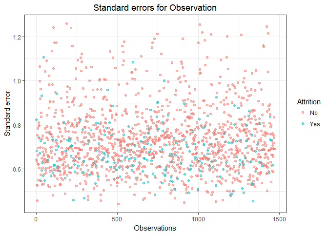<!-- -->

```r
# Residual Vs Leverage
ggplot(forward2, aes(.hat, .stdresid)) +
  geom_vline(size = 2, colour = "white", xintercept = 0) +
  geom_hline(size = 2, colour = "white", yintercept = 0) +
  geom_point(aes(color = Attrition), alpha = .5) + geom_smooth(se = FALSE) +
  labs(title="Residual Vs Leverage", x="Leverage", y="Studentized residuals") +
  theme(plot.title = element_text(hjust = 0.5))
```

```
## `geom_smooth()` using method = 'gam'
```

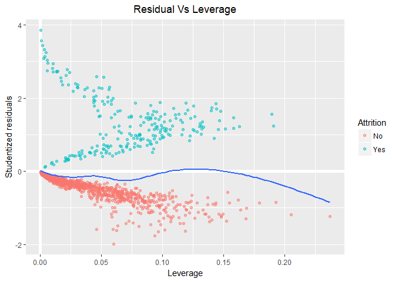<!-- -->

```r
ggplot(forward2, aes(.hat, .stdresid)) +
  geom_point(aes(size = .cooksd, color = Attrition)) +
  geom_smooth(se = FALSE, size = 0.5) +
  labs(title="Residual Vs Leverage", x="Leverage", y="Studentized residuals") +
  theme(plot.title = element_text(hjust = 0.5))
```

```
## `geom_smooth()` using method = 'gam'
```

<!-- -->

```r
# Cooks distance Vs Leverage

ggplot(forward2, aes(.hat, .cooksd)) +
  geom_vline(xintercept = 0, colour = NA) +
  geom_abline(slope = seq(0, 3, by = 0.5), colour = "white") +
  geom_smooth(se = FALSE) +
  geom_point(aes(color = Attrition), alpha = .5) +
  labs(title="Cooks D distance Vs Leverage", x="Leverage", y="Cooks D distance") +
    theme(plot.title = element_text(hjust = 0.5))
```

```
## `geom_smooth()` using method = 'gam'
```

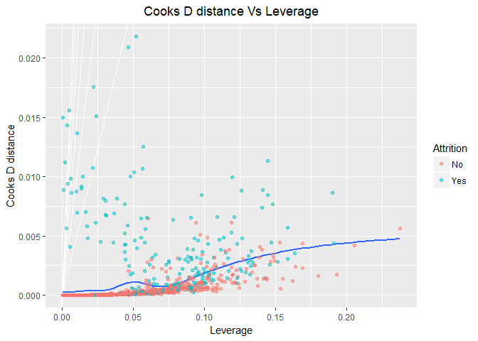<!-- -->


b	Create bar charts in ggplot or similar. The bars should be in descending order, Use any color palette of your choice other than the default.


```r
#age histogram
age_hist <- as.data.frame.table(table(talentManage$Age))

ggplot(data = age_hist, mapping = aes(x=reorder(Var1, -Freq), y=Freq)) +
  geom_bar(stat="identity", col = "gray", fill = "royalblue1" ) +
  labs(x = "Age", y = "Frequency", title = "Histogram of Age") + 
  theme(plot.title = element_text(hjust = 0.5))
```

<!-- -->

```r
#Bsiness Travel histogram
BusinssTrvl_hist <- as.data.frame.table(table(talentManage$BusinssTrvl))

ggplot(data = BusinssTrvl_hist, mapping = aes(x=reorder(Var1, -Freq), y=Freq)) +
  geom_bar(stat="identity", col = "gray", fill = "royalblue1" ) +
  labs(x = "Business Travel", y = "Frequency", title = "Business Travel Histogram") + 
  theme(plot.title = element_text(hjust = 0.5))
```

<!-- -->

```r
#Daily Rate histogram

DailyRate <- cut(talentManage[,c("DailyRate")], breaks = c(100,300,600,900,1200,1500), labels = c("100-300", "301-600", "601-900", "901-1200", "1201-1500"), right = TRUE, include.lowest = TRUE, ordered_result = TRUE)

DailyRate_hist <- as.data.frame.table(table(DailyRate))

ggplot(data = DailyRate_hist, mapping = aes(x=reorder(DailyRate, -Freq), y=Freq)) +
  geom_bar(stat="identity", col = "gray", fill = "royalblue1" ) +
  labs(x = "Daily Rate", y = "Frequency", title = "Histogram of Daily Rate") + 
  theme(plot.title = element_text(hjust = 0.5)) +
  theme(axis.text.x = element_text(angle = 90, hjust = 1))
```

<!-- -->

```r
#Department histogram
Department_hist <- as.data.frame.table(table(talentManage$Department))

ggplot(data = Department_hist, mapping = aes(x=reorder(Var1, -Freq), y=Freq)) +
  geom_bar(stat="identity", col = "gray", fill = "royalblue1" ) +
  labs(x = "Department", y = "Frequency", title = "Department Histogram") + 
  theme(plot.title = element_text(hjust = 0.5))
```

<!-- -->

```r
#Distance From Home histogram
DistncFrmHm_hist <- as.data.frame.table(table(talentManage$DistncFrmHm))

ggplot(data = DistncFrmHm_hist, mapping = aes(x=reorder(Var1, -Freq), y=Freq)) +
  geom_bar(stat="identity", col = "gray", fill = "royalblue1" ) +
  labs(x = "Distance From Home", y = "Frequency", title = "Distance From Home Histogram") + 
  theme(plot.title = element_text(hjust = 0.5))
```

<!-- -->

```r
#Education histogram
Education_hist <- as.data.frame.table(table(talentManage$Education))

ggplot(data = Education_hist, mapping = aes(x=reorder(Var1, -Freq), y=Freq)) +
  geom_bar(stat="identity", col = "gray", fill = "royalblue1" ) +
  labs(x = "Education", y = "Frequency", title = "Education Histogram") + 
  theme(plot.title = element_text(hjust = 0.5))
```

<!-- -->

```r
#Education Field histogram
EducatinFld_hist <- as.data.frame.table(table(talentManage$EducatinFld))

ggplot(data = EducatinFld_hist, mapping = aes(x=reorder(Var1, -Freq), y=Freq)) +
  geom_bar(stat="identity", col = "gray", fill = "royalblue1" ) +
  labs(x = "Education Field", y = "Frequency", title = "Education Field Histogram") + 
  theme(plot.title = element_text(hjust = 0.5))
```

<!-- -->

```r
#Environemnt Status histogram
EnvrnmntSts_hist <- as.data.frame.table(table(talentManage$EnvrnmntSts))

ggplot(data = EnvrnmntSts_hist, mapping = aes(x=reorder(Var1, -Freq), y=Freq)) +
  geom_bar(stat="identity", col = "gray", fill = "royalblue1" ) +
  labs(x = "Environment Status", y = "Frequency", title = "Environment Status Histogram") + 
  theme(plot.title = element_text(hjust = 0.5))
```

<!-- -->

```r
#Gender histogram
Gender_hist <- as.data.frame.table(table(talentManage$Gender))

ggplot(data = Gender_hist, mapping = aes(x=reorder(Var1, -Freq), y=Freq)) +
  geom_bar(stat="identity", col = "gray", fill = "royalblue1" ) +
  labs(x = "Gender", y = "Frequency", title = "Gender Histogram") + 
  theme(plot.title = element_text(hjust = 0.5))
```

<!-- -->

```r
#Hourly Rate histogram
HourlyRate_hist <- as.data.frame.table(table(talentManage$HourlyRate))

ggplot(data = HourlyRate_hist, mapping = aes(x=reorder(Var1, -Freq), y=Freq)) +
  geom_bar(stat="identity", col = "gray", fill = "royalblue1" ) +
  labs(x = "Hourly Rate", y = "Frequency", title = "Hourly Rate Histogram") + 
  theme(plot.title = element_text(hjust = 0.5), axis.text.x = element_text(angle=90, hjust=1))
```

<!-- -->

```r
#Job Involvement histogram
JobInvlvmnt_hist <- as.data.frame.table(table(talentManage$JobInvlvmnt))

ggplot(data = JobInvlvmnt_hist, mapping = aes(x=reorder(Var1, -Freq), y=Freq)) +
  geom_bar(stat="identity", col = "gray", fill = "royalblue1" ) +
  labs(x = "Job Involvement", y = "Frequency", title = "Job Involvement Histogram") + 
  theme(plot.title = element_text(hjust = 0.5))
```

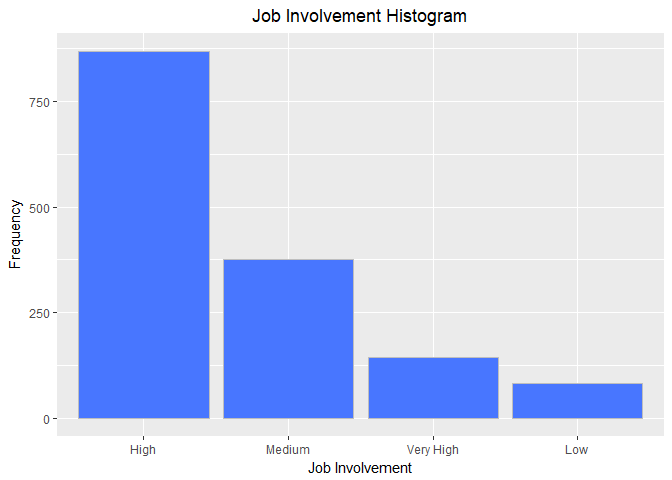<!-- -->

```r
#Job Level histogram
JobLevel_hist <- as.data.frame.table(table(talentManage$JobLevel))

ggplot(data = JobLevel_hist, mapping = aes(x=reorder(Var1, -Freq), y=Freq)) +
  geom_bar(stat="identity", col = "gray", fill = "royalblue1" ) +
  labs(x = "Job Level", y = "Frequency", title = "Job Level Histogram") + 
  theme(plot.title = element_text(hjust = 0.5), axis.text.x = element_text(angle=90, hjust=1))
```

<!-- -->

```r
#Job Role histogram
JobRole_hist <- as.data.frame.table(table(talentManage$JobRole))

ggplot(data = JobRole_hist, mapping = aes(x=reorder(Var1, -Freq), y=Freq)) +
  geom_bar(stat="identity", col = "gray", fill = "royalblue1" ) +
  labs(x = "Job Role", y = "Frequency", title = "Job Role Histogram") + 
  theme(plot.title = element_text(hjust = 0.5), axis.text.x = element_text(angle=90, hjust=1))
```

<!-- -->

```r
#Job Satisfaction histogram
JobSatsfctn_hist <- as.data.frame.table(table(talentManage$JobSatsfctn))

ggplot(data = JobSatsfctn_hist, mapping = aes(x=reorder(Var1, -Freq), y=Freq)) +
  geom_bar(stat="identity", col = "gray", fill = "royalblue1" ) +
  labs(x = "Job satisfaction", y = "Frequency", title = "Job Satisfaction Histogram") + 
  theme(plot.title = element_text(hjust = 0.5), axis.text.x = element_text(angle=90, hjust=1))
```

<!-- -->

```r
#Marital Status histogram
MaritalStts_hist <- as.data.frame.table(table(talentManage$MaritalStts))

ggplot(data = MaritalStts_hist, mapping = aes(x=reorder(Var1, -Freq), y=Freq)) +
  geom_bar(stat="identity", col = "gray", fill = "royalblue1" ) +
  labs(x = "Marital Status", y = "Frequency", title = "Maital Status Histogram") + 
  theme(plot.title = element_text(hjust = 0.5), axis.text.x = element_text(angle=90, hjust=1))
```

<!-- -->

```r
#Job Satisfaction histogram

MonthlyRate <- cut(talentManage[,c("MonthlyRate")], breaks = c(0,5000,10000,15000,20000,25000, 30000), labels = c("0-5000", "5001-10000", "10001-15000", "15001-20000", "20001-25000", "25001-30000"), right = TRUE, include.lowest = TRUE, ordered_result = TRUE)

MonthlyRate_hist <- as.data.frame.table(table(MonthlyRate))

ggplot(data = MonthlyRate_hist, mapping = aes(x=reorder(MonthlyRate, -Freq), y=Freq)) +
  geom_bar(stat="identity", col = "gray", fill = "royalblue1" ) +
  labs(x = "Job satisfaction", y = "Frequency", title = "Job Satisfaction Histogram") + 
  theme(plot.title = element_text(hjust = 0.5), axis.text.x = element_text(angle=90, hjust=1))
```

<!-- -->

```r
#Number of Companies worked histogram
NmCmpnsWrkd_hist <- as.data.frame.table(table(talentManage$NmCmpnsWrkd))

ggplot(data = NmCmpnsWrkd_hist, mapping = aes(x=reorder(Var1, -Freq), y=Freq)) +
  geom_bar(stat="identity", col = "gray", fill = "royalblue1" ) +
  labs(x = "Number of companies worked", y = "Frequency", title = "Number of companies worked Histogram") + 
  theme(plot.title = element_text(hjust = 0.5), axis.text.x = element_text(angle=90, hjust=1))
```

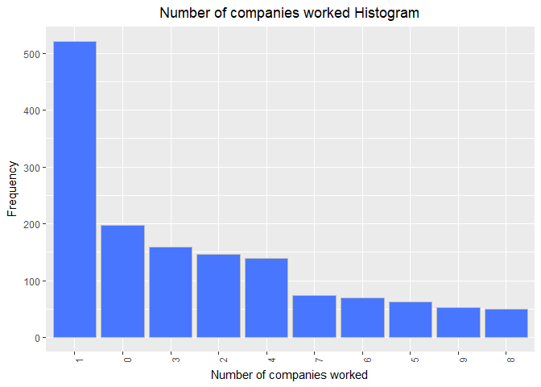<!-- -->

```r
#Overtime histogram
OverTime_hist <- as.data.frame.table(table(talentManage$OverTime))

ggplot(data = OverTime_hist, mapping = aes(x=reorder(Var1, -Freq), y=Freq)) +
  geom_bar(stat="identity", col = "gray", fill = "royalblue1" ) +
  labs(x = "Oertime", y = "Frequency", title = "Overtime Histogram") + 
  theme(plot.title = element_text(hjust = 0.5), axis.text.x = element_text(angle=90, hjust=1))
```

<!-- -->

```r
#Percent Salary Hike histogram
PrcntSlryHk_hist <- as.data.frame.table(table(talentManage$PrcntSlryHk))

ggplot(data = PrcntSlryHk_hist, mapping = aes(x=reorder(Var1, -Freq), y=Freq)) +
  geom_bar(stat="identity", col = "gray", fill = "royalblue1" ) +
  labs(x = "Percent Salary", y = "Frequency", title = "Percent Salary Histogram") + 
  theme(plot.title = element_text(hjust = 0.5), axis.text.x = element_text(angle=90, hjust=1))
```

<!-- -->

```r
#Performance rating histogram
PrfrmncRtng_hist <- as.data.frame.table(table(talentManage$PrfrmncRtng))

ggplot(data = PrfrmncRtng_hist, mapping = aes(x=reorder(Var1, -Freq), y=Freq)) +
  geom_bar(stat="identity", col = "gray", fill = "royalblue1" ) +
  labs(x = "Performance Rating", y = "Frequency", title = "Performance Rating Histogram") + 
  theme(plot.title = element_text(hjust = 0.5), axis.text.x = element_text(angle=90, hjust=1))
```

<!-- -->

```r
#Relationship Satisfaction histogram
RltnshpStsf_hist <- as.data.frame.table(table(talentManage$RltnshpStsf))

ggplot(data = RltnshpStsf_hist, mapping = aes(x=reorder(Var1, -Freq), y=Freq)) +
  geom_bar(stat="identity", col = "gray", fill = "royalblue1" ) +
  labs(x = "Relationship Satisfaction", y = "Frequency", title = "Relationship Satisfaction Histogram") + 
  theme(plot.title = element_text(hjust = 0.5), axis.text.x = element_text(angle=90, hjust=1))
```

<!-- -->

```r
#Standard Hours histogram
#StandardHrs_hist <- as.data.frame.table(table(talentManage$StandardHrs))

#ggplot(data = StandardHrs_hist, mapping = aes(x=reorder(Var1, -Freq), y=Freq)) +
#  geom_bar(stat="identity", col = "gray", fill = "royalblue1" ) +
#  labs(x = "Standard Hours", y = "Frequency", title = "Standard Hours Histogram") + 
#  theme(plot.title = element_text(hjust = 0.5), axis.text.x = element_text(angle=90, hjust=1))

#Stock Option Level histogram
StckOptnLvl_hist <- as.data.frame.table(table(talentManage$StckOptnLvl))

ggplot(data = StckOptnLvl_hist, mapping = aes(x=reorder(Var1, -Freq), y=Freq)) +
  geom_bar(stat="identity", col = "gray", fill = "royalblue1" ) +
  labs(x = "Stock Option Level", y = "Frequency", title = "Stock Option Level Histogram") + 
  theme(plot.title = element_text(hjust = 0.5), axis.text.x = element_text(angle=90, hjust=1))
```

<!-- -->

```r
#Total Working years histogram
TtlWrkngYrs_hist <- as.data.frame.table(table(talentManage$TtlWrkngYrs))

ggplot(data = TtlWrkngYrs_hist, mapping = aes(x=reorder(Var1, -Freq), y=Freq)) +
  geom_bar(stat="identity", col = "gray", fill = "royalblue1" ) +
  labs(x = "Total Working Hours", y = "Frequency", title = "Total Working Hours Histogram") + 
  theme(plot.title = element_text(hjust = 0.5), axis.text.x = element_text(angle=90, hjust=1))
```

<!-- -->

```r
#Training Time Last Year histogram
TrnngTmsLsY_hist <- as.data.frame.table(table(talentManage$TrnngTmsLsY))

ggplot(data = TrnngTmsLsY_hist, mapping = aes(x=reorder(Var1, -Freq), y=Freq)) +
  geom_bar(stat="identity", col = "gray", fill = "royalblue1" ) +
  labs(x = "Training Time Last Year", y = "Frequency", title = "Training Time Last Year Histogram") + 
  theme(plot.title = element_text(hjust = 0.5), axis.text.x = element_text(angle=90, hjust=1))
```

<!-- -->

```r
#Work Life Balance histogram
WorkLifBlnc_hist <- as.data.frame.table(table(talentManage$WorkLifBlnc))

ggplot(data = WorkLifBlnc_hist, mapping = aes(x=reorder(Var1, -Freq), y=Freq)) +
  geom_bar(stat="identity", col = "gray", fill = "royalblue1" ) +
  labs(x = "Work Life Balance", y = "Frequency", title = "Work Life Balance Histogram") + 
  theme(plot.title = element_text(hjust = 0.5), axis.text.x = element_text(angle=90, hjust=1))
```

<!-- -->

```r
#Years at company histogram
YersAtCmpny_hist <- as.data.frame.table(table(talentManage$YersAtCmpny))

ggplot(data = YersAtCmpny_hist, mapping = aes(x=reorder(Var1, -Freq), y=Freq)) +
  geom_bar(stat="identity", col = "gray", fill = "royalblue1" ) +
  labs(x = "Years at Company", y = "Frequency", title = "Years at Company Histogram") + 
  theme(plot.title = element_text(hjust = 0.5), axis.text.x = element_text(angle=90, hjust=1))
```

<!-- -->

```r
#Years in current role histogram
YrsInCrrntR_hist <- as.data.frame.table(table(talentManage$YrsInCrrntR))

ggplot(data = YrsInCrrntR_hist, mapping = aes(x=reorder(Var1, -Freq), y=Freq)) +
  geom_bar(stat="identity", col = "gray", fill = "royalblue1" ) +
  labs(x = "Years in Current Role", y = "Frequency", title = "Years in Current Role Histogram") + 
  theme(plot.title = element_text(hjust = 0.5), axis.text.x = element_text(angle=90, hjust=1))
```

<!-- -->

```r
#Years since last promotion histogram
YrsSncLstPr_hist <- as.data.frame.table(table(talentManage$YrsSncLstPr))

ggplot(data = YrsSncLstPr_hist, mapping = aes(x=reorder(Var1, -Freq), y=Freq)) +
  geom_bar(stat="identity", col = "gray", fill = "royalblue1" ) +
  labs(x = "Years Since Last Promotion", y = "Frequency", title = "Years Since Last Promotion Histogram") + 
  theme(plot.title = element_text(hjust = 0.5), axis.text.x = element_text(angle=90, hjust=1))
```

<!-- -->

```r
#Years with Current Manager histogram
YrsWthCrrMn_hist <- as.data.frame.table(table(talentManage$YrsWthCrrMn))

ggplot(data = YrsWthCrrMn_hist, mapping = aes(x=reorder(Var1, -Freq), y=Freq)) +
  geom_bar(stat="identity", col = "gray", fill = "royalblue1" ) +
  labs(x = "Years with Current Manager", y = "Frequency", title = "Years with Current Manager Histogram") + 
  theme(plot.title = element_text(hjust = 0.5), axis.text.x = element_text(angle=90, hjust=1))
```

<!-- -->

c	Is there a relationship between Age and Income?  Create a scatterplot and make an assessment of whether there is a relationship.  Color each point based on the Gender of the participant.  You’re welcome to use lm() or similar functions to back up your claims.


```r
ggplot(talentManage1, aes(Age, MonthlyIncome, color=Gender)) + 
  geom_point() +
  labs(title="Scatter plot of Monthly Income vs Age", xlab="Age", ylab="Monthly Income")+
  geom_smooth(method="lm", alpha=0.05)
```

<!-- -->

d	What about Life Satisfaction?  Create another scatterplot.  Is there a discernible relationship there to what?   


```r
ggplot(talentManage, aes(WorkLifBlnc, MonthlyIncome, color=Gender)) + 
  geom_point() +
  labs(title="Scatter plot of Monthly Income vs Life Satisfction", xlab="Life Satisfaction", ylab="Monthly Income")+
  geom_smooth(method="lm", alpha=0.05) +
  geom_abline()
```

<!-- -->

